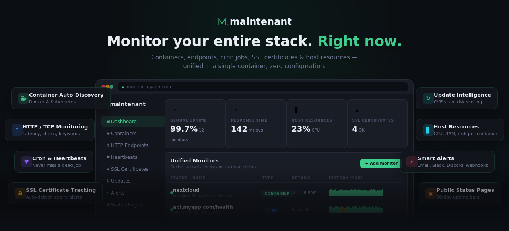
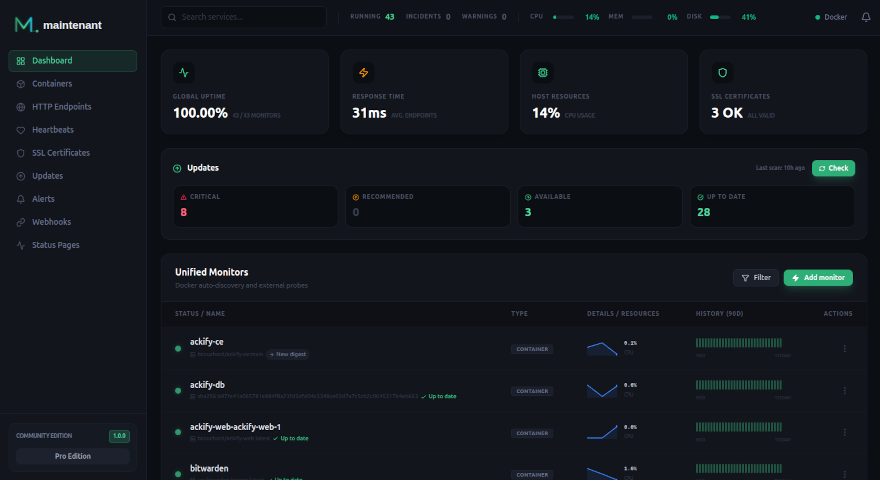
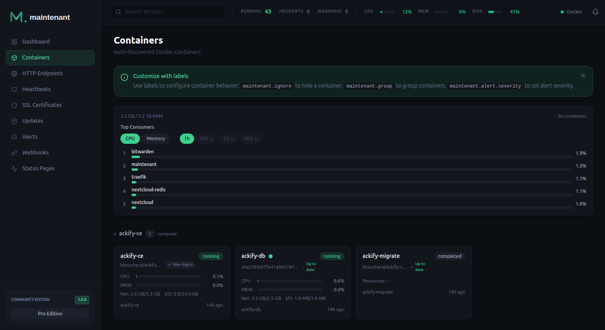
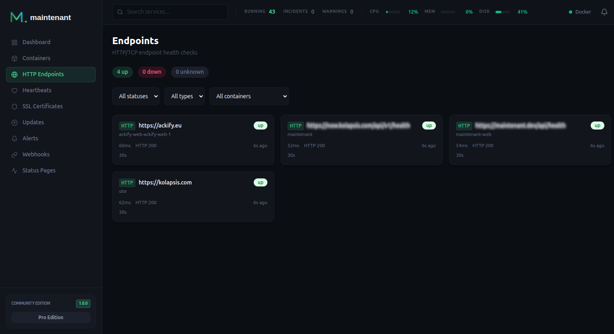
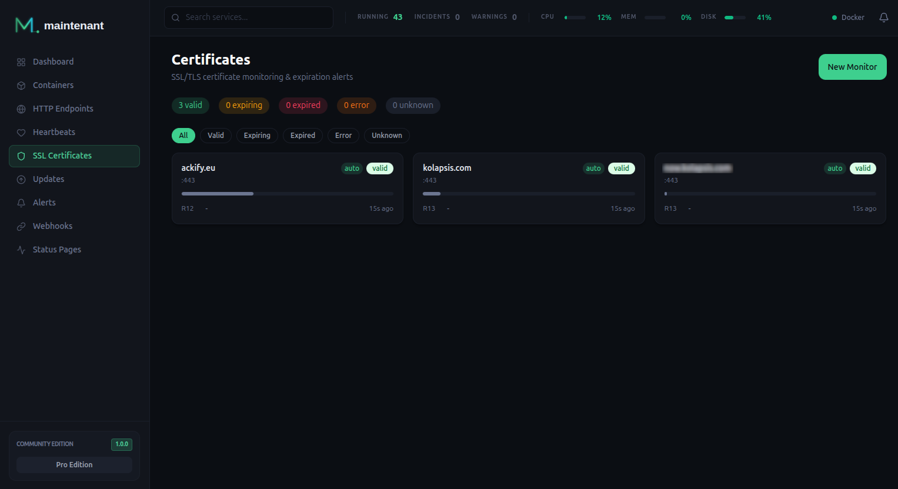
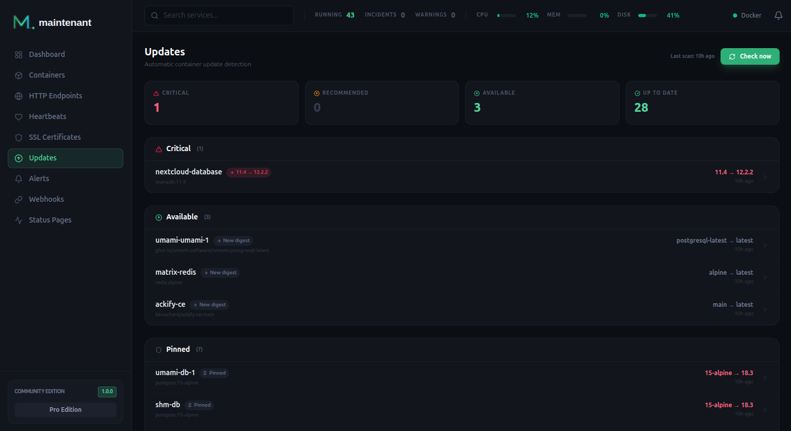
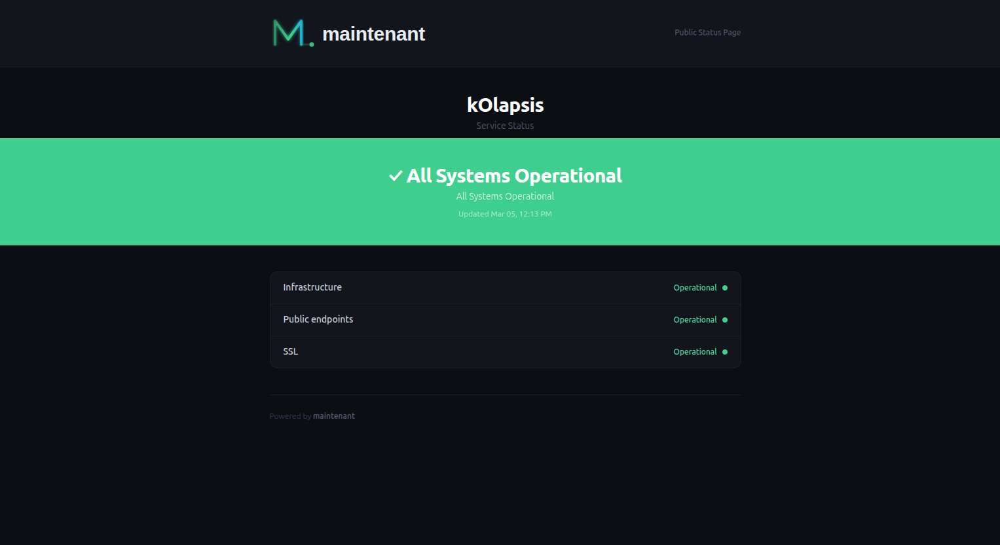
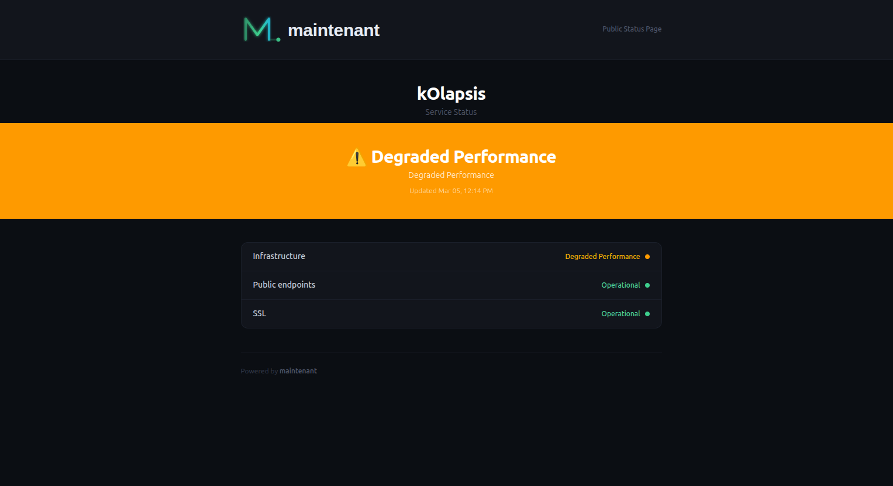
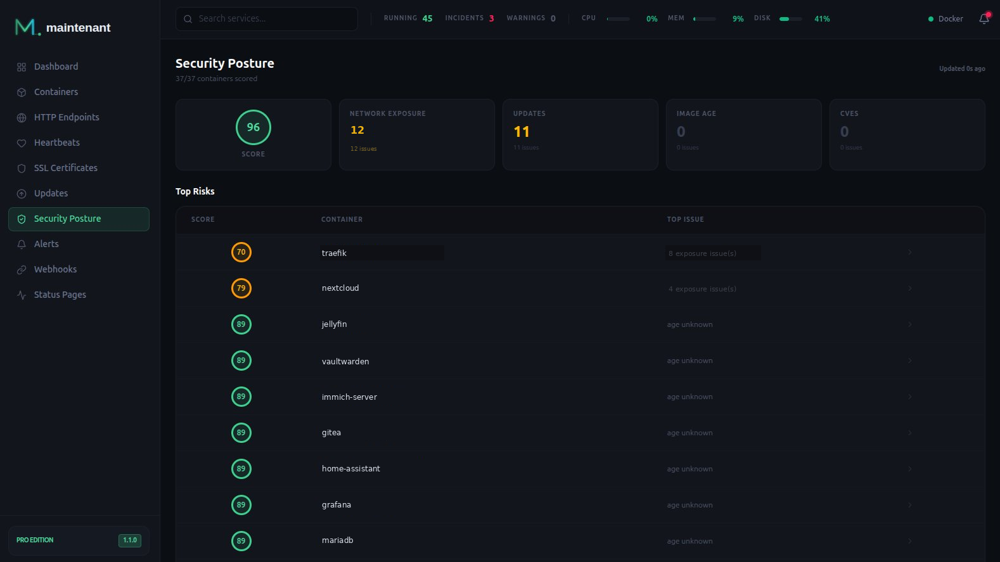

<p align="center">
  
</p>

<h1 align="center">maintenant</h1>

<p align="center">
  <strong>Monitor everything. Manage nothing.</strong><br>
  Drop a single container. Your entire stack is monitored in seconds.
</p>

<p align="center">
  <a href="https://github.com/kolapsis/maintenant/releases"></a>
  <a href="https://github.com/kolapsis/maintenant/pkgs/container/maintenant"></a>
  <a href="LICENSE"></a>
  <a href="https://maintenant.dev/#pricing"></a>
</p>

<p align="center">
  <a href="https://docs.maintenant.dev/">Documentation</a>&nbsp;&nbsp;&bull;&nbsp;&nbsp;<a href="#quick-start">Quick Start</a>&nbsp;&nbsp;&bull;&nbsp;&nbsp;<a href="#features">Features</a>&nbsp;&nbsp;&bull;&nbsp;&nbsp;<a href="#pricing">Pricing</a>&nbsp;&nbsp;&bull;&nbsp;&nbsp;<a href="#configuration">Configuration</a>&nbsp;&nbsp;&bull;&nbsp;&nbsp;<a href="#api">API</a>
</p>

---

<table align="center" width="100%">
  <tr>
    <td align="center" width="100%">
      <h3>Keep maintenant alive — <a href="#pricing">go Pro for €9/mo</a></h3>
      <sub>Built in the open by <strong>one developer in Bordeaux, France</strong> — no VC, no tracking, no dark patterns.<br>If maintenant replaces 3 SaaS tools in your stack, <strong>a Pro subscription pays for itself on day one</strong>.</sub><br><br>
      <a href="https://maintenant.dev/#pricing"><strong>Start 14-day free trial →</strong></a>&nbsp;&nbsp;·&nbsp;&nbsp;<a href="https://github.com/sponsors/kolapsis"><strong>Sponsor on GitHub</strong></a>&nbsp;&nbsp;·&nbsp;&nbsp;<a href="https://github.com/kolapsis/maintenant"><strong>Star the repo</strong></a>
    </td>
  </tr>
</table>

---

## Why maintenant?

Most self-hosters juggle 3-5 tools to monitor their stack: one for containers, one for uptime, one for certs, one for metrics, and yet another for a status page. maintenant replaces all of them.

|                              | maintenant | Uptime Kuma | Portainer  | Dozzle     |
| ---------------------------- |:----------:|:-----------:|:----------:|:----------:|
| Container auto-discovery     | **Yes**    | No          | Yes        | Yes        |
| HTTP/TCP endpoint checks     | **Yes**    | Yes         | No         | No         |
| Cron/heartbeat monitoring    | **Yes**    | Yes         | No         | No         |
| SSL certificate tracking     | **Yes**    | Yes         | No         | No         |
| CPU/memory/network metrics   | **Yes**    | No          | Limited    | No         |
| Image update detection       | **Yes**    | No          | Yes        | No         |
| Network security insights    | **Yes**    | No          | No         | No         |
| Public status page           | **Yes**    | Yes         | No         | No         |
| Alerting (webhook, Discord)  | **Yes**    | Yes         | Limited    | No         |
| Kubernetes native            | **Yes**    | No          | Yes        | No         |
| Single binary, zero deps     | **Yes**    | Node.js     | Docker API | Docker API |

**One container. One dashboard. Everything monitored.**

---

## Screenshots

<table>
  <tr>
    <td colspan="2" align="center">
      <a href="./docs/screen-captures/1-dashboard.png"></a>
      <br><sub>Dashboard — Uptime, response times, resources, unified monitors</sub>
    </td>
  </tr>
  <tr>
    <td align="center" width="50%">
      <a href="./docs/screen-captures/2-containers.png"></a>
      <br><sub>Container auto-discovery</sub>
    </td>
    <td align="center" width="50%">
      <a href="./docs/screen-captures/3-endpoints.png"></a>
      <br><sub>Endpoint monitoring</sub>
    </td>
  </tr>
  <tr>
    <td align="center">
      <a href="./docs/screen-captures/4-certificates.png"></a>
      <br><sub>TLS certificate tracking</sub>
    </td>
    <td align="center">
      <a href="./docs/screen-captures/5-updates.png"></a>
      <br><sub>Update intelligence</sub>
    </td>
  </tr>
  <tr>
    <td align="center">
      <a href="./docs/screen-captures/7-status-page-all-ok.png"></a>
      <br><sub>Status page — All operational</sub>
    </td>
    <td align="center">
      <a href="./docs/screen-captures/8-status-page-degraded.png"></a>
      <br><sub>Status page — Degraded state</sub>
    </td>
  </tr>
</table>

---

## Quick Start

### Docker (30 seconds)

```yaml
# docker-compose.yml
services:
  maintenant:
    image: ghcr.io/kolapsis/maintenant:latest
    ports:
      - "8080:8080"
    volumes:
      - /var/run/docker.sock:/var/run/docker.sock:ro
      - /proc:/host/proc:ro
      - maintenant-data:/data
    environment:
      MAINTENANT_ADDR: "0.0.0.0:8080"
      MAINTENANT_DB: "/data/maintenant.db"
    restart: unless-stopped

volumes:
  maintenant-data:
```

```bash
docker compose up -d
```

Open **http://localhost:8080** — your containers are already there. No configuration needed.

### Kubernetes

```bash
kubectl apply -f deploy/kubernetes/
```

maintenant auto-detects the in-cluster API. Read-only RBAC, namespace filtering, workload-level monitoring out of the box.

> For detailed setup instructions, advanced configuration, and label reference, see the **[full documentation](https://kolapsis.github.io/maintenant/)**.

---

## Features

### Container Monitoring

Zero-config auto-discovery for Docker and Kubernetes. Every container is tracked the moment it starts — state changes, health checks, restart loops, log streaming with stdout/stderr demux. Compose projects are auto-grouped. Kubernetes workloads (Deployments, DaemonSets, StatefulSets) are first-class citizens.

### Endpoint Monitoring

Define HTTP or TCP checks directly as Docker labels — no config files, no UI clicks. maintenant picks them up automatically when a container starts. Response times, uptime history, 90-day sparklines, configurable failure/recovery thresholds.

```yaml
labels:
  maintenant.endpoint.http: "https://api:3000/health"
  maintenant.endpoint.interval: "15s"
  maintenant.endpoint.failure-threshold: "3"
```

### Heartbeat & Cron Monitoring

Create a monitor, get a unique URL, add one `curl` to your cron job. maintenant tracks start/finish times, durations, exit codes, and alerts you when a job misses its deadline.

```bash
# One-liner for any cron job
curl -fsS -o /dev/null https://now.example.com/ping/{uuid}/$?
```

> Community includes up to 5 heartbeats. **[Pro](#pricing)** lifts the cap for unlimited jobs.

### SSL/TLS Certificate Monitoring

Automatic detection from your HTTPS endpoints, plus standalone monitors for any domain. Alerts at 30, 14, 7, 3, and 1 day before expiry. Full chain validation.

### Resource Metrics

Real-time CPU, memory, network I/O, and disk I/O per container. Historical charts from 1 hour to 30 days (Pro). Per-container alert thresholds with debounce to avoid noise. Top consumers view for instant triage.

### Network Security Insights

Automatic detection of dangerous network configurations across your containers. Flags ports binding to `0.0.0.0`, exposed database ports, host-network mode, privileged containers, and Kubernetes-specific risks (NodePort, LoadBalancer without NetworkPolicy). Each container image is mapped to its software ecosystem via OCI manifest inspection for CVE-relevant context.

### Update Intelligence

Knows when your images have updates available. Scans OCI registries, compares digests. Compose-aware update and rollback commands with the correct `--project-directory` flag. Stop running `docker pull` blindly.

### Alert Engine

Unified alerts across all monitoring sources. Webhook and Discord channels included. Silence rules for planned maintenance. Exponential backoff retry on delivery.

> **[Pro](#pricing)** adds Slack, Microsoft Teams, and Email channels, plus escalation chains and maintenance windows.

### Public Status Page

Give your users a clean, real-time status page. Component groups, live SSE updates, severity aggregation across all monitors.

> **[Pro](#pricing)** adds incident timelines and subscriber notifications (email + webhook) — turn outages into trust-building moments.

### MCP Server

Built-in [Model Context Protocol](https://modelcontextprotocol.io/) server. Query your infrastructure, read logs, and check alert status from any MCP-compatible AI assistant. Supports both stdio and Streamable HTTP transports with full OAuth2 authentication for remote clients (Claude web, Claude mobile, Claude Desktop).

---

## Configuration

### Environment Variables

| Variable                            | Default                 | Description                                     |
| ----------------------------------- | ----------------------- | ----------------------------------------------- |
| `MAINTENANT_ADDR`                   | `127.0.0.1:8080`        | HTTP bind address                               |
| `MAINTENANT_DB`                     | `./maintenant.db`       | SQLite database path                            |
| `MAINTENANT_BASE_URL`               | `http://localhost:8080` | Base URL (used for heartbeat ping URLs)         |
| `MAINTENANT_ORGANISATION_NAME`      | `Maintenant`            | Organisation name on the status page            |
| `MAINTENANT_CORS_ORIGINS`           | same-origin             | CORS allowed origins (comma-separated)          |
| `MAINTENANT_RUNTIME`                | auto-detect             | Force `docker` or `kubernetes`                  |
| `MAINTENANT_MAX_BODY_SIZE`          | `1048576`               | Max request body size in bytes (1 MB)           |
| `MAINTENANT_UPDATE_INTERVAL`        | `24h`                   | Update intelligence scan interval               |
| `MAINTENANT_LICENSE_KEY`            | —                       | Pro license key (enables Pro features)          |
| `MAINTENANT_MCP`                    | `false`                 | Enable MCP server (Streamable HTTP on `/mcp`)   |
| `MAINTENANT_MCP_CLIENT_ID`          | —                       | OAuth2 client ID for MCP authentication         |
| `MAINTENANT_MCP_CLIENT_SECRET`      | —                       | OAuth2 client secret for MCP authentication     |
| `MAINTENANT_K8S_NAMESPACES`         | all                     | Namespace allowlist (comma-separated)           |
| `MAINTENANT_K8S_EXCLUDE_NAMESPACES` | none                    | Namespace blocklist                             |

> Full configuration reference in the **[documentation](https://kolapsis.github.io/maintenant/)**.

### Docker Labels Reference

<details>
<summary><strong>Container settings</strong></summary>

```yaml
labels:
  maintenant.ignore: "true"                    # Exclude from monitoring
  maintenant.group: "backend"                  # Custom group name
  maintenant.alert.severity: "critical"        # critical | warning | info
  maintenant.alert.restart_threshold: "5"      # Restart loop threshold
  maintenant.alert.channels: "ops-webhook"     # Route to specific channels
```

</details>

<details>
<summary><strong>Endpoint monitoring</strong></summary>

```yaml
labels:
  # Simple — one endpoint per container
  maintenant.endpoint.http: "https://app:8443/health"
  maintenant.endpoint.tcp: "db:5432"

  # Indexed — multiple endpoints per container
  maintenant.endpoint.0.http: "https://app:8443/health"
  maintenant.endpoint.1.tcp: "redis:6379"

  # Tuning
  maintenant.endpoint.interval: "30s"
  maintenant.endpoint.timeout: "10s"
  maintenant.endpoint.http.method: "POST"
  maintenant.endpoint.http.expected-status: "200,201"
  maintenant.endpoint.http.tls-verify: "false"
  maintenant.endpoint.http.headers: '{"Authorization":"Bearer tok"}'
  maintenant.endpoint.failure-threshold: "3"
  maintenant.endpoint.recovery-threshold: "2"
```

</details>

<details>
<summary><strong>TLS certificate monitoring</strong></summary>

```yaml
labels:
  maintenant.tls.certificates: "example.com:443,api.example.com:443"
```

</details>

<details>
<summary><strong>Full stack example</strong></summary>

```yaml
services:
  maintenant:
    image: ghcr.io/kolapsis/maintenant:latest
    ports:
      - "8080:8080"
    volumes:
      - /var/run/docker.sock:/var/run/docker.sock:ro
      - /proc:/host/proc:ro
      - maintenant-data:/data
    environment:
      MAINTENANT_ADDR: "0.0.0.0:8080"
      MAINTENANT_DB: "/data/maintenant.db"

  api:
    image: myapp:latest
    labels:
      maintenant.group: "production"
      maintenant.endpoint.http: "http://api:3000/health"
      maintenant.endpoint.interval: "15s"
      maintenant.alert.severity: "critical"
      maintenant.alert.channels: "ops-webhook"

  postgres:
    image: postgres:16
    labels:
      maintenant.endpoint.tcp: "postgres:5432"
      maintenant.alert.severity: "critical"

  redis:
    image: redis:7-alpine
    labels:
      maintenant.endpoint.tcp: "redis:6379"

volumes:
  maintenant-data:
```

</details>

---

## Security Model

maintenant does not include built-in authentication — by design.

Like Dozzle, Prometheus, and most self-hosted monitoring tools, maintenant is designed to sit behind your existing reverse proxy + auth middleware. No need to manage yet another set of user accounts.

```
Internet  ->  Reverse Proxy (Traefik / Caddy / nginx)
          ->  Auth (Authelia / Authentik / OAuth2 Proxy)
          ->  maintenant
```

<details>
<summary><strong>Example: Traefik + Authelia</strong></summary>

```yaml
services:
  maintenant:
    image: ghcr.io/kolapsis/maintenant:latest
    labels:
      traefik.enable: "true"
      traefik.http.routers.maintenant.rule: "Host(`now.example.com`)"
      traefik.http.routers.maintenant.middlewares: "authelia@docker"
    volumes:
      - /var/run/docker.sock:/var/run/docker.sock:ro
      - /proc:/host/proc:ro
      - maintenant-data:/data
    environment:
      MAINTENANT_ADDR: "0.0.0.0:8080"
      MAINTENANT_DB: "/data/maintenant.db"
      MAINTENANT_BASE_URL: "https://now.example.com"
```

</details>

> **Note:** `/ping/{uuid}` (heartbeat pings) and `/status/` (public status page) are meant to be publicly accessible. Configure your proxy rules accordingly.

---

## Alert Sources

| Source      | Events                                 | Default Severity  |
| ----------- | -------------------------------------- | ----------------- |
| Container   | `restart_loop`, `health_unhealthy`     | Warning           |
| Endpoint    | `consecutive_failure`                  | Critical          |
| Heartbeat   | `deadline_missed`                      | Critical          |
| Certificate | `expiring`, `expired`, `chain_invalid` | Critical          |
| Resource    | `cpu_threshold`, `memory_threshold`    | Warning           |
| Update      | `available`                            | Info              |

Deliver to Discord or any HTTP webhook. Slack, Teams, and email available with maintenant Pro.

---

## API

Full REST API under `/api/v1/` for automation and integration.

<details>
<summary><strong>Endpoint reference</strong></summary>

| Resource     | Endpoints                                                                                               |
| ------------ | ------------------------------------------------------------------------------------------------------- |
| Containers   | `GET /containers` `GET /containers/{id}` `GET /containers/{id}/transitions` `GET /containers/{id}/logs` |
| Endpoints    | `GET /endpoints` `GET /endpoints/{id}` `GET /endpoints/{id}/checks` `GET /endpoints/{id}/uptime/daily`  |
| Heartbeats   | `GET POST /heartbeats` `GET PUT DELETE /heartbeats/{id}` `POST /heartbeats/{id}/pause\|resume`          |
| Certificates | `GET POST /certificates` `GET PUT DELETE /certificates/{id}`                                            |
| Resources    | `GET /containers/{id}/resources/current\|history` `GET /resources/summary\|top`                         |
| Alerts       | `GET /alerts` `GET /alerts/active` `GET POST /channels` `GET POST /silence`                             |
| Webhooks     | `GET POST /webhooks` `POST /webhooks/{id}/test`                                                         |
| Status Page  | `GET POST /status/groups\|components\|incidents\|maintenance`                                           |
| Updates      | `GET /updates` `POST /updates/scan`                                                                     |
| Security     | `GET /security/insights` `GET /security/summary` `GET /security/insights/{id}`                          |
| Events       | `GET /containers/events` *(SSE stream)*                                                                 |
| Health       | `GET /health`                                                                                           |

</details>

---

## Architecture

```
┌──────────────────────────────────────────────────────┐
│                  Single Go Binary                    │
│                                                      │
│   ┌────────────────────────────────────────────┐     │
│   │  Vue 3 + TypeScript + Tailwind (embed.FS)  │     │
│   │  Real-time SSE  ·  uPlot charts  ·  PWA    │     │
│   └────────────────────────────────────────────┘     │
│                         |                            │
│   ┌────────────────────────────────────────────┐     │
│   │           REST API v1 + SSE Broker         │     │
│   └────────────────────────────────────────────┘     │
│          |                          |                │
│   ┌─────────────┐  ┌──────────────────────┐         │
│   │   Docker     │  │     Kubernetes       │         │
│   │   Runtime    │  │     Runtime          │         │
│   └─────────────┘  └──────────────────────┘         │
│          |                          |                │
│   ┌────────────────────────────────────────────┐     │
│   │  Containers · Endpoints · Heartbeats ·     │     │
│   │  Certificates · Resources · Alerts ·       │     │
│   │  Updates · Security · Status Page ·        │     │
│   │  Webhooks                                  │     │
│   └────────────────────────────────────────────┘     │
│                         |                            │
│   ┌────────────────────────────────────────────┐     │
│   │     SQLite  (WAL · single-writer · zero    │     │
│   │              external dependencies)        │     │
│   └────────────────────────────────────────────┘     │
└──────────────────────────────────────────────────────┘
```

- **Single binary** — Frontend embedded via `embed.FS`. One file to deploy.
- **Zero dependencies** — SQLite is the only database. No Redis, no Postgres, no message queue.
- **Real-time** — SSE pushes every state change to the browser instantly.
- **Read-only** — maintenant never touches your containers. Observe only.
- **Label-driven** — Configure monitoring through Docker labels. No YAML to maintain.
- **~17 MB RAM** — Lightweight enough to run on any VPS or Raspberry Pi.

---

## Pricing

<p align="center">
  <strong>Community Edition is free forever. Pro keeps the project alive.</strong><br>
  <sub>If you ship real software, <strong>€9/mo is less than one hour of debugging</strong> the outage you didn't see coming.<br>
  And <strong>100% of revenue funds full-time development</strong> — no investors to pay back, no salespeople to feed.</sub>
</p>

<table>
  <tr>
    <td width="50%" valign="top" align="left">
      <h3>Community</h3>
      <p><strong>Free</strong> · AGPL-3.0 · self-hosted forever</p>
      <ul>
        <li>Container auto-discovery (Docker + Kubernetes)</li>
        <li>HTTP / TCP endpoint monitoring</li>
        <li>Heartbeat &amp; cron monitoring <sub>(up to 5)</sub></li>
        <li>TLS certificate tracking</li>
        <li>Resource metrics (CPU, RAM, net, disk)</li>
        <li>Network security insights</li>
        <li>Update intelligence (digest scan)</li>
        <li>Alert engine + webhook + Discord</li>
        <li>Public status page</li>
        <li>REST API + SSE + MCP server</li>
        <li>PWA support</li>
      </ul>
      <p><em>Everything a solo self-hoster needs.</em></p>
    </td>
    <td width="50%" valign="top" align="left" style="background:#0B0E13">
      <h3>Pro&nbsp;&nbsp;<sub><code>Recommended · 14-day free trial</code></sub></h3>
      <p><strong>€9</strong>/month · or <strong>€90</strong>/year <sub>(save 2 months)</sub></p>
      <p><sub><strong>Founding-subscriber pricing:</strong> lock in €9/mo <em>forever</em> before public pricing moves up.</sub></p>
      <p><em>Everything in Community, plus:</em></p>
      <ul>
        <li><strong>Unlimited</strong> heartbeats</li>
        <li><strong>Slack, Microsoft Teams, Email</strong> channels</li>
        <li><strong>Alert escalation &amp; routing</strong> — page the right person, not a dead channel</li>
        <li><strong>Maintenance windows</strong> — silence cleanly during deploys</li>
        <li><strong>Unified security posture</strong> dashboard</li>
        <li><strong>CVE enrichment</strong> + risk scoring per container</li>
        <li><strong>Incident management</strong> with public timeline</li>
        <li><strong>Subscriber notifications</strong> (email, webhook)</li>
        <li><strong>Priority email support</strong></li>
      </ul>
      <p><a href="https://maintenant.dev/#pricing"><strong>Start free trial →</strong></a></p>
    </td>
  </tr>
</table>

### Why upgrade to Pro?

- **Sleep through the night.** Escalation chains page the on-call engineer, then the backup, then the lead — instead of dying silently in a muted Discord.
- **Prioritize the vulnerabilities that matter.** CVE enrichment and per-container risk scoring surface what's critical in *your* environment — not a generic feed.
- **Turn outages into trust.** Public incident timelines and subscriber notifications keep your users informed automatically.
- **Get direct answers.** Priority email support, straight to the developer who wrote it.
- **Fund independent software.** maintenant is built in Bordeaux, France — by one developer, with no VC, no tracking, no dark patterns. Your subscription is the roadmap.

<p align="center">
  <a href="./docs/screen-captures/11-security-posture.png"></a>
  <br><sub><strong>Pro</strong> — Unified security posture with CVE enrichment &amp; risk scoring</sub>
</p>

### Flexible billing — your choice of processor

Pick the processor that fits where you are:

| Region          | Processor | Methods                                                 |
| --------------- | --------- | ------------------------------------------------------- |
| Global          | **Stripe** | Credit / debit card                                     |
| European Union  | **Mollie** | Card, SEPA Direct Debit, iDEAL, Bancontact, and more    |

- 14-day free trial — plenty of time to evaluate against a real stack
- Cancel anytime from your dashboard
- VAT-compliant invoices issued automatically
- **Self-hosted means self-hosted** — your monitoring data never leaves your infrastructure

### "Why should I pay for open-source?"

Fair question. Here's the honest answer:

<details>
<summary><strong>Is the Community Edition really everything I need?</strong></summary>

Yes. Community is not crippleware — it runs production infrastructure every day. Pro exists for teams that need escalation routing, CVE intelligence, and premium channels. If you don't need those, stay on Community, and consider <a href="https://github.com/sponsors/kolapsis">sponsoring</a> instead.
</details>

<details>
<summary><strong>If I don't pay, does the project die?</strong></summary>

maintenant is AGPL-3.0 and will always be free. But one developer can only sustain this full-time if users pay. Every Pro subscription is a direct vote for "keep shipping" — no investors to please, no enterprise pivot, no acquisition exit.
</details>

<details>
<summary><strong>Will the price go up later?</strong></summary>

Probably. As Pro grows, the price will increase for new subscribers. **Anyone who subscribes today locks in €9/mo forever** — that's the deal.
</details>

<details>
<summary><strong>Can I self-host Pro? Does my data leave my infra?</strong></summary>

Yes, self-host Pro exactly like Community — it's the same binary. License validation is stateless and offline-tolerant. Your monitoring data never touches our servers. Ever.
</details>

<details>
<summary><strong>Is there an Enterprise plan for larger teams?</strong></summary>

Yes — for teams needing SSO, audit logs, custom SLAs, or on-prem support contracts. Email <a href="mailto:hello@kolapsis.com">hello@kolapsis.com</a>.
</details>

### Activate Pro

Grab a key from [maintenant.dev/#pricing](https://maintenant.dev/#pricing), set it in your environment, restart — done.

```bash
MAINTENANT_LICENSE_KEY=your-license-key
```

<p align="center">
  <a href="https://maintenant.dev/#pricing"></a>
</p>

<p align="center">
  <sub>14-day free trial · cancel anytime · VAT-compliant invoices · founder pricing locked in forever</sub>
</p>

---

## Support the project

maintenant is built independently in Bordeaux, France. No VC, no tracking, no telemetry, no data collection, no acquisition exit. The only way this keeps going is if users who benefit from it give back. **Here's how, ranked by impact:**

<table>
  <tr>
    <td width="33%" valign="top" align="center">
      <h3>1. Go Pro</h3>
      <p><strong>€9/mo</strong> · 14-day trial</p>
      <p><sub>The single most impactful way to support the project. Unlocks advanced features AND funds development.</sub></p>
      <p><a href="https://maintenant.dev/#pricing"><strong>Start trial →</strong></a></p>
    </td>
    <td width="33%" valign="top" align="center">
      <h3>2. Sponsor</h3>
      <p><strong>Any amount</strong> · one-off or monthly</p>
      <p><sub>Don't need Pro? Sponsor on GitHub. Every sponsor gets credited in the <a href="#backers">Backers</a> wall below.</sub></p>
      <p><a href="https://github.com/sponsors/kolapsis"><strong>Sponsor →</strong></a></p>
    </td>
    <td width="33%" valign="top" align="center">
      <h3>3. Spread the word</h3>
      <p><strong>Free · 10 seconds</strong></p>
      <p><sub>Star the repo, share on HN / Lobsters / Reddit / LinkedIn. Discoverability is oxygen for indie projects.</sub></p>
      <p><a href="https://github.com/kolapsis/maintenant"><strong>Star repo →</strong></a></p>
    </td>
  </tr>
</table>

### Backers

<sub>Every Pro subscriber and GitHub sponsor keeps this project independent. Thank you.</sub>

<a href="https://github.com/sponsors/kolapsis"></a>

> Want your company logo here? [Become a corporate sponsor](mailto:hello@kolapsis.com) — visibility for you, runway for the project.

---

## Contributing

Code contributions are welcome. Please open an issue first to discuss bigger changes. Small fixes, typos, docs — just send the PR.

For other ways to contribute (bug reports, feature ideas, feedback), see [Support the project](#support-the-project).

---

## License

Copyright 2025-2026 Benjamin Touchard / kOlapsis — Bordeaux, France

Licensed under the [GNU Affero General Public License v3.0](LICENSE) (AGPL-3.0) or a commercial license.

---

<p align="center">
  <sub>Built with care in Bordeaux, France — if maintenant saves you an outage, <a href="https://maintenant.dev/#pricing">buy the developer a coffee (or a year of runway)</a>.</sub>
</p>