<p align="center">
  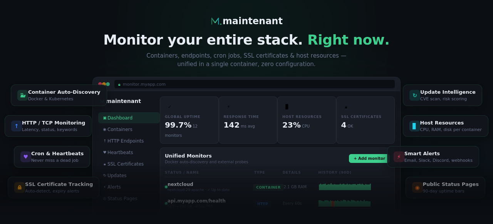
</p>

<!-- TODO: replace the hero with a 10-15 s demo.gif: dashboard live, an endpoint failing, the alert landing in Discord. -->

<h1 align="center">maintenant</h1>

<p align="center">
  <strong>Drop a container. Your stack is monitored.</strong><br>
  Docker, Kubernetes, uptime, TLS, cron jobs, live logs, image updates, CVEs: auto-discovered, alerting on every one of them,<br>
  from a single Go binary that idles at ~17 MB of RAM. No PromQL, no exporters, no dashboards to build.
</p>

<p align="center">
  <a href="https://github.com/kolapsis/maintenant/releases"></a>
  <a href="https://github.com/kolapsis/maintenant/pkgs/container/maintenant"></a>
  <a href="LICENSE"></a>
  <a href="https://github.com/kolapsis/maintenant/stargazers"></a>
</p>

<p align="center">
  <a href="#quick-start">Quick Start</a>&nbsp;&nbsp;&bull;&nbsp;&nbsp;<a href="#why-maintenant">Why maintenant</a>&nbsp;&nbsp;&bull;&nbsp;&nbsp;<a href="#features">Features</a>&nbsp;&nbsp;&bull;&nbsp;&nbsp;<a href="https://docs.maintenant.dev/">Documentation</a>&nbsp;&nbsp;&bull;&nbsp;&nbsp;<a href="#editions">Editions</a>&nbsp;&nbsp;&bull;&nbsp;&nbsp;<a href="https://maintenant.dev/pricing/">Pricing</a>
</p>

---

## Quick Start

```yaml
# docker-compose.yml
services:
  maintenant:
    image: ghcr.io/kolapsis/maintenant:latest
    ports:
      - "8080:8080"
    read_only: true
    security_opt:
      - no-new-privileges:true
    tmpfs:
      - /tmp:noexec,nosuid,size=64m
    volumes:
      - /var/run/docker.sock:/var/run/docker.sock:ro
      - /proc:/host/proc:ro
      - maintenant-data:/data
    environment:
      MAINTENANT_ADDR: "0.0.0.0:8080"
      MAINTENANT_DB: "/data/maintenant.db"
    restart: unless-stopped

volumes:
  maintenant-data:
```

```bash
docker compose up -d
```

Open **http://localhost:8080**. Your containers are already there, with their health, restart loops, resources and logs. Nothing to configure.

Docker socket access is automatic: the entrypoint reads the mounted socket's group and grants it to the unprivileged user, on Compose and on Swarm (where `docker stack deploy` silently ignores `group_add`). If containers do not show up, see [Troubleshooting](https://docs.maintenant.dev/troubleshooting/).

**Kubernetes**

```bash
kubectl apply -f deploy/kubernetes/
```

In-cluster API auto-detected, read-only RBAC, namespace filtering, workloads (Deployments, DaemonSets, StatefulSets) as first-class citizens. [Kubernetes guide](https://docs.maintenant.dev/guides/kubernetes/).

**Bare Linux, no Docker at all** (systemd, amd64 and arm64, statically linked)

```bash
curl -fsSL https://install.maintenant.dev | sudo bash
```

Endpoints, certificates and heartbeats work without any container runtime. Container monitoring switches on by itself the moment a runtime shows up. [Install documentation](https://docs.maintenant.dev/install/) for pinned versions, air-gapped installs and supply-chain verification.

**Cloud**: one `cloud-init` file boots a hardened host with maintenant running on [Hetzner Cloud](https://docs.maintenant.dev/guides/hetzner/) or [DigitalOcean](https://docs.maintenant.dev/guides/digitalocean/).

---

## Why maintenant?

Monitoring your own infrastructure with the standard stack means running Prometheus, Grafana, Alertmanager, node-exporter, cAdvisor, blackbox-exporter, a certificate exporter, Loki, Promtail, Trivy and something for image updates. Ten-odd components, each with its own config, upgrades and dashboards, to answer one question: **is my stack up, and what is burning?**

maintenant answers that question with one container.

| Built into maintenant | What you would assemble instead |
| --- | --- |
| Container state, health checks, restart loops | cAdvisor + node-exporter + alert rules you write |
| CPU, memory, network and disk, per container and per host | cAdvisor + node-exporter + Grafana dashboards you build |
| HTTP / TCP endpoint checks, declared as Docker labels | blackbox-exporter + a config file per target |
| TLS certificate expiry and chain validation | ssl_exporter |
| Cron and heartbeat deadlines | Pushgateway + alert rules you write |
| Live container logs, stdout/stderr demuxed | Dozzle, or Loki + Promtail |
| Image update detection, with compose-aware update and rollback commands | Diun or Watchtower |
| Network exposure audit: `0.0.0.0` binds, exposed database ports, host network, privileged containers | nothing standard |
| CVE enrichment and per-container risk score *(Personal)* | Trivy + its exporter |
| Alerts routed to Discord, webhooks, email, Telegram, Slack and Teams, with escalation *(Pro)* | Alertmanager |
| Public status page with incidents and subscribers | Cachet, Uptime Kuma, or a SaaS |
| One real-time dashboard for all of the above | Grafana + dashboards you build and maintain |

> **Do I still need Prometheus?**
> maintenant monitors your **infrastructure**. Prometheus monitors your **application**. There is no PromQL here, no custom exporters, no panels to design: maintenant already knows what a container, a certificate, an endpoint, a cron job and a CVE are, and starts watching them the moment they appear. If you ship business metrics and write your own queries, keep Prometheus for that. The two answer different questions, and plenty of people run both.

Against the tools self-hosters usually stack up:

|                              | maintenant     | Uptime Kuma | Portainer  | Dozzle     |
| ---------------------------- |:--------------:|:-----------:|:----------:|:----------:|
| Container auto-discovery     | **Yes**        | No          | Yes        | Yes        |
| Live container logs          | **Yes**        | No          | Yes        | Yes        |
| HTTP/TCP endpoint checks     | **Yes**        | Yes         | No         | No         |
| Cron/heartbeat monitoring    | **Yes**        | Yes         | No         | No         |
| SSL certificate tracking     | **Yes**        | Yes         | No         | No         |
| CPU/memory/network metrics   | **Yes**        | No          | Limited    | No         |
| Image update detection       | **Yes**        | No          | Yes        | No         |
| Network security insights    | **Yes**        | No          | No         | No         |
| CVE enrichment, risk scoring | **Personal**   | No          | No         | No         |
| Public status page           | **Yes**        | Yes         | No         | No         |
| Alerting with routing        | **Yes**        | Yes         | Limited    | No         |
| Kubernetes native            | **Yes**        | No          | Yes        | No         |
| Single binary, zero deps     | **Yes**        | Node.js     | Docker API | Docker API |
| Runs without a runtime       | **Yes**        | No          | No         | No         |

**One container. One dashboard. Everything monitored.**

---

## Screenshots

<table>
  <tr>
    <td colspan="2" align="center">
      <a href="./docs/screen-captures/1-dashboard.png">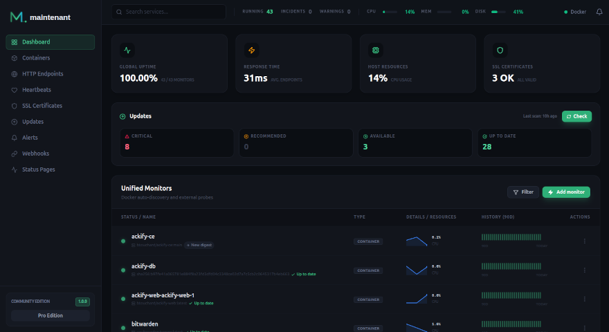</a>
      <br><sub>Dashboard: uptime, response times, resources, unified monitors</sub>
    </td>
  </tr>
  <tr>
    <td align="center" width="50%">
      <a href="./docs/screen-captures/7-unified-alerts.png">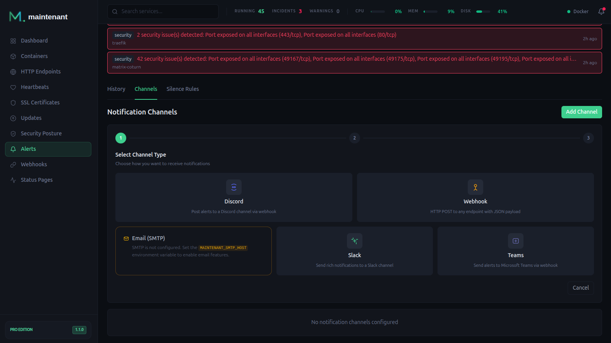</a>
      <br><sub>Unified alerts across every source</sub>
    </td>
    <td align="center" width="50%">
      <a href="./docs/screen-captures/11-security-posture.png">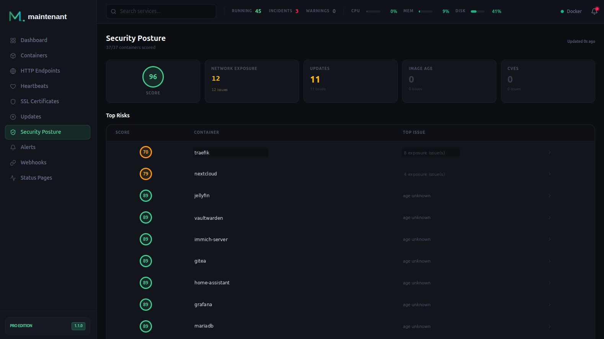</a>
      <br><sub>Security posture with CVE enrichment and risk scoring (Personal)</sub>
    </td>
  </tr>
</table>

<details>
<summary><strong>More screenshots</strong></summary>
<br>
<table>
  <tr>
    <td align="center" width="50%">
      <a href="./docs/screen-captures/2-containers.png">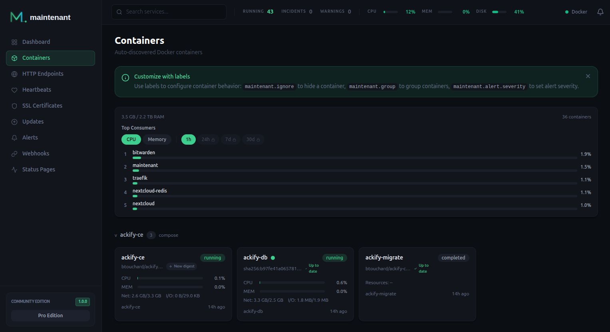</a>
      <br><sub>Container auto-discovery</sub>
    </td>
    <td align="center" width="50%">
      <a href="./docs/screen-captures/2-system-resources.png">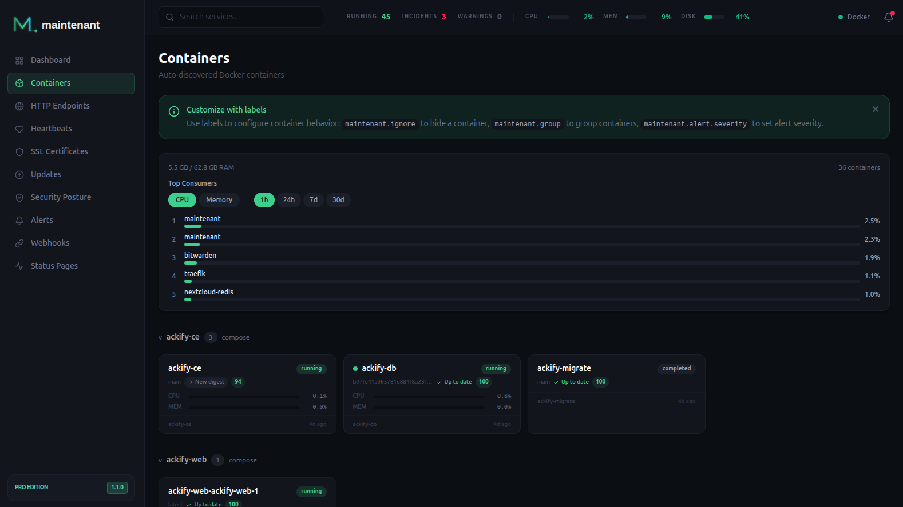</a>
      <br><sub>Resources per container and per host</sub>
    </td>
  </tr>
  <tr>
    <td align="center">
      <a href="./docs/screen-captures/3-endpoints.png">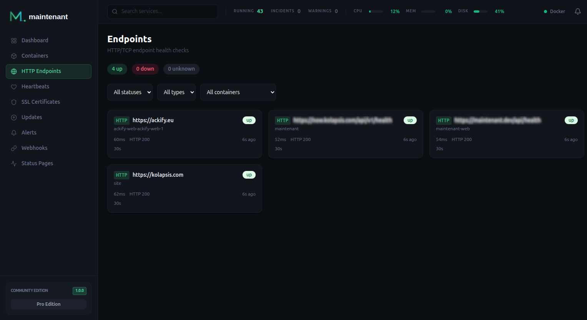</a>
      <br><sub>Endpoint monitoring</sub>
    </td>
    <td align="center">
      <a href="./docs/screen-captures/4-heartbeats-cron.png">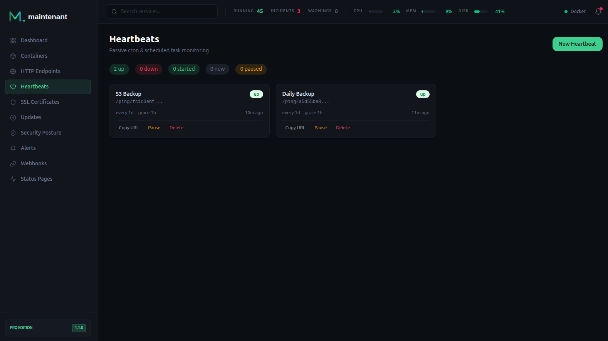</a>
      <br><sub>Heartbeat and cron monitoring</sub>
    </td>
  </tr>
  <tr>
    <td align="center">
      <a href="./docs/screen-captures/4-certificates.png">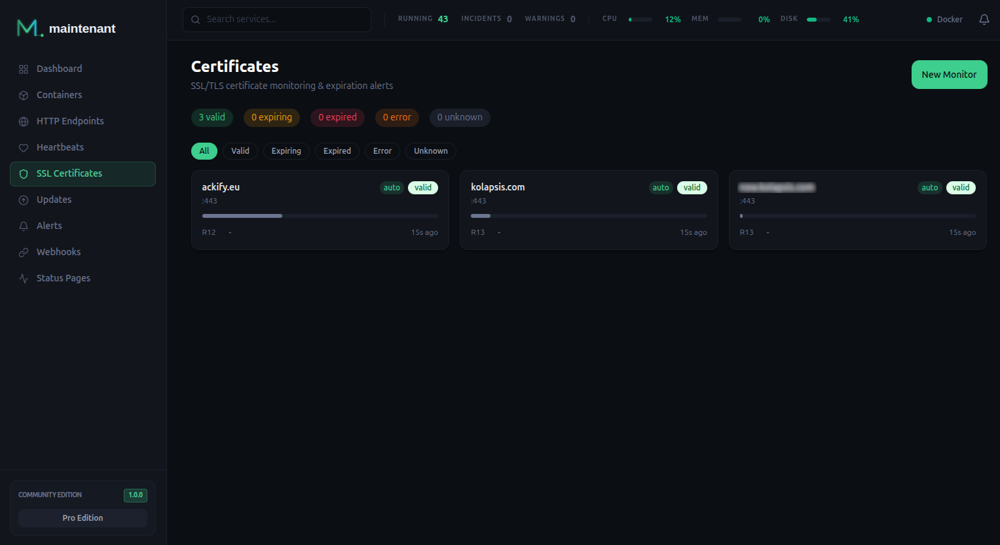</a>
      <br><sub>TLS certificate tracking</sub>
    </td>
    <td align="center">
      <a href="./docs/screen-captures/5-updates.png">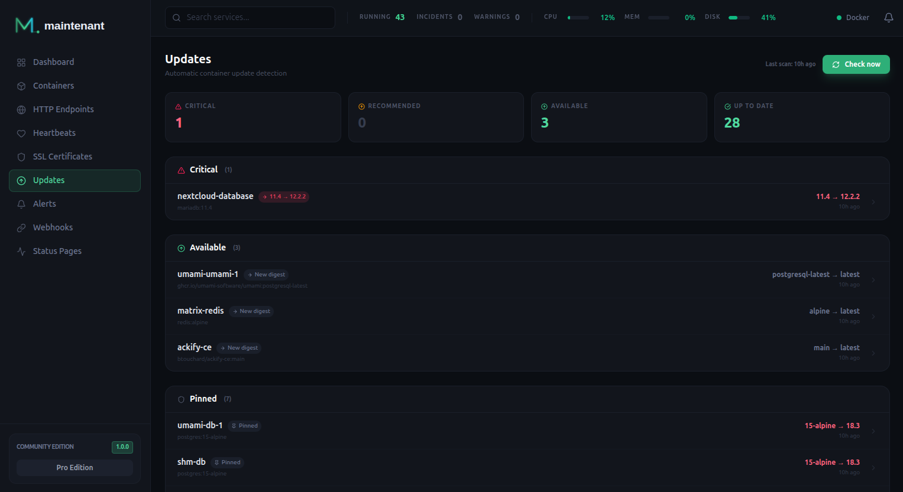</a>
      <br><sub>Update intelligence</sub>
    </td>
  </tr>
  <tr>
    <td align="center">
      <a href="./docs/screen-captures/13-network-security-insights.png">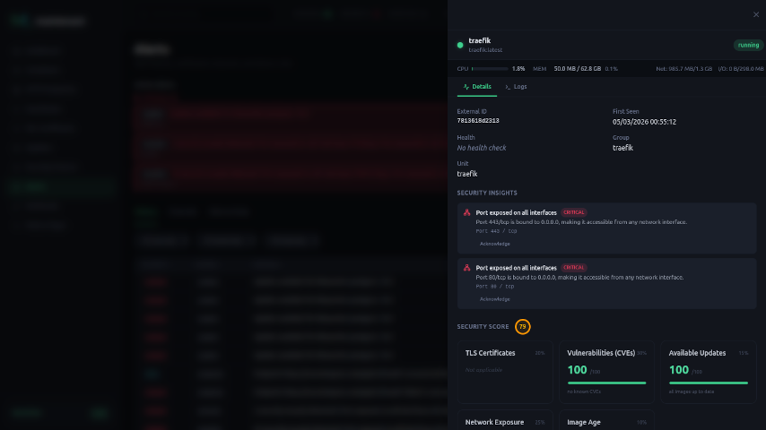</a>
      <br><sub>Network security insights</sub>
    </td>
    <td align="center">
      <a href="./docs/screen-captures/12-ai-assistant.png">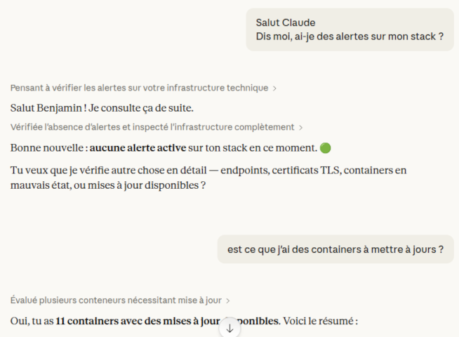</a>
      <br><sub>Your AI assistant, plugged in over MCP</sub>
    </td>
  </tr>
  <tr>
    <td align="center">
      <a href="./docs/screen-captures/7-status-page-all-ok.png"></a>
      <br><sub>Status page, all operational</sub>
    </td>
    <td align="center">
      <a href="./docs/screen-captures/8-status-page-degraded.png"></a>
      <br><sub>Status page, degraded</sub>
    </td>
  </tr>
</table>
</details>

---

## Features

Every section links to its full documentation.

### [Container monitoring](https://docs.maintenant.dev/features/containers/)

Zero-config auto-discovery for Docker, [Docker Swarm](https://docs.maintenant.dev/features/swarm/) and Kubernetes. Every container is tracked the moment it starts: state changes, health checks, restart loops, **live log streaming** with stdout/stderr demux. Compose projects are grouped automatically. Read-only: maintenant observes, it never touches your containers.

### [Multi-host monitoring](https://docs.maintenant.dev/features/multihost/)

One central **server**, lightweight read-only **agents** on your other hosts, a persistent mutually-authenticated gRPC stream between them. No shared database, no message queue, no PKI to run: an agent enrolls with a one-time token and an Ed25519 keypair generated locally, and every stream is challenge-response authenticated. Revoke it from the UI at any time.

```bash
# On each remote host, one command, generated for you in the UI
docker run -d --name maintenant-agent --restart unless-stopped \
  -v /var/run/docker.sock:/var/run/docker.sock:ro \
  -v /proc:/host/proc:ro \
  -v maintenant-agent-data:/var/lib/maintenant \
  ghcr.io/kolapsis/maintenant:latest \
  --mode=agent --server=grpcs://monitoring.example.com \
  --enrollment-token=mnt_enr_XXXXXXXXXXXXXXXX --label="prod-worker-01"
```

Agents detect their local runtime (Docker, Swarm or Kubernetes), stream container state, endpoints, certificates, host CPU/memory/disk, and reconnect on their own. Every entity is attributed to its host, so nothing gets mixed across machines. *Personal: up to 20 remote machines. Pro: unlimited.*

### [Update intelligence](https://docs.maintenant.dev/features/updates/)

Scans OCI registries and compares digests, so you know which images have an update before you `docker pull` blindly. Compose-aware update and rollback commands, with the right `--project-directory`. No Diun, no Watchtower, no extra container: it is part of the monitor.

### [Endpoint monitoring](https://docs.maintenant.dev/features/endpoints/)

HTTP and TCP checks declared as Docker labels, picked up when the container starts. Response times, uptime history, 90-day sparklines, failure and recovery thresholds.

```yaml
labels:
  maintenant.endpoint.http: "https://api:3000/health"
  maintenant.endpoint.interval: "15s"
  maintenant.endpoint.failure-threshold: "3"
```

### [Heartbeat and cron monitoring](https://docs.maintenant.dev/features/heartbeats/)

Create a monitor, get a URL, add one `curl` to the job. maintenant tracks start and finish, duration, exit code, and alerts when the deadline is missed.

```bash
curl -fsS -o /dev/null https://now.example.com/ping/{uuid}/$?
```

### [TLS certificate monitoring](https://docs.maintenant.dev/features/certificates/)

Auto-detected from your HTTPS endpoints, plus standalone monitors for any domain. Full chain validation, alerts at 30, 14, 7, 3 and 1 day before expiry, OCSP stapling checks (Personal).

### [Resource metrics](https://docs.maintenant.dev/features/resources/)

Real-time CPU, memory, network and disk I/O per container and per host, top-consumers view for instant triage, per-container thresholds with debounce. History: 7 days on Community, 30 on Personal, 90 on Pro.

### [Network security insights](https://docs.maintenant.dev/features/security/)

Flags what should not be there: ports bound to `0.0.0.0`, exposed database ports, host-network mode, privileged containers, Kubernetes NodePort and LoadBalancer services without a NetworkPolicy. Each image is mapped to its software ecosystem through OCI manifest inspection. **Personal** adds CVE enrichment, a risk score per container and a unified security posture dashboard.

### [Alert engine](https://docs.maintenant.dev/features/alerts/)

One alert pipeline for every source: container restart loops and unhealthy checks, endpoint failures, missed heartbeats, expiring or invalid certificates, CPU and memory thresholds, available updates. Channels are silent by default and routed through **triggers** (severity, source, scope, tags). Silence rules for planned maintenance, exponential backoff on delivery.

Channels: Discord and webhooks (Community), email and Telegram (Personal), Slack and Microsoft Teams (Pro). **Pro** adds [escalation policies](https://docs.maintenant.dev/features/alert-escalation/) that page the on-call, then the backup, then the lead, plus per-entity routing and maintenance windows.

### [Public status page](https://docs.maintenant.dev/features/status-page/)

Real-time status page with severity aggregation across every monitor, live over SSE. **Personal** adds incident timelines, **Pro** adds subscriber notifications (email and webhook) and branding.

### [MCP server](https://docs.maintenant.dev/features/mcp/)

Built-in [Model Context Protocol](https://modelcontextprotocol.io/) server. Ask your AI assistant what is burning, read a container's logs, check the alert queue, acknowledge an alert, open an incident. stdio and Streamable HTTP transports, full OAuth2 for remote clients (Claude web, mobile and Desktop).

---

## Configuration

Everything is driven by **Docker labels** and a handful of **environment variables**. No YAML to maintain.

- [Environment variables](https://docs.maintenant.dev/getting-started/configuration/): bind address, database, base URL, PostgreSQL DSN, MCP, Kubernetes namespaces, license key, telemetry.
- [Docker labels reference](https://docs.maintenant.dev/guides/docker-labels/): endpoints, TLS, alert severity, restart thresholds, channel routing, grouping, ignore.
- [REST API](https://docs.maintenant.dev/api/reference/) under `/api/v1/`, plus an SSE event stream.

<details>
<summary><strong>Full stack example</strong></summary>

```yaml
services:
  maintenant:
    image: ghcr.io/kolapsis/maintenant:latest
    ports:
      - "8080:8080"
    read_only: true
    security_opt:
      - no-new-privileges:true
    tmpfs:
      - /tmp:noexec,nosuid,size=64m
    volumes:
      - /var/run/docker.sock:/var/run/docker.sock:ro
      - /proc:/host/proc:ro
      - maintenant-data:/data
    environment:
      MAINTENANT_ADDR: "0.0.0.0:8080"
      MAINTENANT_DB: "/data/maintenant.db"

  api:
    image: myapp:latest
    labels:
      maintenant.group: "production"
      maintenant.endpoint.http: "http://api:3000/health"
      maintenant.endpoint.interval: "15s"
      maintenant.alert.severity: "critical"
      maintenant.alert.channels: "ops-webhook"

  postgres:
    image: postgres:16
    labels:
      maintenant.endpoint.tcp: "postgres:5432"
      maintenant.alert.severity: "critical"

  redis:
    image: redis:7-alpine
    labels:
      maintenant.endpoint.tcp: "redis:6379"

volumes:
  maintenant-data:
```

</details>

---

## Security model

- **No built-in authentication, by design.** Like Dozzle and Prometheus, maintenant sits behind your reverse proxy and auth middleware (Traefik or Caddy, Authelia or Authentik). `/ping/{uuid}` and `/status/` are meant to stay public. [Reverse proxy setup](https://docs.maintenant.dev/security/#reverse-proxy-setup).
- **Read-only everywhere.** Docker socket mounted `:ro`, read-only RBAC on Kubernetes, read-only agents. maintenant never starts, stops or modifies a container. A [socket proxy](https://docs.maintenant.dev/security/#recommended-docker-socket-proxy) is supported if you would rather not mount the socket at all.
- **Hardened container.** Runs as `nobody`, `read_only` root filesystem, `no-new-privileges`.
- **Anonymous, opt-out telemetry.** One counts-only snapshot per hour, no hostnames, IPs, names, URLs or keys, ever. `MAINTENANT_DISABLE_TELEMETRY=1` turns it off with no background goroutine and no outbound packet. [Exact payload and details](https://docs.maintenant.dev/getting-started/configuration/#telemetry).

---

## Architecture

- **One binary, three modes.** Go backend, Vue 3 frontend embedded via `embed.FS`, SQLite inside. The same file runs `embedded` (single host, default), `server` (central ingestion) and `agent` (remote host).
- **Zero dependencies.** SQLite is the only datastore. No Redis, no queue, nothing to administer. A fleet operator may back the server on a [PostgreSQL](https://docs.maintenant.dev/guides/postgresql/) they already run; agents always stay on SQLite.
- **Runtime optional.** Endpoints, certificates and heartbeats run without any Docker socket or Kubernetes API. Container monitoring resumes on its own when a runtime becomes reachable.
- **Real-time.** SSE pushes every state change to the browser and to the status page instantly.
- **~17 MB of RAM.** Runs on a Raspberry Pi, a €4 VPS or a NAS.

Full write-up in the [architecture documentation](https://docs.maintenant.dev/architecture/).

---

## Editions

Community is free forever and runs production infrastructure every day: it is the full product on a single host, not a crippled trial. Personal is bought once. Pro is what a team needs.

|                           | **Community**            | **Personal**                       | **Pro**                              |
| ------------------------- | ------------------------ | ---------------------------------- | ------------------------------------ |
| Price                     | Free, AGPL-3.0           | **€149** once, for life            | **€29**/mo or €290/yr, 14-day trial  |
| Hosts                     | 1                        | up to 20 remote machines           | unlimited                            |
| Endpoints / heartbeats / certificates | 10 / 5 / 5   | unlimited                          | unlimited                            |
| Resource history          | 7 days                   | 30 days                            | 90 days                              |
| Alert channels            | Discord, webhooks        | + email, Telegram, advanced filters | + Slack, Teams, escalation, per-entity routing, maintenance windows |
| Security                  | network insights         | + CVE enrichment, risk scoring, security posture, OCSP | same                     |
| Status page               | 3 components             | unlimited, incident timelines      | + subscriber notifications, branding |
| Use                       | anything                 | your own infrastructure            | + running it for others, priority support |

Personal covers one person on infrastructure they own or run for themselves, freelancers included, and ships with one year of updates (then €59 per extra year; every version released inside a paid year stays licensed for life). Pro adds the right to monitor other people's infrastructure. Enterprise (SSO, audit logs, SLAs, on-prem support): [hello@kolapsis.com](mailto:hello@kolapsis.com).

Paid editions are the same binary, self-hosted the same way. The key is verified against the license server and the signed answer is cached, so being offline for weeks changes nothing. **Your monitoring data never leaves your infrastructure.**

```bash
MAINTENANT_LICENSE_KEY=your-license-key   # Personal or Pro, restart, done
```

<p align="center">
  <a href="https://maintenant.dev/pricing/"><strong>Buy Personal, €149 once →</strong></a>&nbsp;&nbsp;·&nbsp;&nbsp;<a href="https://maintenant.dev/pricing/"><strong>Start a 14-day Pro trial →</strong></a>
  <br><sub>Stripe worldwide, Mollie in the EU (SEPA, iDEAL, Bancontact). VAT invoices. Cancel Pro anytime.</sub>
</p>

---

## Support the project

maintenant is built by one developer in Bordeaux, France. No VC, no tracking, no acquisition exit. 100% of revenue funds full-time development. Ranked by impact:

1. **Buy a licence.** Personal if the infrastructure is yours, Pro if you run it for others. Unlocks features and pays for the roadmap. [See editions →](https://maintenant.dev/pricing/)
2. **Sponsor.** Any amount, one-off or monthly, credited below. [GitHub Sponsors →](https://github.com/sponsors/kolapsis)
3. **Spread the word.** Star the repo, share on HN, Lobsters, Reddit or LinkedIn. Discoverability is oxygen for indie projects.
4. **Tell me how you use it.** Two minutes, read by the developer, quoted only with your permission. [Give feedback →](https://maintenant.dev/feedback/)

### Backers

<sub>Every Personal owner, Pro subscriber and GitHub sponsor keeps this project independent. Thank you.</sub>

<a href="https://github.com/sponsors/kolapsis"></a>

> Want your company logo here? [Become a corporate sponsor](mailto:hello@kolapsis.com): visibility for you, runway for the project.

---

## Contributing

Code contributions are welcome. Open an issue first for bigger changes; small fixes, typos and docs, just send the PR.

---

## License

Copyright 2025-2026 Benjamin Touchard / kOlapsis, Bordeaux, France.

Licensed under the [GNU Affero General Public License v3.0](LICENSE) (AGPL-3.0) or a commercial license.

---

<p align="center">
  <br>
  <sub>Lauréat de l'AAP Hyper Open X. Ce projet a été financé par le gouvernement dans le cadre de France 2030.</sub><br>
  <sub><em>Winner of the Hyper Open X call for projects, funded by the French government under France 2030.</em></sub>
</p>
