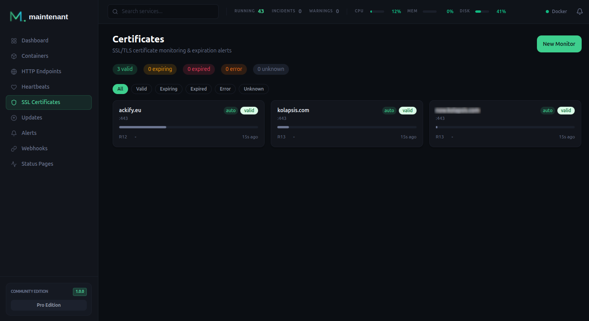

# TLS Certificate Monitoring

Automatic certificate detection from your HTTPS endpoints, plus standalone monitors for any domain. Never get surprised by an expired certificate again.



---

## How It Works

maintenant monitors TLS certificates in three ways:

1. **Automatic detection**: when the server probes an HTTPS [endpoint](endpoints.md), it monitors the certificate of that domain at the same time. Endpoints probed by a [remote agent](multihost.md) do not create one.
2. **Container labels**: `maintenant.tls.certificates` on a container lists the domains to monitor (see [Docker Labels](#docker-labels)).
3. **Standalone monitors**: add any domain manually through the UI or the API, even if it is not part of your monitored stack.

maintenant connects to the domain, performs a full TLS handshake, parses the certificate chain, and records:

- Subject, issuer, SANs, serial number and signature algorithm
- Validity dates and days until expiration
- Chain validity and whether the certificate covers the hostname
- OCSP staple (Personal, see [OCSP Stapling](#ocsp-stapling) below)

A monitor has one of these statuses: `valid`, `expiring` (inside the largest warning threshold), `expired`, `error` (the last scan could not connect) or `unknown` (not scanned yet). A scan that cannot connect records `last_error` and raises no alert.

### When monitors are scanned

| Monitor | Scanned |
|---------|---------|
| Automatic (from an endpoint) | Each time the server probes the endpoint, so every 30 seconds by default |
| Standalone and label | On their own interval: 12 hours by default, from 1 hour to 7 days (`check_interval_seconds`). The scheduler looks for due monitors every minute. |
| On a remote agent | By the agent, every 60 seconds |

### Checking on demand

After renewing a certificate by hand, **Check now** in the certificate panel scans it immediately: the status, the chain and the alert are recomputed on the spot, and the next scheduled scan is pushed a full interval out. No need to wait for the nightly run to see an incident close.

The button is only offered for monitors the server scans itself. A monitor discovered by an agent is scanned from that agent's network, on a one-minute cycle, so it refreshes on its own (the API answers `409 AGENT_SCANNED`). A second request while a check of the same monitor is running answers `409 CHECK_IN_PROGRESS`.

Endpoints have the same button in their panel, for the same reason.

---

## Alert Thresholds

maintenant raises an `expiring` alert as the expiry date approaches. The thresholds are **30, 14, 7, 3 and 1 days** before expiry by default, and each monitor can carry its own list (`warning_thresholds`, in days). The alert is raised when the remaining time first falls under a threshold, and again each time it falls under the next lower one; a certificate renewed past the largest threshold starts over.

Its severity depends on the days left when the alert is raised and on who issued the certificate. Certificates from CAs that renew automatically (Let's Encrypt, ZeroSSL, Buypass, Google Trust Services) are expected to renew by themselves, so they alert later. A monitor scanned by a [remote agent](multihost.md) never reports its issuer organization, so the *Other issuers* column always applies to it.

| Days left | Automatic CA | Other issuers |
|----------:|:------------:|:-------------:|
| more than 14 | Info | Info |
| 8 to 14 | Info | Warning |
| 4 to 7 | Warning | Critical |
| 3 or fewer | Critical | Critical |

Once the certificate has expired, an `expired` alert is raised at Critical severity.

---

## Full Chain Validation

maintenant validates the certificate chain the server presents against the trusted roots, not just the leaf certificate:

- **Leaf certificate**: the server's own certificate
- **Intermediate certificates**: issued by the CA to sign the leaf
- **Root certificate**: it must be one of the roots maintenant trusts (the system roots plus your own CA, see below)

If any certificate in the chain is invalid, expired, or missing, maintenant fires a `chain_invalid` alert with the reason (`expired chain certificate`, `untrusted root or missing intermediate`, and so on). A certificate that does not cover the hostname being checked (or the `server_name`, see below) fires `hostname_mismatch`. The chain check includes the hostname, so the same scan also fires `chain_invalid`, with a reason that starts with `chain validation failed: x509:`.

---

## Trusting an internal CA

If you run your own PKI (step-ca, Smallstep, an internal Active Directory CA), point maintenant at your root certificate:

```yaml
services:
  maintenant:
    environment:
      MAINTENANT_CA_CERT: /etc/maintenant/ca.pem
    volumes:
      - ./ca.pem:/etc/maintenant/ca.pem:ro
```

The bundle is **added** to the system roots, so public CAs keep working. It applies to every outbound TLS connection maintenant makes: endpoint probes and certificate monitoring, a remote agent's connection to its server, webhooks and notification channels, outbound heartbeats, SMTP (STARTTLS), the licence server, image registries and the vulnerability, changelog and end-of-support lookups. A CLI equivalent exists for one-off runs: `--ca-cert /path/to/ca.pem`.

Three things to watch out for:

- **The file must be readable by uid 65534.** The container drops to an unprivileged user, and a root-owned `0600` file (the default output of most CA tooling) will not be readable. `chmod 644` the copy you mount.
- **Provide it to whichever process performs the check.** An endpoint attached to an agent is probed by that agent, on its own host. Setting the variable on the server changes nothing for it.
- **Do not use `SSL_CERT_FILE` for this.** Go treats it as a *replacement* for the system bundle, not an addition, so every public CA disappears the moment you set it. Worse, if the file cannot be read, Go returns an empty trust store with no error at all and every HTTPS check starts failing with "unknown authority" and nothing in the logs. `MAINTENANT_CA_CERT` refuses to start instead.

A bad path, an unreadable file, or a PEM with no certificate in it all stop the process with an explicit message rather than silently degrading every check.

---

## Untrusted certificates are degraded, not down

A host that answers normally but presents a certificate maintenant cannot validate is reported as **degraded** (orange), not **down** (red). The host is not the problem, its chain of trust is. It keeps counting as available in uptime, and raises a `certificate_untrusted` alert at *warning* severity instead of a critical outage.

The certificate is still collected in this state, so expiry monitoring keeps working on internal-PKI hosts even before you configure the CA.

To tell "degraded" from "down" after a certificate is rejected, the endpoint probe only completes a TLS handshake to capture the chain. It never resends the HTTP request, so headers and URL secrets never reach a peer whose identity was not verified. A degraded result therefore carries no HTTP status: the application behind the certificate is never actually reached.

A host that is genuinely unreachable (timeout, DNS failure, connection refused) remains **down**.

---

## Alert Events

| Event | Description | Severity | Resolved |
|-------|-------------|----------|----------|
| `expiring` | Certificate approaching expiry (see [Alert Thresholds](#alert-thresholds)) | Info, Warning or Critical | Once the renewed certificate is past every threshold |
| `expired` | Certificate has expired | Critical | When a scan finds a certificate that has not expired |
| `chain_invalid` | Certificate chain validation failed | Critical | When the chain validates again |
| `hostname_mismatch` | The certificate does not cover the hostname | Critical | When the certificate covers the hostname again |
| `ocsp_revoked` | The OCSP staple reports the certificate as revoked (Personal) | Critical | When the staple no longer reports it as revoked, including when the server stops stapling |

A later good scan resolves each alert whose condition is gone. A scan that cannot connect changes nothing: the first scan that connects afterwards resolves every alert whose condition has cleared in the meantime. Deleting the monitor resolves all of its alerts. Every resolution is announced on the SSE stream by a `certificate.recovery` event, whose `previous_alert_type` names the alert that cleared. An active alert can be acknowledged in the meantime. All of them go through the standard pipeline, so [Alert Triggers](alerts.md), escalation policies, silences and acknowledgments apply.

---

## OCSP Stapling :material-star-four-points:{ title="Personal" }

Expired isn't the only way a certificate goes bad: it can also be **revoked** by the issuing CA while still well within its validity period (private key compromise, mis-issuance, decommissioned service). maintenant catches this by reading the **OCSP staple** delivered by the server during the TLS handshake.

### How it works

On every certificate check, for both standalone monitors and HTTPS endpoints probed by the server, maintenant looks for an OCSP response in the TLS handshake, parses it, validates its signature against the issuer in the presented chain, and persists the result alongside the other check fields. A server that does not staple leaves nothing to record: `ocsp_stapled` stays false and no status is set.

| Status | Meaning | Behavior |
|--------|---------|----------|
| `good` | OCSP responder confirms the certificate is valid | Silent |
| `revoked` | OCSP responder reports the certificate as revoked | Emits `ocsp_revoked` critical alert |
| `unknown` | The staple is stale (`NextUpdate` in the past) or the responder answered "unknown" | Silent, which avoids false alerts during responder outages |
| `error` | Staple is present but cannot be parsed or validated (or the chain carries no issuer) | Silent on alerts, surfaced in the UI for diagnosis |

The `ocsp_revoked` alert is wired into the standard pipeline, so existing **Alert Triggers**, **Escalation Policies**, **silence rules**, and **acknowledgments** apply without extra configuration. As for the other certificate alerts, see [Alert Events](#alert-events) for when it is resolved.

### Persisted fields

The following fields are stored with each check in the certificate history:

| Field | Meaning |
|-------|---------|
| `ocsp_stapled` | `true` when the server presented a staple |
| `ocsp_status` | `good`, `revoked`, `unknown` or `error` |
| `ocsp_produced_at` | Timestamp the OCSP response was issued by the responder |
| `ocsp_next_update` | Timestamp until which the staple is considered fresh |
| `ocsp_error` | Set when the staple is present but unparseable (signature mismatch, malformed payload, missing issuer) |

`GET /api/v1/certificates/{id}` returns all of them in its `latest_check` block, when a staple was presented. The compact history at `GET /api/v1/certificates/{id}/checks` carries only `ocsp_stapled` and `ocsp_status`. The interface shows them in the **OCSP block** of the certificate slideover and in the **History** tab.

!!! note "Out-of-band OCSP queries"
    maintenant only reads staples delivered by the server. It does not actively contact the OCSP responder. Servers that do not staple record no OCSP status and never alert. Enable OCSP stapling on your server (Caddy and modern nginx do this by default) to get full coverage.

### Personal gating

OCSP stapling is a **Personal** feature (Personal and Pro). The staple is read in every edition to keep the code path uniform, but persistence, API exposure, and `ocsp_revoked` alert emission are skipped on Community installs. The `ocsp_stapling` feature flag is exposed on `GET /api/v1/edition` so the frontend can render an upgrade teaser instead of an empty OCSP block.

Certificates scanned by a remote agent carry no OCSP data: the agent reports the leaf certificate only.

---

## Managing Certificate Monitors

### Standalone Monitors

Create a monitor for any domain:

```bash
# Create a certificate monitor
POST /api/v1/certificates
{
  "hostname": "example.com",
  "port": 443,
  "check_interval_seconds": 43200,
  "warning_thresholds": [30, 14, 7, 3, 1]
}
```

Only `hostname` is required: `port` defaults to 443, the interval to 43200 seconds (12 hours, between 3600 and 604800), and the thresholds to the list above. The first scan runs right away and its result is returned with the monitor as `latest_check`. A `hostname:port` that is already monitored answers `409 DUPLICATE_MONITOR` (or `409 ALREADY_AUTO_DETECTED` when an endpoint already covers it).

#### SNI checks (`server_name`)

The optional `server_name` field is presented as **SNI** during the TLS handshake, and the received certificate is validated against it instead of `hostname`. This lets you check which certificate a reverse proxy would serve for a given virtual host, for example verifying every proxy of a keepalived/failover pair before a failover happens:

```bash
POST /api/v1/certificates
{
  "hostname": "proxy2.lan",
  "port": 443,
  "server_name": "service.example.com"
}
```

Several monitors can target the same `hostname:port` with different `server_name` values, one per virtual host you want covered. `server_name` is fixed at creation time; delete and recreate the monitor to change it. When it is empty, the certificate is validated against `hostname` as before.

Community is limited to **5 standalone monitors**. Automatic and label monitors are not counted, and Personal and Pro have no cap. Above the cap, creation answers `403 QUOTA_EXCEEDED`.

### API Endpoints

| Method | Endpoint | Description |
|--------|----------|-------------|
| `GET` | `/api/v1/certificates` | List certificate monitors, with their latest check (filters `status`, `source`, `agent_id`) |
| `POST` | `/api/v1/certificates` | Create a standalone monitor |
| `GET` | `/api/v1/certificates/{id}` | Monitor details, with its latest check and certificate chain |
| `PUT` | `/api/v1/certificates/{id}` | Change `check_interval_seconds` and `warning_thresholds` |
| `DELETE` | `/api/v1/certificates/{id}` | Delete a monitor. Automatic monitors cannot be deleted (`400 CANNOT_DELETE_AUTO`): they follow their endpoint |
| `GET` | `/api/v1/certificates/{id}/checks` | List check history (`limit`, `offset`) |
| `POST` | `/api/v1/certificates/{id}/check` | Scan now, without waiting for the next scheduled check |

Check results are kept for 30 days. Scans that come from an endpoint probe (every 30 seconds by default) or from an agent (every 60 seconds) arrive far more often than the monitor's interval. One is stored per `check_interval_seconds`, or sooner when its outcome changes (another certificate, chain, hostname match, OCSP state or error). The alerts are evaluated on every scan, stored or not.

---

## Docker Labels

Add certificate monitoring to a container using labels:

```yaml
labels:
  maintenant.tls.certificates: "api.example.com,dashboard.example.com:8443"
```

Domains are comma-separated. Port defaults to `443` if omitted, and a scheme or path pasted by mistake is stripped. The monitors are created when the container is discovered or started, and removed when a domain leaves the label (at the container's next start) or when the container is destroyed. A container with `maintenant.ignore` declares none. See the [Docker Labels Reference](../guides/docker-labels.md) for details.

With `MAINTENANT_PROXY_LABELS=true`, the HTTPS hostname of the route retained for the container (see [Endpoints from reverse proxy labels](endpoints.md#endpoints-from-reverse-proxy-labels)) is added to `maintenant.tls.certificates` for you, merged with any value you already set. Sites served with `tls internal` are left out, since their certificate comes from Caddy's local CA. See [Reverse proxy labels](../guides/docker-labels.md#reverse-proxy-labels-traefik-caddy).

On a host monitored by a [remote agent](multihost.md), the agent scans the labelled domains every 60 seconds and reports the leaf certificate only. Expiry alerts work as usual, but the chain, hostname and OCSP checks do not run for those monitors.

---

## Related

- [Endpoint Monitoring](endpoints.md): HTTPS endpoints probed by the server get automatic certificate monitoring
- [Alert Engine](alerts.md): certificate expiry alerts
- [Docker Labels Reference](../guides/docker-labels.md): certificate labels
