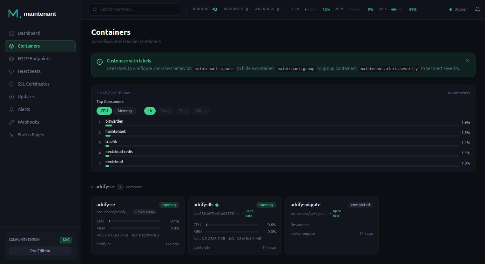

# Container Monitoring

Zero-config auto-discovery for Docker and Kubernetes. Every container is tracked the moment it starts, and containers that are already stopped are listed too. The container runtime is **optional**: endpoint, SSL certificate, and heartbeat monitors continue working fully even without it.



---

## How It Works

maintenant connects to your container runtime (Docker socket or Kubernetes API) and watches for container lifecycle events in real time. There is nothing to configure: every container is discovered automatically.

If the runtime is unreachable at startup, maintenant enters **degraded mode**: it starts normally, all non-container monitors remain fully operational, and container monitoring resumes automatically once the runtime becomes available, with no restart required.

When a new container starts, maintenant immediately begins tracking:

- **State changes**: `running`, `exited`, `completed`, `restarting`, `paused`, `created` or `dead`, with exit codes
- **Health checks**: Docker `HEALTHCHECK` status (healthy, unhealthy, starting)
- **Restart loops**: detection and alerting when a container keeps coming back up after crashing
- **Uptime**: how much of each day the container was running

| State | Meaning |
|-------|---------|
| `running` | The container is up. |
| `exited` | The container stopped with an exit code other than 0, 137 or 143, or was killed. |
| `completed` | The container stopped with exit code 0, 137 (`SIGKILL`, what `docker stop` falls back to) or 143 (`SIGTERM`): a normal end, not a crash. |
| `restarting` | The runtime reports the container as restarting. |
| `paused` | The container is paused. |
| `created` | The container exists but never started. |
| `dead` | The runtime gave up on the container. |

All state transitions are persisted in the database and pushed to the browser via SSE in real time. Raw transitions are kept for 90 days (the latest one of each container is always kept), and the daily uptime computed from them is kept for 365 days.

When a local container dies, the last 50 lines of its logs are stored with the transition, so you can see why it stopped after the container is gone.

---

## Auto-Discovery

=== "Docker"

    maintenant connects to the Docker daemon via the socket (`/var/run/docker.sock`). Mount it as read-only:

    ```yaml
    volumes:
      - /var/run/docker.sock:/var/run/docker.sock:ro
      - /proc:/host/proc:ro
      - /etc/os-release:/host/etc/os-release:ro
    ```

    Every container is discovered automatically, running or not. New containers are picked up the moment they start. maintenant never modifies your containers: it is strictly read-only.

    Containers created by `docker compose run` (Compose one-off containers, labelled `com.docker.compose.oneoff=True`) are skipped entirely: they carry the labels of the service they were run from, and monitoring them would create a duplicate of that service.

    When the image carries OCI labels (`org.opencontainers.image.version`, `source`, `url`, `description`), the container detail panel shows its version, description, and links to the source repository and documentation. The older `org.label-schema.*` labels are read as a fallback, and `org.opencontainers.image.documentation` is used when no URL label is set. See [Image metadata](../guides/docker-labels.md#image-metadata-oci-labels).

    On Docker Swarm, the `deploy.labels` of a service are read too, under the labels of the container itself.

=== "Kubernetes"

    maintenant uses the in-cluster Kubernetes API with a read-only ServiceAccount. It lists and watches:

    - **Deployments**: rollout status, replica counts
    - **StatefulSets**: ordered pod management
    - **DaemonSets**: node-level workloads
    - **Pods with no controller**: bare pods are listed on their own, while pods owned by a controller roll up into their workload

    Each workload gets one of the states above:

    | Workload | State |
    |----------|-------|
    | Deployment | `running` when all desired replicas are ready, or when at least one is (`error_detail` then reads `partial: n/m ready`), `exited` on `ProgressDeadlineExceeded`, `completed` when scaled to 0, `created` otherwise |
    | StatefulSet, DaemonSet | `created` until a pod is ready, `running` after |
    | Bare pod | `running`, `restarting` (`CrashLoopBackOff`), `created` (pending or image pull errors), `exited` (failed or `OOMKilled`), `completed` (succeeded) |

    Workloads carry ready and desired pod counts instead of a Docker health status. See the [Kubernetes Guide](../guides/kubernetes.md) for RBAC setup.

---

## Grouping

Containers are automatically grouped for easy navigation.

=== "Docker"

    - **Compose projects**: containers from the same `docker-compose.yml` are grouped by project name. On Swarm, containers that Compose did not start are grouped by stack (`com.docker.stack.namespace`).
    - **Custom groups**: override with the `maintenant.group` label:

    ```yaml
    labels:
      maintenant.group: "backend"
    ```

    Containers with neither show up under **Ungrouped**.

=== "Kubernetes"

    Workloads are grouped by namespace.

---

## Health Checks

maintenant reads Docker `HEALTHCHECK` results automatically. No configuration needed: if your container defines a health check, maintenant tracks it.

Health states:

| State | Description |
|-------|-------------|
| `healthy` | Health check passing |
| `unhealthy` | Health check failing |
| `starting` | Container just started, health check not yet run |
| none | No health check defined: the API returns `health_status: null` and `has_health_check: false` |

When a container goes from `healthy` to `unhealthy`, maintenant raises a `health_unhealthy` alert at Warning severity through the [Alert Engine](alerts.md), and resolves it when the container is healthy again. A container that never became healthy (`starting` to `unhealthy`) does not raise it, and `maintenant.alert.severity` does not change its severity.

---

## Restart Loop Detection

maintenant counts how many times a container came back to `running` after being `exited` or `restarting` during the last 10 minutes. When that count reaches the restart threshold, a `restart_loop` alert is raised.

- **Threshold**: 3 restarts by default. Set it per container with `maintenant.alert.restart_threshold` (a positive integer; anything else is ignored).
- **Severity**: Warning. The alert escalates in place to Critical when the count reaches three times the threshold (9 restarts with the default). `maintenant.alert.severity` has no effect on it.
- **Not counted**: restarts that follow a `completed` state, such as `docker restart` or a clean stop followed by a start. Only crashes count.
- **Resolution**: automatic. A start that finds the count below the threshold resolves the alert, and while the alert is open maintenant re-checks the running container every minute, so it resolves on its own once the 10-minute window no longer holds enough restarts. A container that is stopped or archived is not re-checked.

```yaml
labels:
  maintenant.alert.restart_threshold: "5"  # Alert after 5 restarts in 10 minutes
```

### Stopped containers

A container that stops and stays stopped raises no restart alert. Set `MAINTENANT_CONTAINER_DOWN_AFTER` (for example `5m`) and a `container_down` alert fires for any container that stays `exited` or `dead` for that long, at the severity of the container's `maintenant.alert.severity` (Warning by default). It resolves when the container runs again. See [Alert Engine](alerts.md).

---

## Log Streaming

maintenant provides real-time log streaming, with stdout and stderr interleaved in a single stream. Logs are streamed directly from the container runtime: they are not stored in maintenant's database, except for the snippet kept when a container dies (see [How It Works](#how-it-works)).

Access logs via the API:

- `GET /api/v1/containers/{id}/logs`: fetch recent logs. `lines` defaults to 100 and is capped at 500, `timestamps=true` prefixes each line with its time.
- `GET /api/v1/containers/{id}/logs/stream`: SSE stream of live logs. It emits `container.log_line` events, then a final `container.log_error` event when the container stops. `lines` sets the initial backlog (default 100, maximum 500). On Kubernetes, `container` selects a container of the pod.

Containers of a [remote agent](multihost.md) are read through that agent. A tail waits at most 15 seconds, and an agent serves four live streams at a time. The API answers `AGENT_OFFLINE` (503), `AGENT_TOO_OLD` (501), `LOGS_BUSY` (429) or `LOGS_TIMEOUT` (504) when it cannot.

---

## Excluding Containers

To exclude a container from maintenant monitoring:

```yaml
labels:
  maintenant.ignore: "true"
```

`true` and `1` are accepted, as a Docker or Swarm service label or as a Kubernetes annotation. This is useful for infrastructure containers (reverse proxies, sidecars) that add noise to your dashboard.

An ignored container is still known to maintenant but is left alone:

- it is hidden from the container list and the dashboard,
- no state or health change is recorded, and no `container.state_changed` or `container.discovered` event is sent over SSE or webhooks,
- it raises no alert (restart loop, health, container down),
- it gets no security insight and no resource sample,
- it is left out of update checks,
- the endpoint and certificate monitors that its labels would create are not created.

Settings read from labels and annotations (`ignore`, `group`, severity, restart threshold) are refreshed when maintenant reconciles with the runtime, at startup and after a reconnection. After changing a label on an existing Swarm service or Kubernetes workload, restart maintenant to apply it without waiting.

---

## Uptime

The container detail panel shows the share of each day the container was `running` and not `unhealthy`, for up to 365 days:

```
GET /api/v1/containers/{id}/uptime/daily?days=90
```

The response has one entry per UTC day, most recent first, each with `date`, `uptime_percent` (`null` for a day maintenant has no data for) and `incident_count` (transitions from up to not up). `days` defaults to 90 and is capped at 365. The state timeline is available at `GET /api/v1/containers/{id}/transitions`.

Completed days are aggregated once a day ends, so the history outlives the raw transitions. Days that were already past the raw retention when this aggregation appeared are not recovered, and an archived container has no value after its archival.

---

## Security Insights

Each container's detail panel displays network security insights detected by maintenant's analyzer. These include exposed ports binding to `0.0.0.0`, database ports without restriction, host-network mode, and privileged containers. For Kubernetes workloads, the insights come from the `LoadBalancer` and `NodePort` Services that expose them.

See [Network Security Insights](security.md) for full details.

---

## Degraded Mode

If the container runtime (Docker socket or Kubernetes API) is unavailable when maintenant starts, or becomes unavailable while running, container monitoring enters **degraded mode**:

- The app starts and serves the full UI and API normally.
- Endpoint, SSL certificate, and heartbeat monitors are **unaffected**: they continue checking and alerting as usual.
- Container list and detail pages show **last-known data** (marked as stale) so history is preserved.
- Live operations (log streaming, real-time stats) return a clear error instead of crashing.
- A non-blocking banner appears on the Containers and Dashboard pages.
- The runtime availability is exposed on `GET /api/v1/health` (`runtime.connected: false`) and broadcast in real time via SSE when the state changes.

**Automatic recovery**: maintenant retries the runtime connection in the background. When the runtime becomes reachable again, container monitoring resumes (reconciliation runs, the event stream restarts, and the banner disappears), all without a restart.

On Kubernetes the runtime retries indefinitely with a backoff, and it is considered lost after about 45 seconds without an answer from the API server (three missed probes, 15 seconds apart). When maintenant starts outside a cluster with a kubeconfig whose cluster does not answer, it falls back to Docker and logs a warning, unless `MAINTENANT_RUNTIME=kubernetes` makes it wait for that cluster.

This makes it safe to run maintenant without mounting the Docker socket, or to temporarily stop Docker during a host maintenance window while keeping all other monitors active.

---

## Related

- [Docker Labels Reference](../guides/docker-labels.md): full list of container labels
- [Alert Engine](alerts.md): configure alerts for container events
- [Resource Metrics](resources.md): CPU, memory, and network metrics per container
- [Network Security Insights](security.md): port exposure and network misconfiguration detection
