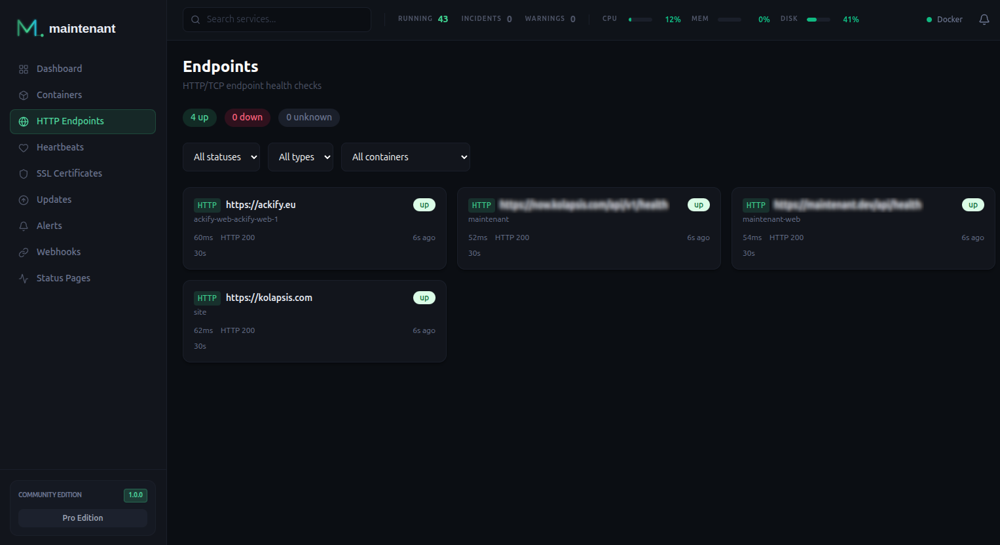

# Endpoint Monitoring

Define HTTP or TCP checks directly as Docker labels: no config files, no UI clicks. maintenant picks them up automatically when a container starts. Checks for targets that do not belong to a container can be added by hand, through the UI or the API.



---

## How It Works

maintenant reads endpoint definitions from Docker labels on your containers. When a container with endpoint labels starts, maintenant automatically begins monitoring those endpoints at the configured interval. A stopped container pauses its checks and its endpoints show `unknown` ("container stopped") until it starts again.

Each check records:

- **Response time**: how long the endpoint took to respond
- **Status**: `up`, `down`, `degraded` or `unknown`, based on the HTTP status code or the TCP connection
- **Uptime history**: daily uptime percentages and sparkline charts

An endpoint is `degraded` when the host answers but its TLS certificate is not trusted (see [Untrusted certificates](certificates.md#untrusted-certificates-are-degraded-not-down)), and `unknown` until its first check.

When the container behind a label-discovered endpoint disappears, or the label is removed, the endpoint
is **retired**: checks stop and it leaves the list. Retirement happens on the
container's `destroy` event, and again at every startup for anything that
vanished while the instance was down.

Retired endpoints are hidden by default; the **Include retired** filter (`include_inactive=true` in the API) brings
them back so you can delete them without waiting for retention, which removes them for good 30 days after they were last seen. A
label endpoint whose container is still running cannot be deleted: the next
discovery pass would recreate it. Remove the label, or the container.

---

## Quick Start

Add labels to any container in your `docker-compose.yml`:

```yaml
services:
  api:
    image: myapp:latest
    labels:
      maintenant.endpoint.http: "http://api:3000/health"
      maintenant.endpoint.interval: "15s"
```

That is it. maintenant starts checking `http://api:3000/health` every 15 seconds as soon as the container starts.

---

## HTTP Checks

HTTP checks send a request to the configured URL and validate the response status code. The URL needs an `http://` or `https://` scheme and a host.

```yaml
labels:
  maintenant.endpoint.http: "https://api:8443/health"
```

### Configuration Options

| Label | Default | Description |
|-------|---------|-------------|
| `maintenant.endpoint.http` | none | URL to check (required for HTTP) |
| `maintenant.endpoint.http.method` | `GET` | HTTP method: `GET`, `HEAD`, `POST`, `PUT`, `DELETE`, `PATCH` or `OPTIONS` |
| `maintenant.endpoint.http.expected-status` | `2xx` | Accepted status codes, comma-separated. Each entry is an exact code (`200,201`) or a range (`2xx,301`) |
| `maintenant.endpoint.http.tls-verify` | `true` | Verify TLS certificates. Set to `false` for self-signed certs. |
| `maintenant.endpoint.http.headers` | none | Request headers, as a JSON object or as `Name=value,Name2=value2` |
| `maintenant.endpoint.http.max-redirects` | `5` | Redirects to follow. Past the limit, the last response is judged against `expected-status` |
| `maintenant.endpoint.interval` | `30s` | Check interval (Go duration format), at least `5s`: a shorter value is raised to 5 seconds and a warning is logged |
| `maintenant.endpoint.timeout` | `10s` | Request timeout. A value above the interval is lowered to the interval |
| `maintenant.endpoint.failure-threshold` | `3` | Consecutive failures before the `consecutive_failure` alert is raised |
| `maintenant.endpoint.recovery-threshold` | `2` | Consecutive successes before that alert is resolved |

A value that cannot be parsed is ignored and the default applies; a malformed target is skipped and reported on the `endpoint.config_error` event.

---

## TCP Checks

TCP checks attempt to establish a connection to the configured host and port. The target is `host:port`, with a port from 1 to 65535.

```yaml
labels:
  maintenant.endpoint.tcp: "postgres:5432"
```

Useful for databases, caches, and services that do not expose HTTP endpoints.

---

## Multiple Endpoints per Container

Use indexed labels to monitor multiple endpoints from a single container:

```yaml
labels:
  # First endpoint: HTTP health check
  maintenant.endpoint.0.http: "https://app:8443/health"
  maintenant.endpoint.0.interval: "15s"
  maintenant.endpoint.0.failure-threshold: "3"

  # Second endpoint: Redis TCP check
  maintenant.endpoint.1.tcp: "redis:6379"
  maintenant.endpoint.1.interval: "30s"
```

Labels without an index (`maintenant.endpoint.interval`) apply to every endpoint of the container, and an indexed label overrides them for its endpoint.

!!! info "Indexed vs simple labels"
    You can use either **simple** labels (`maintenant.endpoint.http`) for a single endpoint
    or **indexed** labels (`maintenant.endpoint.0.http`, `maintenant.endpoint.1.tcp`) for multiple
    endpoints. Do not mix both styles on the same container: a simple target takes the place of index 0.

---

## Status, Failure and Recovery Thresholds

The status of an endpoint follows the last check: it turns `down` at the first failed check and back to `up` at the first successful one.

The thresholds do not delay that status. They control the **alert**, which prevents pages for transient network issues:

```yaml
labels:
  maintenant.endpoint.http: "https://api:3000/health"
  maintenant.endpoint.failure-threshold: "3"   # 3 consecutive failures = alert (default)
  maintenant.endpoint.recovery-threshold: "2"  # 2 consecutive successes = resolved (default)
```

- **failure-threshold**: number of consecutive failures before a Critical `consecutive_failure` alert is raised.
- **recovery-threshold**: number of consecutive successes before that alert is resolved.

A `degraded` result counts as a success for both thresholds and for uptime. It raises its own `certificate_untrusted` alert at Warning severity.

---

## Uptime History and Sparklines

maintenant records every check result and computes:

- **Uptime percentages**: 1 hour, 24 hours, 7 days and 30 days, returned with `GET /api/v1/endpoints/{id}`
- **Daily uptime**: one percentage per UTC day for up to 365 days, available via `GET /api/v1/endpoints/{id}/uptime/daily?days=90` (`days` defaults to 90 and is capped at 365). The interface shows 90 days.
- **Response time trends**: visualized as sparkline charts in the dashboard

Raw check results are kept for 30 days. Each completed day is aggregated into a daily uptime that is kept for 365 days, so the long history does not depend on the raw rows.

---

## Manual Endpoints

An endpoint does not have to come from a label. Create one from the Endpoints page or through the API, for a service on another machine or one that is not in a container:

```bash
POST /api/v1/endpoints
{
  "name": "Status page",
  "endpoint_type": "http",
  "target": "https://status.example.com/health",
  "interval": "30s",
  "timeout": "10s",
  "method": "GET",
  "headers": { "Authorization": "Bearer …" }
}
```

`name`, `endpoint_type` (`http` or `tcp`) and `target` are required. The target is validated on creation and on update, with the same rules as for labels: an HTTP target needs an `http://` or `https://` scheme and a host, a TCP target must be `host:port` with a port from 1 to 65535, otherwise the call answers `400 INVALID_INPUT`. `interval` must be at least 5 seconds, `timeout` at least 1 second and no longer than the interval. Thresholds, expected status, TLS verification and redirects take their defaults (3, 2, `2xx`, on, 5).

| Method | Endpoint | Description |
|--------|----------|-------------|
| `GET` | `/api/v1/endpoints` | List endpoints (filters `status`, `type`, `source`, `container` by container name, `agent_id`, `include_inactive`) |
| `GET` | `/api/v1/containers/{id}/endpoints` | Endpoints of one container |
| `POST` | `/api/v1/endpoints` | Create a manual endpoint |
| `GET` | `/api/v1/endpoints/{id}` | Endpoint details and uptime percentages |
| `PUT` | `/api/v1/endpoints/{id}` | Update a manual endpoint (`400 NOT_STANDALONE` for a label endpoint) |
| `DELETE` | `/api/v1/endpoints/{id}` | Delete an endpoint (`409 ENDPOINT_LIVE` for a label endpoint whose container still runs) |
| `GET` | `/api/v1/endpoints/{id}/checks` | Check history (`limit`, `offset`, `since` as epoch seconds) |
| `POST` | `/api/v1/endpoints/{id}/check` | Check now, processed like a scheduled check |
| `GET` | `/api/v1/endpoints/{id}/uptime/daily` | Daily uptime |

Only endpoints the server probes can be checked on demand: an endpoint probed by a remote agent answers `409 AGENT_PROBED`, and a second check while one is running answers `409 CHECK_IN_PROGRESS`.

Community is limited to **10 manual endpoints**. Endpoints created from labels are not counted, and Personal and Pro have no cap. Above the cap, creation answers `403 QUOTA_EXCEEDED`.

!!! note "Probes are not restricted to public addresses"
    A check can target a private, loopback or link-local address: that is how a container is reached by its name on the Docker network. maintenant logs a warning, once per endpoint, when a target resolves to a loopback, link-local or cloud metadata address. Since the API has no authentication of its own, keep it behind a reverse proxy (see [Security](../security.md)).

---

## Endpoints from reverse proxy labels

If your containers already carry Traefik or Caddy docker-proxy labels, set `MAINTENANT_PROXY_LABELS=true` and maintenant creates an HTTP endpoint from them, with no `maintenant.endpoint.*` label to write. A container gets **one** endpoint: when its labels route several hostnames, maintenant keeps one URL, preferring routes without an authentication middleware, then the shortest path, then HTTPS. The expected status defaults to `2xx,3xx` (unless the container sets `maintenant.endpoint.http.expected-status`), because a protected or redirecting route answers with a redirect, and a Caddy site served with `tls internal` is probed without TLS verification. The HTTPS hostname of the retained route is also added to the container's certificate monitors (see [TLS Certificate Monitoring](certificates.md#docker-labels)). A container that declares its own endpoint target keeps full control, `maintenant.proxy-labels: "false"` opts a container out, and `traefik.enable: "false"` leaves out its Traefik routes. See [Reverse proxy labels](../guides/docker-labels.md#reverse-proxy-labels-traefik-caddy).

---

## Containers on remote hosts

Endpoints declared on the containers of a [remote agent](multihost.md) are probed by that agent, from its own network, at the interval and timeout their labels set. The agent re-reads the labels every 30 seconds. The server never probes them, and while an agent is offline its endpoints are flagged stale. Results an agent could not deliver during an outage are replayed afterwards and feed the uptime history only.

---

## Events

Endpoint events are broadcast on the SSE stream (`GET /api/v1/containers/events`), for label, manual and agent-probed endpoints alike:

| Event | Sent when | Main fields |
|-------|-----------|-------------|
| `endpoint.discovered` | A label endpoint is found or a manual one is created | `endpoint_id`, `container_name`, `endpoint_type`, `target` |
| `endpoint.status_changed` | The status moves between `up`, `down`, `degraded` and `unknown` | `endpoint_id`, `container_name`, `target`, `previous_status`, `new_status`, `response_time_ms`, `http_status`, `error`, `timestamp`, `agent_id` |
| `endpoint.removed` | An endpoint is retired or deleted | `endpoint_id`, `reason` (`label_removed`, `container_destroyed`, `container_gone` or `user_deleted`), and `container_name` except for `user_deleted` |
| `endpoint.alert` | The failure threshold is reached | `endpoint_id`, `container_name`, `target`, `consecutive_failures`, `threshold`, `last_error`, `timestamp` |
| `endpoint.recovery` | The recovery threshold is reached | `endpoint_id`, `container_name`, `target`, `consecutive_successes`, `threshold`, `timestamp` |
| `endpoint.config_error` | A label target is malformed | `endpoint_id` (always `null`), `container_name`, `label_key`, `error`, `timestamp` |

[Webhook subscriptions](../api/reference.md#webhooks) receive `endpoint.discovered`, `endpoint.status_changed` and `endpoint.removed` under the single type `endpoint.status_changed`, with the payload above as `data`. `endpoint.alert`, `endpoint.recovery` and `endpoint.config_error` are not sent to webhooks: the alert itself reaches them as `alert.fired` and `alert.resolved`.

---

## Related

- [Docker Labels Reference](../guides/docker-labels.md): complete label reference
- [TLS Certificate Monitoring](certificates.md): HTTPS endpoints probed by the server automatically get certificate monitoring
- [Alert Engine](alerts.md): configure alerts for endpoint failures
