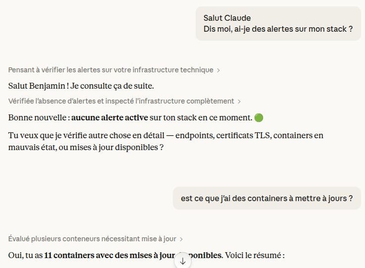

# MCP Server

Expose maintenant monitoring data to AI coding assistants (Claude Code, Claude Desktop, Cursor, Windsurf) via the [Model Context Protocol](https://modelcontextprotocol.io/). Query container states, resource metrics, endpoint health, and more — directly from your editor.



---

## Overview

maintenant embeds an MCP server that provides 44 tools covering every monitoring dimension — containers, endpoints, heartbeats, certificates, resources, alerts, image updates, security insights, CVEs, Kubernetes, Docker Swarm, alert routing, and the status page. AI assistants can use these tools to diagnose issues, correlate data, and act on them without you ever leaving your editor.

**Transports:**

| Transport | Use case | Auth |
|-----------|----------|------|
| **Stdio** (`--mcp-stdio`) | Local development, Claude Code | None (trusted local) |
| **Streamable HTTP** (`/mcp`) | Remote access, Claude web/mobile, Claude Desktop | OAuth2 (client_id + secret) |

---

## Getting Started

### Claude Code (stdio)

Add to your Claude Code MCP settings:

```json
{
  "mcpServers": {
    "maintenant": {
      "command": "maintenant",
      "args": ["--mcp-stdio"],
      "env": {
        "MAINTENANT_DB": "/path/to/maintenant.db"
      }
    }
  }
}
```

### Claude web / Claude Desktop / Cursor (Streamable HTTP)

1. Enable the MCP server and configure OAuth2 credentials:

```bash
MAINTENANT_MCP=true
MAINTENANT_MCP_CLIENT_ID=my-mcp-client
MAINTENANT_MCP_CLIENT_SECRET=a-strong-random-secret
MAINTENANT_BASE_URL=https://now.example.com
```

2. In Claude's settings, add your maintenant instance as a remote MCP server:
   - **URL**: `https://now.example.com/mcp`
   - **Advanced Settings**: enter the `client_id` and `client_secret` you configured above.

3. Claude will automatically discover the OAuth2 endpoints, authorize, and connect. No manual token exchange required.

---

## Authentication

### Stdio

No authentication. The stdio transport is a local, trusted channel — only the process that spawned maintenant can communicate with it. The `--mcp-stdio` flag is independent of `MAINTENANT_MCP`.

### Streamable HTTP (OAuth2)

When `MAINTENANT_MCP_CLIENT_ID` and `MAINTENANT_MCP_CLIENT_SECRET` are both set, maintenant runs a full OAuth2 authorization server implementing the flow required by the MCP specification (2025-11-25):

1. **Discovery** — The client fetches `/.well-known/oauth-protected-resource` ([RFC 9728](https://www.rfc-editor.org/rfc/rfc9728)) and `/.well-known/oauth-authorization-server` ([RFC 8414](https://www.rfc-editor.org/rfc/rfc8414)) to discover endpoints.
2. **Authorization** — The client redirects to `/oauth/authorize` with PKCE (S256). maintenant validates the client credentials and auto-approves (no consent page).
3. **Token exchange** — The client exchanges the authorization code at `/oauth/token` for an access token (1h) and a refresh token (30d).
4. **Authenticated requests** — The client sends `Authorization: Bearer <token>` on every `/mcp` request.
5. **Token refresh** — When the access token expires, the client silently uses the refresh token to obtain new tokens.

**Access control** is based on knowledge of the client secret. The administrator generates the credentials and shares them with authorized users, who enter them in Claude's Advanced Settings. There is no user login page — maintenant has no user authentication system.

When the OAuth2 variables are absent, the HTTP transport is open. Use your reverse proxy's auth layer to protect it.

### OAuth2 Endpoints

| Endpoint | Method | Description |
|----------|--------|-------------|
| `/.well-known/oauth-protected-resource` | GET | Protected resource metadata (RFC 9728). Public. |
| `/.well-known/oauth-authorization-server` | GET | Authorization server metadata (RFC 8414). Public. |
| `/oauth/authorize` | GET | Authorization endpoint. Validates client credentials + PKCE, auto-approves, redirects with code. |
| `/oauth/token` | POST | Token endpoint. Exchanges code for tokens (`authorization_code`) or refreshes (`refresh_token`). |

### Security Details

- **PKCE S256** is mandatory on all authorization requests.
- **Tokens are opaque** (random 32 bytes, hex-encoded). They are stored as SHA-256 hashes — even a database leak does not expose usable tokens.
- **Refresh token rotation** — each use of a refresh token invalidates it and issues a new one.
- **Replay detection** — reusing an already-consumed refresh token revokes all tokens in the session (family), forcing re-authorization.
- **Automatic cleanup** — expired tokens and codes are garbage-collected every 15 minutes.
- **Client secret comparison** uses constant-time comparison to prevent timing attacks.

---

## Configuration

| Variable | Default | Description |
|----------|---------|-------------|
| `MAINTENANT_MCP` | `false` | Enable the Streamable HTTP MCP server on `/mcp`. |
| `MAINTENANT_MCP_CLIENT_ID` | — | OAuth2 client identifier. Required for authentication. |
| `MAINTENANT_MCP_CLIENT_SECRET` | — | OAuth2 client secret. Required for authentication. |
| `MAINTENANT_MCP_ALLOWED_REDIRECT_URIS` | — | Comma-separated allowlist of OAuth2 `redirect_uri` values. Required when client credentials are set. |
| `MAINTENANT_MCP_ALLOW_UNAUTHENTICATED` | `false` | Serve `/mcp` with no authentication at all. Without it, `MAINTENANT_MCP=true` with no client credentials refuses to start. Trusted networks only; `--mcp-stdio` never needs it. |
| `MAINTENANT_BASE_URL` | `http://localhost:8080` | Public-facing URL. Used as OAuth2 issuer and in metadata endpoints. |

`MAINTENANT_MCP_ALLOWED_REDIRECT_URIS` accepts an exact list of full URIs. Any `redirect_uri` submitted to `/oauth/authorize` is matched against the list with simple string comparison ([RFC 6749 §3.1.2.3](https://www.rfc-editor.org/rfc/rfc6749#section-3.1.2.3)); anything that does not match an entry exactly is rejected, closing the open-redirect path. Use the full callback URI, not just the origin.

Loopback callbacks (`localhost` / `127.0.0.1` / `::1`, any port or path, `http` or `https`) are **always accepted** without configuration, so local clients such as Claude Desktop and Claude Code work out of the box. Only remote callbacks (Claude web/mobile) need to be listed. Common values:

- Claude web — `https://claude.ai/api/mcp/auth_callback`
- Claude Desktop — `http://localhost:33418/oauth/callback` (loopback, accepted automatically)
- Claude mobile — see Claude documentation for the current callback host.

The `--mcp-stdio` flag is independent of these variables — it runs the MCP server over stdin/stdout and exits when the connection closes.

### Generating Credentials

Use any random string generator for the client ID and secret:

```bash
# Example using openssl
export MAINTENANT_MCP_CLIENT_ID="maintenant-mcp"
export MAINTENANT_MCP_CLIENT_SECRET=$(openssl rand -hex 32)
```

Share the client ID and secret with authorized users. They enter these values in Claude's Advanced Settings when adding the remote MCP server.

---

## Available Tools

The **Edition** column is the minimum a tool needs. Below it, the tool returns an
`edition_required` error naming the capability and the edition that grants it.
That is the same decision the REST API makes, from the same table. Every tool is
read-only except the ones listed under [Actions](#actions-write).

One tool is not a plain yes or no: `get_top_consumers` ranks either the live
samples or a history window, and how far back a window may go depends on the
edition. The live ranking (`period` omitted, or `"current"`) is open everywhere;
a `period` of `1h`, `6h`, `24h`, `7d`, `30d` or `90d` is held to the same cap as
the charts (Community up to 6h, Personal up to 30d, Pro up to 90d), and a window
above it returns `edition_required` carrying `window` and `max_window`.
See [Resource Metrics](resources.md#historical-charts). An MCP client has no
interface in front of it, which is exactly why the cap is enforced here and not
only in the web UI.

### Monitoring (read)

| Tool | Description | Edition |
|------|-------------|---------|
| `list_containers` | List all monitored containers with state, health, and metadata | Community |
| `get_container` | Detailed container info with recent state transitions | Community |
| `get_container_logs` | Recent log lines from a container (configurable line count) | Community |
| `list_endpoints` | All HTTP/TCP endpoints with status, response time, uptime | Community |
| `get_endpoint_history` | Check history for a specific endpoint | Community |
| `list_heartbeats` | All heartbeat monitors with status, last ping, periods | Community |
| `list_certificates` | TLS certificates with expiration, issuer, chain validity | Community |
| `list_alerts` | Active alerts (or recent resolved/silenced ones with `active_only: false`) | Community |
| `get_resources` | Host resource summary: CPU, memory, network, disk | Community |
| `get_top_consumers` | Containers ranked by CPU or memory usage, live or over a history window | Community (see below) |
| `get_updates` | Available image updates for monitored containers | Community |
| `get_health` | maintenant version, runtime, and status | Community |
| `list_agents` | Registered remote agents with connection state and runtime | Personal |

### Security & supply chain (read)

| Tool | Description | Edition |
|------|-------------|---------|
| `get_security_insights` | Security insights (dangerous runtime configs), all containers or one, with a severity summary | Community |
| `list_cve` | Active CVE vulnerabilities in container images, filterable by container or minimum severity | Personal |
| `list_risk_scores` | Image-update risk scores per container (0–100) with risk level | Personal |
| `get_security_posture` | Infrastructure posture score, or a single container's posture | Personal |

### Kubernetes (read)

| Tool | Description | Edition |
|------|-------------|---------|
| `list_kubernetes_namespaces` | Namespaces known across monitored clusters | Community |
| `list_kubernetes_workloads` | Workloads grouped by namespace with ready/desired replicas and status | Community |
| `list_kubernetes_pods` | Pods with status, restart count and node (filter by namespace/workload/node/status) | Community |
| `list_kubernetes_nodes` | Nodes with roles, conditions, capacity and running-pod counts | Community |

### Docker Swarm (read)

| Tool | Description | Edition |
|------|-------------|---------|
| `get_swarm_info` | Cluster info (manager/worker counts, manager status); reports inactive when Swarm is off | Community |
| `list_swarm_services` | Services with image, mode, desired/running replicas | Community |
| `list_swarm_tasks` | Tasks (a service's running units) with state and node; filter by service | Community |
| `list_swarm_nodes` | Nodes with role, status, availability and task count | Community |

### Alert routing (read & write)

| Tool | Description | Edition |
|------|-------------|---------|
| `list_triggers` / `get_trigger` | List or fetch alert triggers (entity → channel routing) | Community |
| `create_trigger` / `update_trigger` / `delete_trigger` | Manage alert triggers (scope/tag filters require Personal) | Community |
| `list_escalation_policies` / `get_escalation_policy` | List or fetch escalation policies | Pro |
| `create_escalation_policy` / `update_escalation_policy` / `delete_escalation_policy` | Manage escalation policies | Pro |
| `set_escalation_policy_active` | Enable or disable a policy | Pro |
| `list_alert_escalation_runs` / `get_escalation_run` | Inspect escalation runs for an alert | Pro |

### Actions (write)

| Tool | Description | Edition |
|------|-------------|---------|
| `acknowledge_alert` | Acknowledge an active alert (stops escalation) | Community |
| `pause_monitor` | Pause a heartbeat monitor | Community |
| `resume_monitor` | Resume a paused heartbeat monitor | Community |
| `create_incident` | Create a status page incident | Pro |
| `update_incident` | Post a status update to an incident | Pro |
| `create_maintenance` | Schedule a maintenance window | Pro |

---

## Example Prompts

Once connected, you can ask your AI assistant questions like:

- "Which containers are unhealthy right now?"
- "Show me the logs for the postgres container."
- "What's consuming the most CPU?"
- "Are there any active alerts? Acknowledge the one for the API."
- "Which certificates expire within 30 days?"
- "Are there image updates available for my containers?"
- "Pause the backup-check heartbeat monitor."
- "Any critical CVEs in my images? What's my security posture?"
- "List the Kubernetes workloads that aren't fully ready."
- "Show the Swarm services and how many replicas are running."
- "Open a status page incident: API degraded, investigating."

---

## Proxy Configuration

If maintenant runs behind a reverse proxy, the `/mcp` and `/oauth/*` paths require special handling:

- **No request timeout** — MCP uses SSE for server-to-client streaming, which requires long-lived connections.
- **No buffering** — Disable response buffering for `/mcp` to allow real-time SSE delivery.
- **Pass-through for OAuth** — The `/oauth/authorize` endpoint issues 302 redirects. Ensure your proxy does not intercept them.

### Traefik Example

```yaml
labels:
  traefik.http.routers.maintenant-mcp.rule: "Host(`now.example.com`) && PathPrefix(`/mcp`)"
  traefik.http.services.maintenant-mcp.loadbalancer.server.port: "8080"
```

### Caddy Example

```
now.example.com {
    reverse_proxy maintenant:8080
}
```

No special configuration needed — Caddy handles SSE and redirects natively.

---

## Related

- [Container Monitoring](containers.md) — Container states and health exposed via `list_containers`, `get_container`
- [Endpoint Monitoring](endpoints.md) — Endpoint health via `list_endpoints`, `get_endpoint_history`
- [Heartbeat Monitoring](heartbeats.md) — Heartbeat status via `list_heartbeats`, `pause_monitor`
- [Certificate Monitoring](certificates.md) — Certificate expiry via `list_certificates`
- [Resource Metrics](resources.md) — Resource usage via `get_resources`, `get_top_consumers`
- [Alert Engine](alerts.md) — Active alerts via `list_alerts`, acknowledgement and triggers
- [Alert Escalation](alert-escalation.md) — Escalation policies via `list_escalation_policies` and related tools
- [Network Security Insights](security.md) — Insights, CVEs and posture via `get_security_insights`, `list_cve`, `get_security_posture`
- [Update Intelligence](updates.md) — Image updates via `get_updates`, CVEs via `list_cve`, risk via `list_risk_scores`
