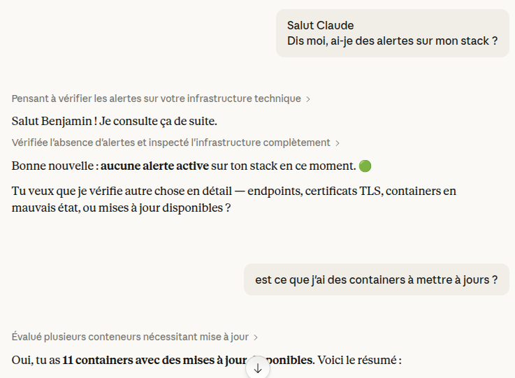

# MCP Server

Expose maintenant monitoring data to AI coding assistants (Claude Code, Claude Desktop, Cursor, Windsurf) via the [Model Context Protocol](https://modelcontextprotocol.io/). Query container states, resource metrics, endpoint health, and more, directly from your editor.



---

## Overview

maintenant embeds an MCP server that provides 51 tools covering every monitoring dimension: containers, endpoints, heartbeats, certificates, resources, alerts, image updates, security insights, CVEs, Kubernetes, Docker Swarm, alert routing, and the status page. AI assistants can use these tools to diagnose issues, correlate data, and act on them without you ever leaving your editor.

In a demo build, `/mcp` and the OAuth routes are not served, and the MCP server registers only its 34 read-only tools.

**Transports:**

| Transport | Use case | Auth |
|-----------|----------|------|
| **Stdio** (`--mcp-stdio`) | Local development, Claude Code | None (trusted local) |
| **Streamable HTTP** (`/mcp`) | Remote access, Claude web/mobile, Claude Desktop | OAuth2 (client_id + secret), or none with an explicit opt-out |

---

## Getting Started

### Claude Code (stdio)

Add to your Claude Code MCP settings:

```json
{
  "mcpServers": {
    "maintenant": {
      "command": "maintenant",
      "args": ["--mcp-stdio"],
      "env": {
        "MAINTENANT_DB": "/path/to/maintenant.db"
      }
    }
  }
}
```

### Claude web / Claude Desktop / Cursor (Streamable HTTP)

1. Enable the MCP server and configure OAuth2 credentials:

```bash
MAINTENANT_MCP=true
MAINTENANT_MCP_CLIENT_ID=my-mcp-client
MAINTENANT_MCP_CLIENT_SECRET=a-strong-random-secret   # openssl rand -hex 32
MAINTENANT_BASE_URL=https://now.example.com
MAINTENANT_MCP_ALLOWED_REDIRECT_URIS=https://claude.ai/api/mcp/auth_callback
```

2. In Claude's settings, add your maintenant instance as a remote MCP server:
   - **URL**: `https://now.example.com/mcp`
   - **Advanced Settings**: enter the `client_id` and `client_secret` you configured above.

3. Claude will automatically discover the OAuth2 endpoints, authorize, and connect. No manual token exchange required.

---

## Authentication

### Stdio

No authentication. The stdio transport is a local, trusted channel: only the process that spawned maintenant can communicate with it. The `--mcp-stdio` flag is independent of `MAINTENANT_MCP`. It must be the first argument, and in this mode the logs go to stderr so that stdout carries only the protocol.

### Streamable HTTP (OAuth2)

When `MAINTENANT_MCP_CLIENT_ID` and `MAINTENANT_MCP_CLIENT_SECRET` are both set, maintenant runs a small OAuth2 authorization server for `/mcp`: one static client, authorization code flow with PKCE, no dynamic client registration.

1. **Discovery**: The client fetches `/.well-known/oauth-protected-resource` ([RFC 9728](https://www.rfc-editor.org/rfc/rfc9728)) and `/.well-known/oauth-authorization-server` ([RFC 8414](https://www.rfc-editor.org/rfc/rfc8414)) to discover endpoints.
2. **Authorization**: The client redirects to `/oauth/authorize` with PKCE (S256). maintenant checks the `client_id`, the `redirect_uri` and the PKCE challenge, then approves on its own: there is no login and no consent page. The client secret is not involved at this step.
3. **Token exchange**: The client exchanges the authorization code at `/oauth/token`, sending `client_id` and `client_secret` in the form body (`client_secret_post`), for an access token (1 hour) and a refresh token (30 days). An authorization code is valid for 10 minutes and works once.
4. **Authenticated requests**: The client sends `Authorization: Bearer <token>` on every `/mcp` request.
5. **Token refresh**: When the access token expires, the client uses the refresh token to obtain a new pair.

**The client secret is the only access control.** Anyone who can reach `/oauth/authorize` with the right `client_id` gets a code, but cannot turn it into a token without the secret. The administrator generates the credentials and shares them with authorized users, who enter them in Claude's Advanced Settings. There is no user login page: maintenant has no user authentication system. At startup, maintenant logs a warning when the secret is shorter than 32 characters.

**Without OAuth credentials, maintenant refuses to start** when `MAINTENANT_MCP=true`: the error names `MAINTENANT_MCP_CLIENT_ID` and `MAINTENANT_MCP_CLIENT_SECRET`, because `/mcp` is meant to bypass the reverse proxy's authentication and would otherwise answer anyone. If only one of the two is set, it counts as missing. To serve `/mcp` with no authentication on a trusted network, set `MAINTENANT_MCP_ALLOW_UNAUTHENTICATED=true`; the startup log then carries a warning.

### OAuth2 Endpoints

| Endpoint | Method | Description |
|----------|--------|-------------|
| `/.well-known/oauth-protected-resource` | GET | Protected resource metadata (RFC 9728). Public. |
| `/.well-known/oauth-authorization-server` | GET | Authorization server metadata (RFC 8414). Public. |
| `/oauth/authorize` | GET | Authorization endpoint. Validates `client_id`, `redirect_uri` and PKCE, auto-approves, redirects with the code (`302`). |
| `/oauth/token` | POST | Token endpoint. Checks `client_id` and `client_secret`, then exchanges a code (`authorization_code`) or refreshes (`refresh_token`). |

These four routes are served only when `MAINTENANT_MCP=true` and both OAuth credentials are set.

### Security Details

- **PKCE S256** is mandatory on all authorization requests, and the verifier is checked at the token endpoint.
- **Tokens are opaque** (random 32 bytes, hex-encoded). They are stored as SHA-256 hashes: even a database leak does not expose usable tokens.
- **The client secret is not stored.** maintenant reads it from the environment and keeps only its hash in memory.
- **Refresh token rotation**: each use of a refresh token invalidates it and issues a new one.
- **Replay detection**: reusing an already-consumed refresh token revokes all tokens in the session (family), forcing re-authorization.
- **Automatic cleanup**: expired tokens and codes are garbage-collected every 15 minutes.
- **Client secret comparison** uses constant-time comparison to prevent timing attacks.
- **Redirect allowlist**: a code is only ever sent to a loopback callback or to a URI listed in `MAINTENANT_MCP_ALLOWED_REDIRECT_URIS`, see [Configuration](#configuration).

---

## Configuration

| Variable | Default | Description |
|----------|---------|-------------|
| `MAINTENANT_MCP` | `false` | Enable the Streamable HTTP MCP server on `/mcp`. |
| `MAINTENANT_MCP_CLIENT_ID` | — | OAuth2 client identifier. Both this and the secret are required for `MAINTENANT_MCP=true`, unless `MAINTENANT_MCP_ALLOW_UNAUTHENTICATED` is set. |
| `MAINTENANT_MCP_CLIENT_SECRET` | — | OAuth2 client secret, at least 32 characters recommended (`openssl rand -hex 32`). |
| `MAINTENANT_MCP_ALLOWED_REDIRECT_URIS` | — | Comma-separated allowlist of remote OAuth2 `redirect_uri` values. Loopback callbacks need no entry. |
| `MAINTENANT_MCP_ALLOW_UNAUTHENTICATED` | `false` | Serve `/mcp` with no authentication at all. Without it, `MAINTENANT_MCP=true` with no client credentials refuses to start. Trusted networks only; `--mcp-stdio` never needs it. |
| `MAINTENANT_BASE_URL` | `http://<MAINTENANT_ADDR>` (`http://127.0.0.1:8080` by default) | Public-facing URL. Used as the OAuth2 issuer and in the metadata endpoints, so set it to the URL clients reach (`https://now.example.com`). |

`MAINTENANT_MCP_ALLOWED_REDIRECT_URIS` accepts an exact list of full URIs. A `redirect_uri` submitted to `/oauth/authorize` is matched against the list with simple string comparison ([RFC 6749 §3.1.2.3](https://www.rfc-editor.org/rfc/rfc6749#section-3.1.2.3)); anything that does not match an entry exactly is refused with `400 invalid redirect_uri`, closing the open-redirect path. Use the full callback URI, not just the origin.

Loopback callbacks (`localhost` / `127.0.0.1` / `::1`, any port or path, `http` or `https`) are **always accepted** without configuration, so local clients such as Claude Desktop and Claude Code work out of the box. Only remote callbacks (Claude web/mobile) need to be listed. Common values:

- Claude web: `https://claude.ai/api/mcp/auth_callback`
- Claude Desktop: `http://localhost:33418/oauth/callback` (loopback, accepted automatically)
- Claude mobile: see Claude documentation for the current callback host.

The `--mcp-stdio` flag is independent of these variables: it runs the MCP server over stdin/stdout and exits when the connection closes.

### Generating Credentials

Use any random string generator for the client ID and secret:

```bash
# Example using openssl
export MAINTENANT_MCP_CLIENT_ID="maintenant-mcp"
export MAINTENANT_MCP_CLIENT_SECRET=$(openssl rand -hex 32)
```

Share the client ID and secret with authorized users. They enter these values in Claude's Advanced Settings when adding the remote MCP server.

---

## Available Tools

The **Edition** column is the minimum a tool needs. Below it, the tool returns an
`edition_required` error naming the capability and the edition that grants it.
That is the same decision the REST API makes, from the same table. Every tool is
read-only except the ones that create, change or delete something: the
[Actions](#actions-write) and the write tools under
[Alert routing](#alert-routing-read-write). Read-only tools are the only ones a demo
build registers.

One tool is not a plain yes or no: `get_top_consumers` ranks either the live
samples or a history window, and how far back a window may go depends on the
edition. The live ranking (`period` omitted, or `"current"`) is open everywhere;
a `period` of `1h`, `6h`, `24h`, `7d`, `30d` or `90d` is held to the same cap as
the charts (Community up to 7d, Personal up to 30d, Pro up to 90d), and a window
above it returns `edition_required` carrying `window` and `max_window`.
See [Resource Metrics](resources.md#historical-charts). An MCP client has no
interface in front of it, which is exactly why the cap is enforced here and not
only in the web UI.

The tools that list containers, endpoints, heartbeats or certificates accept an
optional `agent_id` (an agent UUID, or `local` for what the server manages itself)
and add an `agent_label` to each row that belongs to a remote agent.

### Monitoring (read)

| Tool | Description | Edition |
|------|-------------|---------|
| `list_containers` | List all monitored containers with state, health, and metadata | Community |
| `get_container` | Detailed info for one container (`container_id`) with recent state transitions | Community |
| `get_container_logs` | Recent log lines from a container (`container_id`): `lines` (default 100, at most 1000) and optional `timestamps`. A container on a remote agent is read through that agent. | Community |
| `list_endpoints` | All HTTP/TCP endpoints with status, response time, uptime | Community |
| `get_endpoint_history` | Check history for a specific endpoint (`endpoint_id`, `limit` defaulting to 50) | Community |
| `list_heartbeats` | All heartbeat monitors with status, last ping, periods | Community |
| `list_certificates` | TLS certificates with expiration, issuer, chain validity | Community |
| `list_alerts` | Active alerts that are not yet acknowledged (or the last 100 alerts, acknowledged, resolved and silenced included, with `active_only: false`) | Community |
| `get_resources` | Resource summary: CPU, memory and network throughput (`net_rx_rate` and `net_tx_rate`, in bytes per second) across the containers, plus disk usage of the server's root filesystem | Community |
| `get_top_consumers` | Containers ranked by CPU or memory usage (`metric`, `limit` defaulting to 10, at most 20), live or over a history window (`period`) | Community (see above) |
| `get_updates` | Returns `updates` (available image updates), `hosts` (each host's OS and end-of-support status) and `eol_table` | Community |
| `get_health` | maintenant version, runtime, and status | Community |
| `list_agents` | Active remote agents with label, hostname, runtime and connection state | Personal |
| `get_edition` | Running edition, which capability each edition opens, quota usage, history windows, and the notification channels the edition has suspended | Community |

### Security & supply chain (read)

| Tool | Description | Edition |
|------|-------------|---------|
| `get_security_insights` | Security insights (dangerous runtime configs), all containers or one (`container_id`), with a severity summary | Community |
| `list_cve` | Active CVE vulnerabilities in container images, filterable by `container_id` or by minimum `severity` (`low`, `medium`, `high` or `critical`). For one container, the answer carries an `evaluation` state (`evaluated`, `unsupported`, `not_evaluated`, `error`): an empty list means "no known CVEs" only when it is `evaluated`. | Personal |
| `list_risk_scores` | Image-update risk scores per container (0 to 100) with risk level; `container_id` fetches a single one | Personal |
| `get_security_posture` | Infrastructure posture score, or a single container's posture (`container_id`) | Personal |

### Kubernetes (read)

| Tool | Description | Edition |
|------|-------------|---------|
| `list_kubernetes_namespaces` | Namespaces known across monitored clusters | Community |
| `list_kubernetes_workloads` | Workloads grouped by namespace with ready/desired replicas and status | Community |
| `list_kubernetes_pods` | Pods with status, restart count and node (filter by namespace/workload/node/status) | Community |
| `list_kubernetes_nodes` | Nodes with roles, conditions, capacity and running-pod counts | Community |

### Docker Swarm (read)

| Tool | Description | Edition |
|------|-------------|---------|
| `get_swarm_info` | Cluster info: `cluster_id`, `created_at`, `manager_count`, `worker_count` and `is_manager`, read from the Docker daemon and refreshed every 60 seconds; answers `{"active": false}` when Swarm is not detected | Community |
| `list_swarm_services` | Services with image, mode, desired/running replicas | Community |
| `list_swarm_tasks` | Tasks (a service's running units) with state and node; filter by service (`service_id`) | Community |
| `list_swarm_nodes` | Nodes with role, status, availability and task count | Community |

### Alert routing (read & write)

The write tools of this section change configuration: channels, triggers and escalation policies. A tool that creates, changes or tests a channel of a gated type (email, Telegram, Slack or Teams) is refused below the edition that opens it; switching a channel off always works.

| Tool | Description | Edition |
|------|-------------|---------|
| `list_channels` / `get_channel` | List or fetch notification channels; `get_channel` adds the delivery health and the triggers routing to it. Secrets are never returned. | Community |
| `create_channel` / `update_channel` / `delete_channel` | Manage notification channels (webhook is Community; email and Telegram need Personal, Slack and Teams need Pro). A channel is created enabled unless `enabled` is `false`. | Community |
| `test_channel` | Send a test notification through a channel | Community |
| `list_triggers` / `get_trigger` | List or fetch alert triggers (entity to channel routing) | Community |
| `create_trigger` / `update_trigger` / `delete_trigger` | Manage alert triggers. A trigger needs at least one channel in `channel_ids`, is created enabled unless `enabled` is `false`, and relays recoveries unless `notify_on_resolve` is `false`. An update replaces the name, the filters and the channels, so send them all; an update that omits `enabled` or `notify_on_resolve` keeps the stored value. Scope filters (`filter_scopes`) require Personal. | Community |
| `list_escalation_policies` / `get_escalation_policy` | List or fetch escalation policies | Pro |
| `create_escalation_policy` / `update_escalation_policy` / `delete_escalation_policy` | Manage escalation policies: 1 to 5 levels, each with a delay of 60 to 86400 seconds (counted from the start of the alert, at least 60 seconds after the previous level) and at least one channel. An update replaces the whole policy. | Pro |
| `set_escalation_policy_active` | Enable or disable a policy | Pro |
| `list_alert_escalation_runs` / `get_escalation_run` | Inspect escalation runs for an alert | Pro |

### Actions (write)

| Tool | Description | Edition |
|------|-------------|---------|
| `acknowledge_alert` | Acknowledge an active alert (`alert_id`) through the same path as the REST API: the acknowledgment is broadcast as `alert.acknowledged` and stops its escalation. An unknown or already acknowledged alert is refused. The optional `acknowledged_by` defaults to `mcp`. | Community |
| `pause_monitor` | Pause a heartbeat monitor (`monitor_type` must be `heartbeat`, plus `monitor_id`) | Community |
| `resume_monitor` | Resume a paused heartbeat monitor (same parameters) | Community |
| `create_incident` | Create a status page incident (`title`, `severity`, optional `status`, `message` and `component_ids`); announced on the page and emailed to subscribers like an incident created in the UI | Personal |
| `update_incident` | Post a status update to an incident (`incident_id`, `status`, `message`), announced the same way | Personal |
| `create_maintenance` | Schedule a maintenance window (`title`, `start_time` and `end_time` in RFC 3339, optional `message` and `component_ids`) | Pro |

`severity` is `minor`, `major` or `critical`, and `status` is `investigating`, `identified`, `monitoring` or `resolved`. A value outside these lists is refused. So is a `component_ids` entry that is empty, unknown or repeated: the tool answers an error and writes nothing, as the REST API does with `400`. `create_maintenance` only stores the window: the scheduler of the [status page](status-page.md#maintenance-windows) starts and ends it, and emails subscribers at those moments.

---

## Example Prompts

Once connected, you can ask your AI assistant questions like:

- "Which containers are unhealthy right now?"
- "Show me the logs for the postgres container."
- "What's consuming the most CPU?"
- "Are there any active alerts? Acknowledge the one for the API."
- "Which certificates expire within 30 days?"
- "Create a Slack channel for the ops webhook and route critical container alerts to it."
- "Are there image updates available for my containers?"
- "Pause the backup-check heartbeat monitor."
- "Any critical CVEs in my images? What's my security posture?"
- "List the Kubernetes workloads that aren't fully ready."
- "Show the Swarm services and how many replicas are running."
- "Open a status page incident: API degraded, investigating."

---

## Proxy Configuration

If maintenant runs behind a reverse proxy, `/mcp` and the OAuth routes need special handling:

- **Bypass the proxy's authentication** for `/mcp`, `/oauth/*` and `/.well-known/oauth-*`. MCP clients cannot answer a login page; access is controlled by the OAuth client secret. Keep the rest of the site behind your authentication.
- **No request timeout**: MCP uses SSE for server-to-client streaming, which requires long-lived connections. maintenant applies no timeout to `/mcp` itself.
- **No buffering**: every `/mcp` response carries `X-Accel-Buffering: no`, which nginx honours. For a proxy that ignores it, disable response buffering for `/mcp`.
- **Pass-through for OAuth**: the `/oauth/authorize` endpoint issues 302 redirects. Ensure your proxy does not intercept them.
- **Set `MAINTENANT_BASE_URL`** to the public URL, for example `https://now.example.com`. It becomes the OAuth issuer, so a wrong value breaks discovery.
- **Set `MAINTENANT_TRUSTED_PROXIES`** to the proxy's address. `/mcp`, `/oauth/authorize` and `/oauth/token` share a rate limit of 10 requests per second per client address (bursts of up to 20) with `/ping/` and `/status/`; without the setting, every request appears to come from the proxy.

With OAuth configured, `/mcp` accepts any `Host` header, so a proxy on the same machine (nginx on `127.0.0.1` forwarding `now.example.com`) works. With `MAINTENANT_MCP_ALLOW_UNAUTHENTICATED=true` and a listener on a loopback address, a request whose `Host` is not a loopback name is refused with `403 invalid Host header`.

### Traefik Example

```yaml
labels:
  traefik.http.routers.maintenant-mcp.rule: "Host(`now.example.com`) && (PathPrefix(`/mcp`) || PathPrefix(`/oauth`) || PathPrefix(`/.well-known/oauth-`))"
  traefik.http.services.maintenant-mcp.loadbalancer.server.port: "8080"
```

This router has no authentication middleware; the router of the dashboard keeps its own.

### Caddy Example

```
now.example.com {
    @mcp path /mcp /mcp/* /oauth/* /.well-known/oauth-*
    handle @mcp {
        reverse_proxy maintenant:8080
    }
    handle {
        # your authentication, then reverse_proxy maintenant:8080
    }
}
```

Caddy handles SSE and redirects natively.

---

## Related

- [Container Monitoring](containers.md): Container states and health exposed via `list_containers`, `get_container`
- [Endpoint Monitoring](endpoints.md): Endpoint health via `list_endpoints`, `get_endpoint_history`
- [Heartbeat Monitoring](heartbeats.md): Heartbeat status via `list_heartbeats`, `pause_monitor`
- [Certificate Monitoring](certificates.md): Certificate expiry via `list_certificates`
- [Resource Metrics](resources.md): Resource usage via `get_resources`, `get_top_consumers`
- [Alert Engine](alerts.md): Active alerts via `list_alerts`, acknowledgement and triggers
- [Alert Escalation](alert-escalation.md): Escalation policies via `list_escalation_policies` and related tools
- [Network Security Insights](security.md): Insights, CVEs and posture via `get_security_insights`, `list_cve`, `get_security_posture`
- [Update Intelligence](updates.md): Image updates via `get_updates`, CVEs via `list_cve`, risk via `list_risk_scores`
- [Host OS End-of-Support](host-os.md): Host OS and support state via `get_updates`
