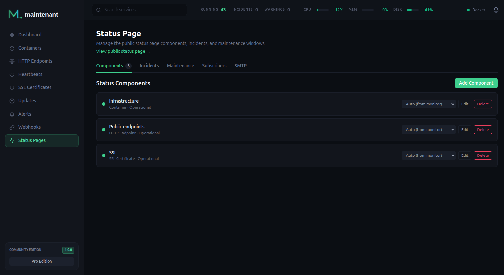

# Public Status Page

Give your users a clean status page. Incident management with timeline updates, scheduled maintenance windows.

<div class="screenshot-pair">
  
  
</div>

---

## How It Works

maintenant serves a standalone public status page at `/status/`. It is a server-rendered HTML page (no JavaScript required) with a real-time SSE connection for live updates.

The status page displays:

- **Component status** — Operational, degraded, partial outage, major outage
- **Active incidents** — Current issues with timeline updates
- **Scheduled maintenance** — Upcoming planned downtime windows

---

## Components



Link monitored resources to status page components. Each component maps to a container, endpoint, heartbeat, or certificate monitor.

```bash
# Create a component linked to a container
POST /api/v1/status/components
{
  "name": "API Server",
  "monitor_type": "container",
  "monitor_id": 42,
  "sort_order": 1
}
```

Supported `monitor_type` values:

| Type | Source |
|------|--------|
| `container` | Container state and health |
| `endpoint` | HTTP/TCP check status |
| `heartbeat` | Heartbeat ping status |
| `certificate` | TLS certificate validity |

maintenant automatically derives the component status from the linked monitor:

| Monitor State | Component Status |
|---------------|-----------------|
| Running / Up / Valid | Operational |
| Unhealthy / Expiring | Degraded |
| Down / Expired / Stopped | Major Outage |

---

## Status Values

| Status | Meaning |
|--------|---------|
| `operational` | Everything working normally |
| `degraded` | Service is slow or partially impaired |
| `partial_outage` | Some functionality unavailable |
| `major_outage` | Service is down |
| `maintenance` | Planned maintenance in progress |

---

## Public Access

The status page is served at `/status/` and is designed to be publicly accessible without authentication.

!!! warning "Reverse proxy configuration"
    Configure your reverse proxy to allow unauthenticated access to `/status/` paths.
    See [Configuration](../getting-started/configuration.md#public-routes) for details.

The status page includes:

- A real-time SSE stream at `/status/events` for live status updates
- Self-contained HTML with embedded CSS (no external dependencies)
- Responsive design for mobile and desktop

---

## Incident Management :material-crown:{ title="Pro" }
Track and communicate incidents with timeline updates. Each incident has a severity, status, and a history of updates visible on the public status page.

```bash
# Create an incident
POST /api/v1/status/incidents
{
  "title": "API latency increase",
  "severity": "minor",
  "message": "Investigating elevated response times on the API."
}

# Post a timeline update
POST /api/v1/status/incidents/{id}/updates
{
  "status": "identified",
  "message": "Root cause identified. Deploying fix."
}
```

---

## Maintenance Windows :material-crown:{ title="Pro" }
Schedule planned downtime. Maintenance windows appear on the status page and automatically suppress alerts for affected components.

```bash
POST /api/v1/status/maintenance
{
  "title": "Database migration",
  "starts_at": "2026-03-10T02:00:00Z",
  "ends_at": "2026-03-10T04:00:00Z",
  "components": [1, 3]
}
```

---

## Subscriber Notifications :material-crown:{ title="Pro" }
Let users subscribe to status updates. Subscribers receive notifications when incidents are created or updated.

```bash
# List subscribers
GET /api/v1/status/subscribers

# Subscriber sign-up (public endpoint)
POST /status/subscribe
{
  "email": "user@example.com"
}
```

---

## API Endpoints

| Method | Endpoint | Description |
|--------|----------|-------------|
| `GET` | `/api/v1/status/components` | List all components |
| `POST` | `/api/v1/status/components` | Create a component |
| `PUT` | `/api/v1/status/components/{id}` | Update a component |
| `DELETE` | `/api/v1/status/components/{id}` | Delete a component |
| `POST` | `/api/v1/status/incidents` | Create incident | :material-crown:{ title="Pro" } |
| `POST` | `/api/v1/status/incidents/{id}/updates` | Post incident update | :material-crown:{ title="Pro" } |
| `POST` | `/api/v1/status/maintenance` | Schedule maintenance | :material-crown:{ title="Pro" } |
| `GET` | `/api/v1/status/subscribers` | List subscribers | :material-crown:{ title="Pro" } |

---

## Related

- [Alert Engine](alerts.md) — Alerts that feed into incident creation
- [Configuration](../getting-started/configuration.md#public-routes) — Public route setup
