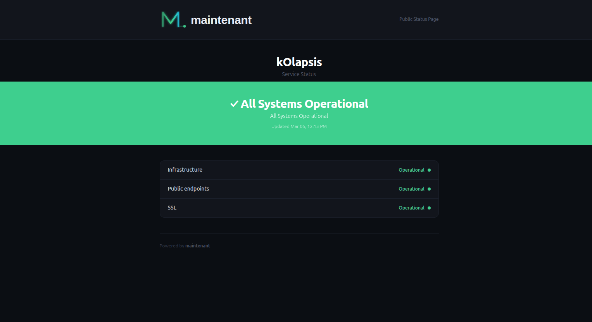
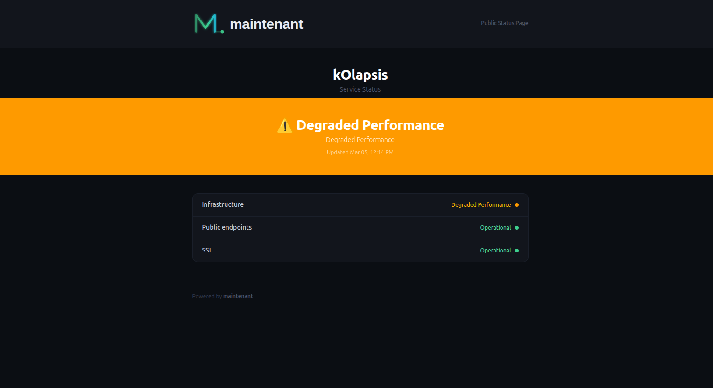
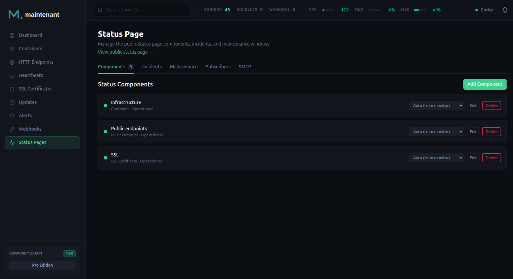

# Public Status Page

Give your users a clean status page. Incident management with timeline updates, scheduled maintenance windows.

<div class="screenshot-pair">
  
  
</div>

---

## How It Works

maintenant serves the public status page through the same Vue SPA as the admin UI, with full personalization, branding, incidents, maintenance, FAQ and footer support. The page connects to a real-time SSE stream for live updates and reads a cached settings document so content changes are visible on the next refresh.

The status page displays:

- **Component status** — Operational, degraded, partial outage, major outage
- **Active incidents** — Current issues with timeline updates
- **Scheduled maintenance** — Upcoming planned downtime windows

---

## Status URL

The status page can be reached two ways:

| Mode | URL the visitor sees | When to use |
|------|----------------------|-------------|
| **Same domain** (default) | `https://app.example.com/status` | Simplest setup, no extra DNS or proxy work. |
| **Dedicated subdomain** | `https://status.example.com/` | Cleaner public-facing URL, easier to keep behind a separate auth bypass, recommended for production. |

Set [`MAINTENANT_STATUS_URL`](../getting-started/configuration.md#environment-variables) to the canonical public URL of the status page. The admin UI surfaces this as the *View public status page* link in `/status-admin`. The frontend reads it from `GET /api/v1/edition` as `status_url`. When unset, the link falls back to `{MAINTENANT_BASE_URL}/status`.

### Subdomain deployment

When serving the status page from its own subdomain, point the subdomain at the same backend container as the main app and rewrite only the root path to `/status/`. The Vue router detects the dedicated-status context and mounts the public status page at `/`, so the browser URL stays clean (`status.example.com/`) without a visible redirect.

**Traefik example:**

```yaml
# Main app on app.example.com
http.routers.maintenant.rule: "Host(`app.example.com`)"
http.routers.maintenant.middlewares: "authelia@docker"

# Public status page on status.example.com (no auth, root rewritten to /status/)
http.routers.maintenant-status.rule: "Host(`status.example.com`)"
http.routers.maintenant-status.middlewares: "status-rewrite@docker"
http.middlewares.status-rewrite.replacepathregex.regex: "^/$"
http.middlewares.status-rewrite.replacepathregex.replacement: "/status/"
```

Use `replacepathregex` (only rewriting `/` to `/status/`), not `addprefix=/status` — the latter would also prepend `/status` to SPA asset paths (`/assets/...`) and SSE endpoints (`/status/events`), causing 404s. All other paths (`/assets/...`, `/status/api`, `/status/events`, `/status/settings.json`) must pass through unchanged.

Set the matching env var on the backend:

```bash
MAINTENANT_STATUS_URL=https://status.example.com
```

---

## Components



Link monitored resources to status page components. Each component maps to a container, endpoint, heartbeat, or certificate monitor.

```bash
# Create a component linked to a container
POST /api/v1/status/components
{
  "name": "API Server",
  "monitor_type": "container",
  "monitor_id": 42,
  "sort_order": 1
}
```

Supported `monitor_type` values:

| Type | Source |
|------|--------|
| `container` | Container state and health |
| `endpoint` | HTTP/TCP check status |
| `heartbeat` | Heartbeat ping status |
| `certificate` | TLS certificate validity |

maintenant automatically derives the component status from the linked monitor:

| Monitor State | Component Status |
|---------------|-----------------|
| Running / Up / Valid | Operational |
| Unhealthy / Expiring | Degraded |
| Down / Expired / Stopped | Major Outage |

---

## Status Values

| Status | Meaning |
|--------|---------|
| `operational` | Everything working normally |
| `degraded` | Service is slow or partially impaired |
| `partial_outage` | Some functionality unavailable |
| `major_outage` | Service is down |
| `maintenance` | Planned maintenance in progress |

---

## Public Access

The status page is designed to be publicly accessible without authentication. Configure your reverse proxy to allow unauthenticated access to:

- `/status/` — the page itself (or the subdomain root if you use `MAINTENANT_STATUS_URL`)
- `/status/api` — the JSON payload backing the page
- `/status/events` — the real-time SSE stream
- `/status/settings.json` — the cached personalization document

!!! warning "Reverse proxy configuration"
    See the [Security Guide → Public Routes](../security.md#public-routes) for the full list of routes that must bypass authentication, and worked examples for Traefik, Caddy, and nginx.

The status page is a responsive Vue SPA with live SSE updates. It supports the full personalization model (branding, palette, FAQ, footer, localization) on both the same-domain and dedicated-subdomain deployments.

---

## Incident Management :material-crown:{ title="Pro" }
Track and communicate incidents with timeline updates. Each incident has a severity, status, and a history of updates visible on the public status page.

```bash
# Create an incident
POST /api/v1/status/incidents
{
  "title": "API latency increase",
  "severity": "minor",
  "message": "Investigating elevated response times on the API."
}

# Post a timeline update
POST /api/v1/status/incidents/{id}/updates
{
  "status": "identified",
  "message": "Root cause identified. Deploying fix."
}
```

---

## Maintenance Windows :material-crown:{ title="Pro" }
Schedule planned downtime. Maintenance windows appear on the status page and automatically suppress alerts for affected components.

```bash
POST /api/v1/status/maintenance
{
  "title": "Database migration",
  "starts_at": "2026-03-10T02:00:00Z",
  "ends_at": "2026-03-10T04:00:00Z",
  "components": [1, 3]
}
```

---

## Subscriber Notifications :material-crown:{ title="Pro" }
Let users subscribe to status updates. Subscribers receive notifications when incidents are created or updated.

```bash
# List subscribers
GET /api/v1/status/subscribers

# Subscriber sign-up (public endpoint)
POST /status/subscribe
{
  "email": "user@example.com"
}
```

---

## API Endpoints

| Method | Endpoint | Description |
|--------|----------|-------------|
| `GET` | `/api/v1/status/components` | List all components |
| `POST` | `/api/v1/status/components` | Create a component |
| `PUT` | `/api/v1/status/components/{id}` | Update a component |
| `DELETE` | `/api/v1/status/components/{id}` | Delete a component |
| `POST` | `/api/v1/status/incidents` | Create incident | :material-crown:{ title="Pro" } |
| `POST` | `/api/v1/status/incidents/{id}/updates` | Post incident update | :material-crown:{ title="Pro" } |
| `POST` | `/api/v1/status/maintenance` | Schedule maintenance | :material-crown:{ title="Pro" } |
| `GET` | `/api/v1/status/subscribers` | List subscribers | :material-crown:{ title="Pro" } |

---

## Related

- [Alert Engine](alerts.md) — Alerts that feed into incident creation
- [Configuration](../getting-started/configuration.md#public-routes) — Public route setup
