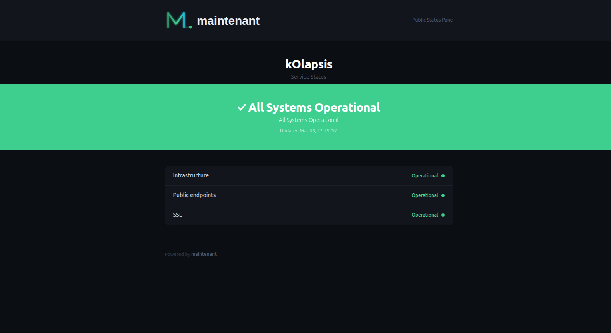
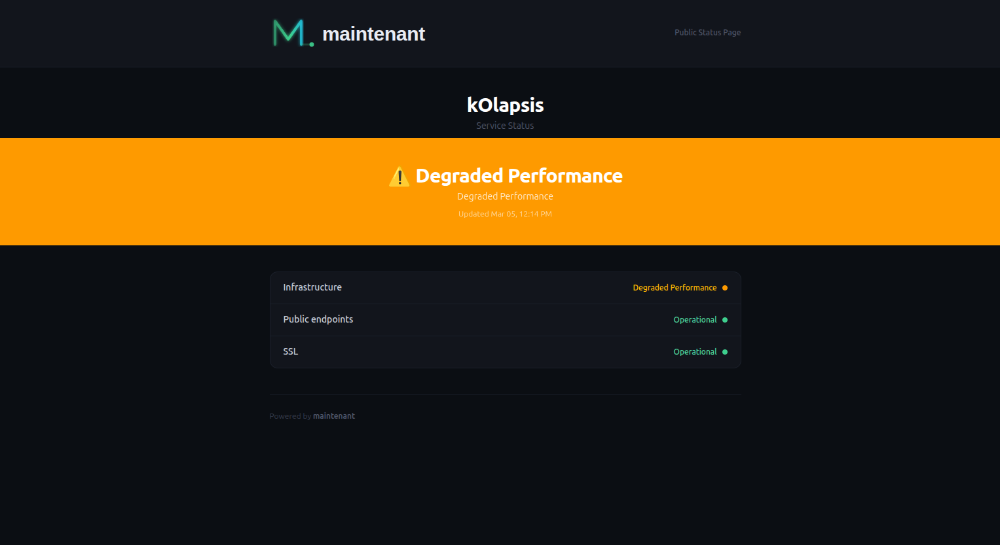
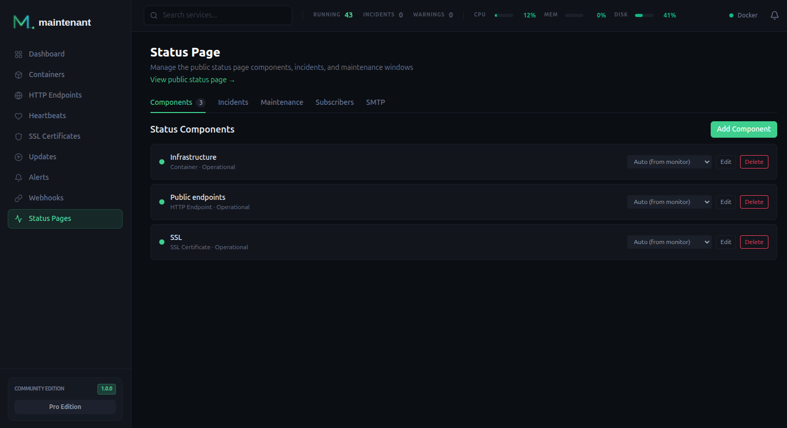

# Public Status Page

Give your users a clean status page. Incident management with timeline updates, scheduled maintenance windows, email subscriptions.

<div class="screenshot-pair">
  
  
</div>

---

## How It Works

maintenant serves the public status page through the same Vue SPA as the admin UI. The page loads its content from `/status/api`, follows changes through an SSE stream (`/status/events`), and reads its look from a settings document (`/status/settings.json`) that is served with a 30-second cache.

The status page displays:

- **Component status**: operational, degraded, partial outage, major outage, under maintenance
- **Active incidents**: current issues with timeline updates
- **Scheduled maintenance**: upcoming planned downtime windows (up to five)
- **Subscription form**: only when email subscriptions are open (see [Subscriber Notifications](#subscriber-notifications))

What each edition opens:

| Capability | Community | Personal | Pro |
|------------|:---------:|:--------:|:---:|
| Components | up to 3 | unlimited | unlimited |
| Automatic incidents (`auto_incident`) | yes | yes | yes |
| Manual incidents and timeline updates | — | yes | yes |
| Maintenance windows | — | — | yes |
| Email subscribers | — | — | yes |
| Personalization (branding, FAQ, footer) | — | — | yes |

Reading incidents and maintenance windows through the API is open in every edition; only creating, changing and deleting them is gated. Below the required edition those calls return `403 EDITION_REQUIRED`; creating a fourth component in Community returns `403 QUOTA_EXCEEDED`.

---

## Status URL

The status page can be reached two ways:

| Mode | URL the visitor sees | When to use |
|------|----------------------|-------------|
| **Same domain** (default) | `https://app.example.com/status` | Simplest setup, no extra DNS or proxy work. |
| **Dedicated subdomain** | `https://status.example.com/` | Cleaner public-facing URL, easier to keep behind a separate auth bypass, recommended for production. |

Set [`MAINTENANT_STATUS_URL`](../getting-started/configuration.md#environment-variables) to the canonical public URL of the status page. It only changes the *View public status page* link in `/status-admin`: the frontend reads it from `GET /api/v1/edition` as `status_url`. When it is unset, the link is the relative path `/status` on the host that serves the admin UI. There is no fallback to `MAINTENANT_BASE_URL`.

### Subdomain deployment

When serving the status page from its own subdomain, point the subdomain at the same backend container as the main app and rewrite only the root path to `/status/`. The Vue router detects the dedicated-status context and mounts the public status page at `/`, so the browser URL stays clean (`status.example.com/`) without a visible redirect.

**Traefik example:**

```yaml
# Main app on app.example.com
traefik.http.routers.maintenant.rule: "Host(`app.example.com`)"
traefik.http.routers.maintenant.middlewares: "authelia@docker"

# Public status page on status.example.com (no auth, root rewritten to /status/)
traefik.http.routers.maintenant-status.rule: "Host(`status.example.com`)"
traefik.http.routers.maintenant-status.middlewares: "status-rewrite@docker"
traefik.http.middlewares.status-rewrite.replacepathregex.regex: "^/$"
traefik.http.middlewares.status-rewrite.replacepathregex.replacement: "/status/"
```

Use `replacepathregex` (only rewriting `/` to `/status/`), not `addprefix=/status`: the latter would also prepend `/status` to SPA asset paths (`/assets/...`) and SSE endpoints (`/status/events`), causing 404s. All other paths (`/assets/...`, `/status/api`, `/status/events`, `/status/settings.json`) must pass through unchanged.

Set the matching env var on the backend:

```bash
MAINTENANT_STATUS_URL=https://status.example.com
```

---

## Components



Link monitored resources to status page components. A component is either an explicit list of monitors or every monitor of one type (`match-all`).

```bash
# A component made of two explicit monitors
POST /api/v1/status/components
{
  "display_name": "API",
  "composition_mode": "explicit",
  "monitors": [
    { "type": "container", "id": "0195f3c2-7b1e-7c3a-9d2e-5a4f8e1b6c70" },
    { "type": "endpoint",  "id": "0195f3c4-11aa-7f00-8c55-2b9d0e3a4c18" }
  ],
  "display_order": 1,
  "visible": true,
  "auto_incident": false
}

# A component that follows every endpoint
POST /api/v1/status/components
{
  "display_name": "All endpoints",
  "composition_mode": "match-all",
  "match_all_type": "endpoint"
}
```

| Field | Meaning |
|-------|---------|
| `display_name` | Name shown on the page. Required. |
| `composition_mode` | `explicit` (default) or `match-all`. Fixed once the component exists. |
| `monitors` | Explicit mode only, at least one entry. Each entry is `{type, id}` where `id` is the UUID of the monitor. |
| `match_all_type` | Match-all mode only: `container`, `endpoint`, `heartbeat` or `certificate`. Fixed once the component exists. |
| `display_order` | Sort position on the page. |
| `visible` | `false` hides the component from the public page and from the global status. Default `true`. |
| `auto_incident` | Open and resolve incidents automatically, see [Automatic Incidents](#automatic-incidents). |
| `status_override` | Update only. Forces a status (see [Status Values](#status-values)); an empty string goes back to the status derived from the monitors. |

An explicit component without monitors is flagged as needing attention and stays off the public page. In Community, creating a fourth component returns `403 QUOTA_EXCEEDED`.

Supported monitor types:

| Type | Source |
|------|--------|
| `container` | Container state and health |
| `endpoint` | HTTP/TCP check status |
| `heartbeat` | Heartbeat ping status |
| `certificate` | TLS certificate validity |

### How a component status is derived

Each monitor is first mapped to a status:

| Monitor | Operational | Degraded | Major Outage |
|---------|-------------|----------|--------------|
| Container | `running` and not `unhealthy`, or `completed` | running but `unhealthy` | any other state (`exited`, `restarting`, `paused`, `created`, `dead`) |
| Endpoint | `up`, or not checked yet | `degraded` (served over a certificate that is not trusted) | `down` |
| Heartbeat | `up` | `new`, `started`, `paused` | `down` |
| Certificate | `valid` | `expiring` | `expired`, `error`, `unknown` |

A monitor that no longer exists counts as operational.

A component with several monitors (or a match-all component) combines them:

| Monitors | Component status |
|----------|------------------|
| All operational, or none | Operational |
| At least one degraded, none in major outage | Degraded |
| Some in major outage, not all | Partial Outage |
| All in major outage | Major Outage |

A status override replaces the derived status. The global status of the page is the worst status among visible components, ranked Major Outage, Under Maintenance, Partial Outage, Degraded.

---

## Status Values

| Status | Meaning |
|--------|---------|
| `operational` | Everything working normally |
| `degraded` | Service is slow or partially impaired |
| `partial_outage` | Some functionality unavailable |
| `major_outage` | Service is down |
| `under_maintenance` | Planned maintenance in progress |

The global banner reads *All Systems Operational*, *Degraded Performance*, *Partial System Outage*, *Major System Outage* or *Scheduled Maintenance*.

---

## Public Access

The status page is designed to be publicly accessible without authentication. Configure your reverse proxy to allow unauthenticated access to:

- `/status/`: the page itself (or the subdomain root if you use a dedicated status host)
- `/status/api`: the JSON payload backing the page
- `/status/events`: the real-time SSE stream
- `/status/settings.json`: the personalization document
- `/status/feed.atom`: Atom feed of the incidents resolved in the last 30 days
- `/status/subscribe`, `/status/confirm`, `/status/unsubscribe`: email subscriptions
- `/assets/*`: the JavaScript and CSS of the SPA, which the page needs when it shares a host with a protected dashboard

!!! warning "Reverse proxy configuration"
    See the [Security Guide → Public Routes](../security.md#public-routes) for the full list of routes that must bypass authentication, and worked examples for Traefik, Caddy, and nginx.

The status page is a responsive Vue SPA with live SSE updates. The SSE stream carries `status.component_changed`, `status.global_changed`, `status.incident_created`, `status.incident_updated`, `status.incident_resolved`, `status.maintenance_started` and `status.maintenance_ended`.

### `/status/api`

```json
{
  "global_status": "degraded",
  "global_message": "Degraded Performance",
  "updated_at": "2026-03-10T14:02:11Z",
  "components": [{ "id": "…", "name": "API", "status": "degraded" }],
  "active_incidents": [{
    "id": "…", "title": "API latency increase", "severity": "minor",
    "status": "investigating", "components": ["API"],
    "created_at": "2026-03-10T13:58:00Z",
    "latest_update": { "status": "investigating", "message": "…", "created_at": "…" }
  }],
  "upcoming_maintenance": [],
  "personalization_version": 4,
  "subscriptions_enabled": true
}
```

`subscriptions_enabled` is `true` only when email subscriptions are open. The page shows its *Subscribe to updates* form only in that case. `personalization_version` is omitted when no personalization has been saved.

---

## Automatic Incidents

A component with `auto_incident: true` opens incidents by itself from alerts, in every edition. Every alert event about one of the component's monitors (or about any monitor of the type, for a match-all component) is handled like this:

- **A problem alert while the component is not operational** opens an incident titled `<component name> - <alert message>`, status `investigating`, with severity `critical` for a critical alert, `major` for a warning and `minor` otherwise. If an incident is already open for the component, the alert message is added to its timeline instead.
- **A recovery while the component is operational again** adds a `resolved` update, "Auto-resolved: all monitors operational".
- **A component with a status override is left alone**, which includes every component under an active maintenance window.

Opening an incident and resolving it are announced on the SSE stream and emailed to subscribers. The timeline entries added to an open incident are pushed on the SSE stream only.

---

## Incident Management :material-star-four-points:{ title="Personal" }
Track and communicate incidents with timeline updates. Each incident has a severity (`minor`, `major`, `critical`), a status, the components it affects, and a history of updates visible on the public status page.

```bash
# Create an incident
POST /api/v1/status/incidents
{
  "title": "API latency increase",
  "severity": "minor",
  "component_ids": ["0195f3c6-2d4e-7a10-b3c9-6e1f0a8d5b22"],
  "message": "Investigating elevated response times on the API."
}

# Post a timeline update
POST /api/v1/status/incidents/{id}/updates
{
  "status": "identified",
  "message": "Root cause identified. Deploying fix."
}
```

`title` and `severity` are required on creation; the initial status is `investigating`. An update requires both `status` and `message`, and sets the status of the incident. The admin UI offers `investigating`, `identified`, `monitoring` and `resolved`; `resolved` closes the incident. `PUT /api/v1/status/incidents/{id}` edits the title, severity and components without posting an update.

Creating an incident, posting an update and resolving an incident are emailed to subscribers when subscriptions are open, whether they come from the API, the admin UI or the [MCP server](mcp.md). Editing with `PUT` is not announced.

---

## Maintenance Windows :material-crown:{ title="Pro" }
Schedule planned downtime. Maintenance windows appear on the status page and automatically suppress alerts for affected components.

```bash
POST /api/v1/status/maintenance
{
  "title": "Database migration",
  "description": "Upgrading PostgreSQL. Expect a few minutes of downtime.",
  "starts_at": "2026-03-10T02:00:00Z",
  "ends_at": "2026-03-10T04:00:00Z",
  "component_ids": ["0195f3c6-2d4e-7a10-b3c9-6e1f0a8d5b22"]
}
```

`title`, `starts_at` and `ends_at` (RFC 3339) are required, and `ends_at` must not be before `starts_at`. A window that is currently running cannot be edited (`409`).

A scheduler checks the windows every 60 seconds:

- **At the start**, it creates an incident `Scheduled Maintenance: <title>` (severity `minor`), sets `under_maintenance` on every listed component, and emails subscribers `Maintenance Started: <title>`.
- **At the end**, it resolves that incident, removes the `under_maintenance` status and emails subscribers `Maintenance Completed: <title>`.

The status page start and end can therefore lag the scheduled times by up to a minute. The alert suppression does not: from `starts_at` to `ends_at`, alerts about the monitors of the listed components are dropped, and [escalation runs](alert-escalation.md#maintenance-windows-suspend-escalation) on them are paused. A match-all component in a window covers every monitor of its type.

Until a window starts, the public page lists it under upcoming maintenance.

---

## Personalization :material-crown:{ title="Pro" }
Change how the public page looks and what it says, from the *Personalization* tab of `/status-admin` or through the API. `PUT /api/v1/status-page/settings` replaces all the settings at once, so send every field. Below Pro the public page shows the default look; the saved settings are kept and apply again with Pro.

```bash
PUT /api/v1/status-page/settings
{
  "title": "Acme Status",
  "subtitle": "Live status of our services",
  "colors": {
    "bg": "#0B0E13", "surface": "#12151C", "border": "#1F2937",
    "text": "#FFFFFF", "accent": "#22C55E",
    "status_operational": "#22C55E", "status_degraded": "#EAB308",
    "status_partial": "#F97316", "status_major": "#EF4444"
  },
  "announcement": { "enabled": true, "message_md": "Planned upgrade on **Friday**.", "url": "https://example.com/upgrade" },
  "footer_text_md": "Questions? Write to ops@example.com.",
  "locale": "en",
  "timezone": "Europe/Paris",
  "date_format": "relative"
}
```

| Setting | Rules |
|---------|-------|
| `title` | 1 to 100 characters. Required. Default `System Status`. |
| `subtitle` | Up to 200 characters. |
| `colors` | All nine keys are required, each `#RRGGBB` or `#RRGGBBAA`. |
| `announcement` | `message_md` up to 1000 characters (bold, italic, links), `url` starts with `http://` or `https://`. |
| `footer_text_md` | Up to 500 characters (bold, italic, lists, code, links). |
| `locale` | `en` or `fr`. Required. |
| `timezone` | Empty, or an IANA name such as `Europe/Paris`. |
| `date_format` | `relative` or `absolute`. Required. |

Markdown is converted to HTML and sanitized, and every link opens in a new tab. A palette pair that fails the WCAG AA contrast ratio does not block the save: the response carries them under `warnings.contrast`.

Other routes, all Pro and all under `/api/v1/status-page/`:

| Route | Purpose |
|-------|---------|
| `GET`, `PUT /settings` | Read and save the settings above |
| `PUT`, `GET`, `DELETE /assets/{role}` | Upload (multipart field `file`, optional `alt_text`), read and remove the `logo`, `favicon` or `hero` image |
| `GET`, `POST /footer-links`, `PUT /footer-links/order`, `PUT`, `DELETE /footer-links/{id}` | Footer links: a label of 1 to 60 characters and an `http(s)` URL; the order call takes `{"ids": […]}` |
| `GET`, `POST /faq`, `PUT /faq/order`, `PUT`, `DELETE /faq/{id}` | FAQ entries: a question of 1 to 200 characters and a Markdown `answer_md` up to 4000 characters |

The type of an upload is detected from its content, not from its name:

| Role | Formats | Size limit |
|------|---------|-----------|
| `logo` | PNG, JPEG, WebP, SVG | 200 KiB |
| `favicon` | PNG, ICO, SVG | 50 KiB |
| `hero` | PNG, JPEG, WebP | 500 KiB |

---

## Subscriber Notifications :material-crown:{ title="Pro" }
Let users subscribe to status updates by email.

Subscriptions are open only when both conditions hold, and the page reports the result in `subscriptions_enabled`:

- the edition is Pro;
- an SMTP server is configured through the environment.

| Variable | Default | Description |
|----------|---------|-------------|
| `MAINTENANT_SMTP_HOST` | — | SMTP server. Nothing is sent while it is empty. |
| `MAINTENANT_SMTP_PORT` | `587` | SMTP port. |
| `MAINTENANT_SMTP_USERNAME` | — | Login for AUTH PLAIN. Authentication is skipped when empty. |
| `MAINTENANT_SMTP_PASSWORD` | — | Password for that login. |
| `MAINTENANT_SMTP_FROM` | `maintenant@localhost` | Sender address. |

The same server sends the emails of the email alert channel. maintenant upgrades the connection with STARTTLS when the server offers it; implicit TLS (port 465) is not supported. Any send gives up after 30 seconds. The SMTP tab of `/status-admin` shows whether SMTP is configured and sends a test email (`POST /api/v1/status/smtp/test` with `{"to": "you@example.com"}`, from Personal; `400 not_configured` without `MAINTENANT_SMTP_HOST`, `502 smtp_failed` when the server refuses); the Subscribers tab warns when SMTP is missing.

```bash
# List subscribers (emails are masked)
GET /api/v1/status/subscribers

# Subscriber sign-up (public endpoint)
POST /status/subscribe
{
  "email": "user@example.com"
}
```

### How a subscription works

1. The visitor submits an address. `POST /status/subscribe` accepts JSON (`Content-Type: application/json`) or a form field `email`, and answers `200 {"status": "confirmation_sent"}`.
2. A confirmation email arrives with a link that stays valid for 24 hours. The subscription is pending until the visitor opens it.
3. Opening the link (`GET /status/confirm?token=…`) confirms the subscription. Unconfirmed subscriptions older than 24 hours are purged daily.
4. Every notification ends with a personal unsubscribe link (`GET /status/unsubscribe?token=…`). Unsubscribing always works, even when subscriptions are closed.

The answer to `POST /status/subscribe` is the same for a new address, a pending one and a confirmed one, so nobody can use the form to find out who is subscribed. A pending address receives a fresh link and the previous one stops working; a confirmed address receives nothing. A failed email is only written to the log.

| Status | Code | Reason |
|--------|------|--------|
| `400` | `invalid_email` | Not a valid address, or longer than 254 characters |
| `400` | `invalid_body` | Body that is neither JSON nor a form |
| `413` | `body_too_large` | Body over 4 KiB |
| `429` | `rate_limited` | Limit of 5 attempts per hour per address (one attempt is given back every 12 minutes); `Retry-After` is 720 seconds |
| `503` | `subscriptions_unavailable` | SMTP missing or edition below Pro |

!!! warning "Set `MAINTENANT_BASE_URL`"
    The confirmation and unsubscribe links are built from `MAINTENANT_BASE_URL` (default `http://<MAINTENANT_ADDR>`), not from `MAINTENANT_STATUS_URL`. Set it to the public URL, and let `/status/confirm` and `/status/unsubscribe` through without authentication on that host. Behind a reverse proxy, also set `MAINTENANT_TRUSTED_PROXIES`: without it every visitor counts as the proxy's address and shares one limit of 5 attempts per hour.

### What subscribers receive

Plain-text emails sent from `MAINTENANT_SMTP_FROM`, one per confirmed subscriber:

| Event | Subject |
|-------|---------|
| Incident opened | `[<severity>] <title>` |
| Incident updated | `Update: <title>` |
| Incident resolved | `Resolved: <title>` |
| Maintenance started | `Maintenance Started: <title>` |
| Maintenance completed | `Maintenance Completed: <title>` |

Incidents opened and resolved automatically are included; timeline entries added automatically to an open incident are not. A resolution sends a single email.

---

## API Endpoints

| Method | Endpoint | Description | Edition |
|--------|----------|-------------|---------|
| `GET` | `/api/v1/status/components` | List all components with their derived and effective status | Community |
| `POST` | `/api/v1/status/components` | Create a component | Community (3 max) |
| `PUT` | `/api/v1/status/components/{id}` | Update a component | Community |
| `DELETE` | `/api/v1/status/components/{id}` | Delete a component | Community |
| `GET` | `/api/v1/status/incidents` | List incidents (`status`, `severity`, `limit`, `offset`) | Community |
| `POST` | `/api/v1/status/incidents` | Create an incident | Personal |
| `PUT` | `/api/v1/status/incidents/{id}` | Edit an incident | Personal |
| `DELETE` | `/api/v1/status/incidents/{id}` | Delete an incident | Personal |
| `POST` | `/api/v1/status/incidents/{id}/updates` | Post an incident update | Personal |
| `GET` | `/api/v1/status/maintenance` | List windows (`status` = `upcoming`, `active` or `completed`; `limit`) | Community |
| `POST` | `/api/v1/status/maintenance` | Schedule maintenance | Pro |
| `PUT` | `/api/v1/status/maintenance/{id}` | Edit a window that is not running | Pro |
| `DELETE` | `/api/v1/status/maintenance/{id}` | Delete a window | Pro |
| `GET` | `/api/v1/status/subscribers` | List subscribers | Pro |
| `POST` | `/api/v1/status/smtp/test` | Send a test email | Personal |
| `GET`, `PUT` | `/api/v1/status-page/settings` | Personalization settings | Pro |

Public routes, without authentication: `GET /status/`, `GET /status/api`, `GET /status/events`, `GET /status/settings.json`, `GET /status/feed.atom`, `POST /status/subscribe`, `GET /status/confirm`, `GET /status/unsubscribe`.

---

## Related

- [Alert Engine](alerts.md): Alerts that feed into incident creation
- [Alert Escalation](alert-escalation.md): Escalation runs pause during maintenance windows
- [MCP Server](mcp.md): `create_incident`, `update_incident` and `create_maintenance` tools
- [Security](../security.md#public-routes): Public route setup
