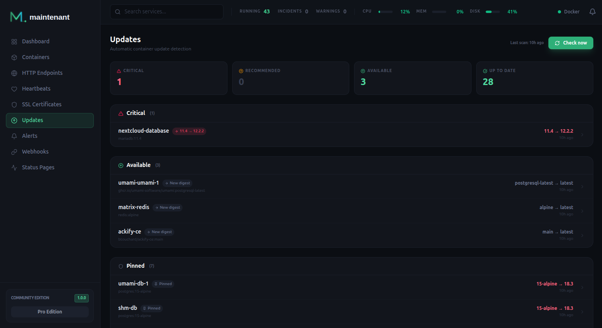

# Update Intelligence

Know when your container images have updates available. maintenant checks the OCI registry of every running container's image: it tells you when a newer version exists and when the tag you run now points at a different image. Stop running `docker pull` blindly.



---

## How It Works

maintenant periodically scans the registry of each running container's image. For each container it decides in one of two ways:

1. **A fixed version tag** (`1.25.3`, `3.19.1-alpine`): it lists the tags of the repository and looks for a newer version.
2. **A floating tag** (`latest`, `stable`, `v3`, `1.2`): it compares the digest of the image the container runs with the digest the tag points at in the registry now.

### What the scan covers

The scan covers the running containers that are not ignored (`maintenant.ignore`, which also works on a Swarm service) and not archived: those of the server's own runtime (Docker, Swarm, or the workloads of the Kubernetes cluster it runs in), and those of remote agents once they have reported since the server started. The server queries the registries itself, with its own network and credentials. Agents never do.

It leaves out:

- images built locally, which the runtime reports as never pulled from nor pushed to a registry, whatever their name;
- containers with `maintenant.update.enabled: "false"` or a `maintenant.update.pin` label, pinned containers, and images matching an [exclusion](#update-exclusions);
- images of a private registry or repository the credentials of maintenant do not open, and tags the registry does not know. These are skipped without an error.

Images of Docker Hub's official library count: `nginx` and `redis:latest` are looked up as `library/nginx` and `library/redis`.

### Fixed version tags

For a tag written `major.minor.patch`, maintenant picks the highest newer version in the repository's tag list that has the same variant suffix (`-alpine`, `-bookworm`, `-slim-bookworm`, and the other [known variants](#default-behavior)). Pre-releases and tags without dots (build numbers) are ignored. The update is classified `major`, `minor` or `patch` by the first component that changed. The digest of the running image plays no part: a republished `1.25.3` is not reported.

### Floating tags and digests

A tag is floating when it is not a version (`latest`, `lts`, `stable`) or when it is a partial version (`v3`, `1.2`, `16-bookworm`), which the registry keeps pointing at the newest release of that line. A container on `traefik:v3` already runs whatever `v3` resolves to, so `v3.7.10` is not an update. A newer tag written the same way (`v4`) still is, and is reported as a major update.

For a floating tag, maintenant reports a `digest_only` update for as long as the container does not run what the tag points at now. A multi-platform tag counts as matching when the container runs the digest of the index or of any of its platform manifests.

### What the container actually runs

| Runtime | Where the running digest comes from |
|---------|-------------------------------------|
| Docker, Swarm, Docker agents | The repo digests of the container's image, from the Docker image list |
| Kubernetes | The image ID reported by the running pods of the workload, when they all run the same image |
| None of the above | A stored baseline, see below |

When the runtime cannot say what a container runs, the first scan stores the digest the tag points at as the baseline for that container, without reporting anything. Later scans compare the tag with that baseline, so a tag moved after the first scan is detected, but a container that was already behind at that first scan is not. A recreated container gets a new baseline.

!!! note "docker-socket-proxy needs `IMAGES`"
    The scan reads the Docker image list (`GET /images/json`) on every pass. Behind a socket proxy, set `IMAGES: "1"` on it. If the list is refused, the scan carries on and logs one warning that names `IMAGES=1` (a new one only after the list was served again): images built locally are no longer recognised, the exact running digest is unknown (floating tags fall back to the baseline above) and rollback commands lose the digest.

### When an update goes away

Each scan replaces the pending updates of the containers it covered. An update that a scan no longer finds is removed from the list and its [alert](#update-alerts) is resolved. This happens when the container is recreated on the new image, when its tag filter or labels change, when it is excluded or pinned, when the registry stops serving the image to maintenant (credentials refused, tag removed), and when its container is gone.

A container whose check failed during the scan (a registry that is down, a timeout) is left out of that cleanup: it keeps its pending update and its alert until a scan checks it successfully.

---

## Scan Interval

The scan interval is configured via the `MAINTENANT_UPDATE_INTERVAL` environment variable:

```bash
MAINTENANT_UPDATE_INTERVAL=24h  # Default: check once per day
```

Accepts Go duration format: `12h`, `6h`, `30m`, etc. A value that does not parse, or that is not positive, falls back to `24h`.

The first scan runs 30 seconds after startup. Within a scan, images are checked one at a time with one second between two of them, so a large fleet takes a while and sends few requests per second to a registry.

You can also trigger a manual scan at any time:

```bash
POST /api/v1/updates/scan
```

It answers `202` and runs in the background, or `409 SCAN_IN_PROGRESS` when a scan is already running. `GET /api/v1/updates/summary` reports `scan_status`, and the `update.scan_started` and `update.scan_completed` events on the SSE stream carry the scan id to read with `GET /api/v1/updates/scan/{scan_id}` (status, containers scanned, updates found, errors).

---

## OCI Registry Scanning

maintenant queries the OCI (Docker) registry API:

- **Docker Hub**: public and private repositories
- **GitHub Container Registry (GHCR)**: `ghcr.io` images
- **Self-hosted registries**: any OCI-compliant registry

**Private registries.** maintenant authenticates with the Docker client configuration of its own process: the `config.json` in the directory named by `DOCKER_CONFIG`, or in `~/.docker`. In a container, mount it read-only and set `DOCKER_CONFIG`; the image has no credential helper, so the file must hold the credentials themselves. A registry that refuses the credentials is skipped quietly, like any image the credentials do not open. The credentials are looked up for the registry that is queried, so a mirror set with `maintenant.update.registry` needs its own entry. `MAINTENANT_CA_CERT` adds a private root certificate to the registry connections.

**Errors.** A failure other than "unauthorized", "denied", unknown name or unknown manifest (a registry that is down, a timeout) counts as an error of the scan, reported in its `errors` count and logged as a warning. Such a container is checked again at the next scan.

---

## Update Labels

Every container is tracked by default. These labels adjust that per container. The [Docker Labels Reference](../guides/docker-labels.md#update-settings) lists them with their values.

| Label | Effect |
|-------|--------|
| `maintenant.update.enabled` | `false` leaves the container out of the scan. |
| `maintenant.update.track` | The widest change reported: `major` (default, any newer version), `minor` (same major version), `patch` (same major and minor version) or `digest` (only a new image under the current tag). |
| `maintenant.update.ignore_major` | `true` behaves as `track: minor` when `track` is absent or `major`. |
| `maintenant.update.digest_only` | `true` behaves as `track: digest` and wins over `track` and `ignore_major`. |
| `maintenant.update.pin` | Any non-empty value freezes the container: no update is reported for it. |
| `maintenant.update.alert_on` | Which updates raise an alert: `all` (default), `critical` or `none`. The update is listed on the Updates page in every case. |
| `maintenant.update.tag-include`, `maintenant.update.tag-exclude` | Go regular expressions that narrow the candidate tags, see [Tag Filtering](#tag-filtering). |
| `maintenant.update.registry` | Queries this registry instead of the one in the image reference, for a mirror that serves the same repositories. The repository path is kept (`<mirror>/library/nginx` for the official `nginx` image), and the registry name recorded with the update becomes the value of the label. |

**Where the labels are read.** They are container labels on the server's own Docker runtime and on Docker agents (on a Swarm manager, the `deploy.labels` of the service count too), and annotations with the same names on Kubernetes workloads: Deployments, StatefulSets, DaemonSets and pods without a controller, of the cluster the server runs in. The annotation goes on the workload object, and the image checked is the first container of its pod spec. A remote Kubernetes agent reports neither annotations nor image digests, so its workloads are tracked without them. A label that cannot be parsed is ignored and logged as a warning.

---

## Version Pinning

Pin a container to its current version to suppress update notifications:

```bash
# Pin current version, with an optional reason
POST /api/v1/updates/pin/{container_id}
{ "reason": "Waiting for the v2 migration" }

# Unpin
DELETE /api/v1/updates/pin/{container_id}
```

`container_id` is the `container_id` of the update in `GET /api/v1/updates`, which is the container's runtime ID (`namespace/Kind/name` for a Kubernetes workload). Pinning needs an update to pin: it answers `404 NOT_FOUND` when none is pending for the container. The pin records the tag and digest the container runs. The update shows as **Pinned** until the next scan, which skips the container, drops the update and resolves its alert. `DELETE` removes the pin and the container is checked again.

---

## Update Exclusions

Exclude specific images or tags from update scanning. Both fields are required:

```bash
# Create exclusion
POST /api/v1/updates/exclusions
{
  "pattern": "myregistry.example.com/internal-app",
  "pattern_type": "image"
}

# List exclusions
GET /api/v1/updates/exclusions

# Remove exclusion
DELETE /api/v1/updates/exclusions/{id}
```

| `pattern_type` | What the `pattern` is matched with |
|----------------|------------------------------------|
| `image` | The image name without tag or digest (`myregistry.example.com/internal-app`), then its short Docker Hub form (`library/nginx` becomes `nginx`), then the full reference as written (`nginx:1.25`). |
| `tag` | The tag the container runs now. |

Patterns are shell-style globs, not regular expressions: `*` matches any run of characters except `/`, `?` one character, `[a-z]` a range. `myregistry.example.com/*` therefore excludes `myregistry.example.com/app` but not `myregistry.example.com/team/app`. Creating a new exclusion answers `201`, and creating one that exists already answers `200` with the stored one. Any other `pattern_type` answers `400 INVALID_TYPE`.

---

## Tag Filtering

### Default Behavior

By default, maintenant determines update candidates from the OCI registry tag list using two strategies:

- **Semver mode**: for pinned version tags (`major.minor.patch`, e.g. `1.24.0`, `3.19.1-alpine`), maintenant compares semver versions and respects variant suffixes (e.g. `-alpine`, `-bookworm`). A container running `nginx:1.24.0-alpine` will only be compared against other `-alpine` tags.
- **Digest-only mode**: for floating tags, maintenant compares the digest the container runs against the remote image digest. If they differ (the tag was moved or the image rebuilt), an update is reported. Floating tags are non-semver channels (`latest`, `lts`, `stable`, etc.) **and partial version tags** (`v3`, `1.2`, `16-bookworm`), which the registry keeps pointing at the newest release of that line.

A partial tag is never told to move to a more precise tag beneath it: a container on `traefik:v3` already runs whatever `v3` currently resolves to, so `v3.7.10` is not an update. A newer tag written the same way (`v4`) still is, and is reported as a major update. The known variant suffixes are `-slim-bookworm`, `-slim-bullseye`, `-slim-buster`, `-alpine3.18` to `-alpine3.21`, `-alpine`, `-bookworm`, `-bullseye`, `-buster`, `-noble`, `-jammy` and `-focal`.

### Tag Filter Labels

Two labels (Docker labels, or annotations on Kubernetes workloads) let you override the default update candidate selection:

| Label | Type | Description |
|-------|------|-------------|
| `maintenant.update.tag-include` | Go regex | Only tags matching this pattern are considered as update candidates |
| `maintenant.update.tag-exclude` | Go regex | Tags matching this pattern are excluded from update candidates |

Patterns use Go [`regexp`](https://pkg.go.dev/regexp/syntax) syntax. Without anchors (`^`, `$`), the pattern matches anywhere in the tag string: add them for exact matches.

### Priority Rules

1. **`tag-include` replaces the automatic variant filter**: when set, only matching tags are candidates; the `-alpine`/`-bookworm` variant detection is bypassed.
2. **`tag-exclude` alone preserves the variant filter**: the automatic variant suffix matching still applies; matching tags are removed after.
3. **Exclude applies after include, and exclude always wins**: when both labels are set, include filters first, then exclude removes from the result.
4. **Invalid regex: warning and label ignored**: a malformed pattern is logged as a warning and treated as absent; default behavior applies.
5. **Empty string: treated as absent**: an empty label value has no effect.
6. **The current tag is never filtered out**: when the registry lists it, it stays in the candidate list even if the filters reject it, so a filter cannot hide a tag that was moved.

### Digest-Only Mode

Both `tag-include` and `tag-exclude` are **ignored** for containers using non-semver channel tags (`latest`, `lts`, `stable`, etc.) and for containers with `track: digest` or `digest_only: true`. Digest-only mode compares digests directly and does not use a tag list, so filtering has no effect.

### Concrete Examples

**Stay on Node 20 alpine only, never jump to Node 21:**

```yaml
services:
  app:
    image: node:20.12.0-alpine
    labels:
      maintenant.update.tag-include: "^20\\.\\d+\\.\\d+-alpine$$"
```

**Exclude pre-release tags:**

```yaml
services:
  redis:
    image: redis:7.0.0
    labels:
      maintenant.update.tag-exclude: "(rc|beta|alpha)"
```

**Combine include and exclude: Node 20, no pre-releases:**

```yaml
services:
  app:
    image: node:20.0.0
    labels:
      maintenant.update.tag-include: "^20\\."
      maintenant.update.tag-exclude: "(rc|beta|alpha)"
```

**Pin to a major version:**

```yaml
services:
  postgres:
    image: postgres:15.1
    labels:
      maintenant.update.tag-include: "^15\\."
```

**Only stable semver tags (no channel tags that happen to match):**

```yaml
services:
  traefik:
    image: traefik:2.11.0
    labels:
      maintenant.update.tag-include: "^v?[0-9]+\\.[0-9]+\\.[0-9]+$$"
```

**Only slim-bookworm variants:**

```yaml
services:
  python:
    image: python:3.11-slim-bookworm
    labels:
      maintenant.update.tag-include: ".*-slim-bookworm$$"
```

### Troubleshooting

**No update shown after adding `tag-include`:**
Test your regex against the actual tag list in the registry. The pattern must match at least one tag that is newer than the current tag. Use a tool like [regex101.com](https://regex101.com) with Go flavor.

**Filter seems to have no effect:**
Check if the container uses a non-semver channel tag (`latest`, `lts`, `stable`). Digest-only mode containers bypass tag filters.

**Warning in logs: `invalid maintenant.update.tag-include regex, label ignored`:**
The regex pattern has a syntax error. Check for unbalanced brackets or other Go `regexp` syntax issues.

---

## Update and Rollback Commands

For every update, maintenant writes the command that applies it and the command that puts the previous image back. They are shown in the detail panel of the Updates page, returned as `update_command` and `rollback_command` by `GET /api/v1/updates/container/{container_id}`, and, with Personal, carried by the `update_available` alert so that the Discord, Slack, Teams and email notifications include them. maintenant never runs them: it observes, you decide.

**Docker Compose.** A container with the Compose project and service labels gets commands that start with `cd` to the project's `com.docker.compose.project.working_dir` (`<compose-project-dir>` when the label is missing). There is no `--project-directory` flag. Compose pulls the tag written in the compose file, so when the update changes the tag, the command tells you to edit the file first:

```bash
# A newer tag (nginx:1.25.3 to 1.27.0)
cd /srv/app
# Set the image of service web to nginx:1.27.0 in the compose file, then:
docker compose pull web
docker compose up -d web

# The same tag, republished
cd /srv/app
docker compose pull web
docker compose up -d --force-recreate web
```

**Standalone Docker container.**

```bash
docker pull nginx:1.27.0
docker stop web && docker rm web
docker run -d --name web nginx:1.27.0
```

This form only names the image. The `docker run` line carries none of the original options (ports, volumes, environment): use it as a template, or recreate the container the way you created it.

**Docker Swarm.** A task gets the command that points its service at the new image, and Swarm replaces the tasks with its rolling update:

```bash
docker service update --image nginx:1.27.0 web
```

**Kubernetes.** The command sets the image of the workload's first pod container, in its namespace. The workload kind comes from the controller (`deployment`, `statefulset`, `daemonset`), and a pod without a controller is updated in place as `pod/<name>`:

```bash
kubectl set image deployment/web nginx=nginx:1.27.0 -n production
```

On Kubernetes and Swarm, when the tag is unchanged (a republished floating tag), the reference carries the digest of the registry's current manifest index (`nginx:latest@sha256:…`), because an unchanged reference would leave the pod template or the service as it is and nothing would roll out.

**Rollback.** The rollback names the image the container ran before by its digest (`repo@sha256:…`) when maintenant knows it, else by its tag when that tag is a fixed version (`repo:1.25.3`). When it can name neither, for instance a `latest` container whose digest the runtime does not report, there is no `rollback_command`. A Compose rollback when the tag is unchanged pulls the old image, tags it back to the name in the compose file and recreates the service without pulling:

```bash
cd /srv/app
docker pull nginx@sha256:…
docker tag nginx@sha256:… nginx:latest
docker compose up -d --pull never --force-recreate web
```

When the update changed the tag, the rollback tells you to set the image of the service back to the previous reference in the compose file, then to run `docker compose up -d <service>`. Standalone containers use `docker pull`, `stop`, `rm` and `run` with the previous reference, Swarm tasks `docker service update --image <previous reference> <service>`, and Kubernetes `kubectl set image` with the previous reference.

---

## CVE Enrichment, Risk Scoring and Changelog :material-star-four-points:{ title="Personal" }

With Personal, update intelligence goes beyond digest comparison. Each scan enriches what it found:

- **CVE details**: known vulnerabilities of the version the container runs, from [OSV.dev](https://osv.dev) (results are cached for 24 hours). The lookup covers every running container that is neither ignored nor archived and whose image maps to a known software ecosystem, whether or not an update is pending, and including the containers left out of update tracking (pinned, `maintenant.update.enabled: "false"`, excluded images). For a CVE with a known fix, the detail of an update says whether the update fixes it (`is_fixed_by_update`) and gives the update command for the fixed version (`fix_command`, in the form of the runtime: Compose, `docker run`, `docker service update --image <ref> <service>` on Swarm or `kubectl set image`). `fix_command` is empty when the fixed version is not a version tag newer than the one that runs. How an image is mapped to an ecosystem is described in [Network Security Insights](security.md).
- **Risk scoring**: a score from 0 to 100 for each pending update. It never falls below the base score of the update type (major 85, minor 50, patch 15, digest-only 5), and it rises with known CVEs (up to 30 points), network exposure (10 points when the container publishes a port on all interfaces, runs on the host network or sits behind a load balancer or node port), restarts during the last day (up to 10 points), breaking changes in the release notes (5 points) and the update type (up to 20 points). Outside that floor the score reaches 75 at most. Risk levels are `critical` from 81, `high` from 61, `moderate` from 31 and `low` below.
- **Changelog**: the release notes of the new version. maintenant reads the source repository from the image's `org.opencontainers.image.source` (or `org.label-schema.vcs-url`) label, and when it is on GitHub, takes the release that matches the new tag, else the latest one. It returns the link, a summary of up to 500 characters and a `has_breaking_changes` flag set from keywords such as "breaking change" or "migration required". Set the `GITHUB_TOKEN` environment variable to raise GitHub's rate limit.

Without Personal, every pending update still carries the base score, and the Updates page groups updates as **Critical** (score 81 and above), **Recommended** (31 to 80), **Available** (below 31) and **Pinned**. So a major update is Critical, a minor one Recommended, and patch and digest updates Available.

```
GET /api/v1/cve                              # every active CVE, grouped by CVE id
GET /api/v1/cve/{container_id}               # the CVEs of one container
GET /api/v1/risk                             # the risk score of every pending update
GET /api/v1/risk/{container_id}              # the risk score of one container
GET /api/v1/risk/{container_id}?period=7d    # its score history: 24h, 7d or 30d
```

The CVE routes need CVE enrichment and the risk routes need risk scoring: on Community they answer `403 EDITION_REQUIRED`. `GET /api/v1/updates/container/{container_id}` adds the changelog fields (`changelog_url`, `changelog_summary`, `has_breaking_changes`, `source_url`, `previous_digest`) and `active_cves` with Personal.

---

## Operating Systems

The Updates page also lists the hosts whose operating system has reached, or is about to reach, the end of its free security support. Each distribution and version appears once, with its hosts, a bar of its support phases and the time left. An **OS at risk** card counts the hosts whose support ended or ends within 30 days, out of all hosts, and the same card appears on the dashboard. The dates come from a support table embedded in the binary and refreshed daily from endoflife.date. See [Host OS End-of-Support](host-os.md) for what is read on each host, the mount a container needs, and the alert.

---

## Update Alerts

| Alert | Source | Description | Severity |
|-------|--------|-------------|----------|
| `update_available` | `update` | A new image version is available for a running container | Critical for a major update, Info for the others |

The severity comes from the base score of the update type, so only major updates are Critical. `maintenant.update.alert_on` narrows what raises an alert: `all` (default), `critical` (major updates only) or `none`. There is one alert per container. It resolves when a scan no longer finds the update, see [When an update goes away](#when-an-update-goes-away). Like any alert, it reaches a channel through an [alert trigger](alerts.md#alert-triggers) (source `update`).

With Personal, the alert details carry the `update_command` and the `rollback_command`.

---

## Data Retention

Once a day, maintenant deletes the scan records older than 30 days, the expired CVE cache entries and the baselines of containers that no longer exist. A scan that a pending update still refers to is kept. Pending updates are never deleted by age: one stays until a scan no longer finds it or its container is gone, see [When an update goes away](#when-an-update-goes-away).

---

## API Endpoints

| Method | Endpoint | Description |
|--------|----------|-------------|
| `GET` | `/api/v1/updates` | List pending updates (filters `status`, `update_type`), with `last_scan` and `next_scan` |
| `GET` | `/api/v1/updates/summary` | Counts (`critical`, `recommended`, `available`, `up_to_date`, `pinned`), `scan_status`, `cve_counts` with Personal, `os_counts` for host operating systems |
| `GET` | `/api/v1/updates/hosts` | Every host with its OS identity and end-of-support status |
| `POST` | `/api/v1/updates/scan` | Trigger a manual scan |
| `GET` | `/api/v1/updates/scan/{scan_id}` | Get scan status |
| `GET` | `/api/v1/updates/container/{container_id}` | Get update info for a container, with its commands |
| `GET` | `/api/v1/updates/dry-run` | List what is pending, from the last scan (`would_update`) |
| `POST` | `/api/v1/updates/pin/{container_id}` | Pin current version |
| `DELETE` | `/api/v1/updates/pin/{container_id}` | Unpin version |
| `GET` | `/api/v1/updates/exclusions` | List exclusions |
| `POST` | `/api/v1/updates/exclusions` | Create exclusion |
| `DELETE` | `/api/v1/updates/exclusions/{id}` | Delete exclusion |
| `GET` | `/api/v1/cve` | List active CVEs (Personal) |
| `GET` | `/api/v1/cve/{container_id}` | CVEs of a container (Personal) |
| `GET` | `/api/v1/risk` | Risk scores (Personal) |
| `GET` | `/api/v1/risk/{container_id}` | Risk score of a container, or its history with `?period=` (Personal) |

The dry run contacts no registry: it lists the updates the last scan left pending.

---

## Related

- [Container Monitoring](containers.md): Container states and image info
- [Host OS End-of-Support](host-os.md): The "Operating systems" section of this page
- [Alert Engine](alerts.md): Update alerts
- [Docker Labels Reference](../guides/docker-labels.md#update-settings): Full reference for `maintenant.update.*` labels
