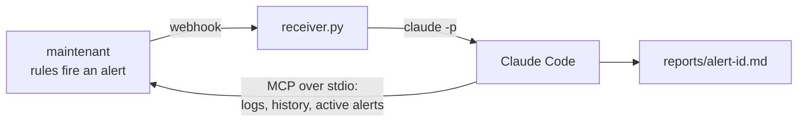

# AI Agents

maintenant decides that something is down, an AI agent finds out why. This guide connects the two: every fired alert is pushed to a small receiver, which starts a headless [Claude Code](https://docs.claude.com/en/docs/claude-code/overview) session that investigates through maintenant's [MCP server](../features/mcp.md) and writes a diagnosis.



1. **Detect.** Alerts come from fixed rules (consecutive failures, thresholds, deadlines). No model decides whether something is down, and nothing runs while everything is fine.
2. **Push.** The alert leaves as a [webhook](../features/alerts.md#webhook-payload) carrying the host it belongs to (`agent_id`) and a link back to it (`url`).
3. **Investigate.** The agent reads what it needs through the MCP tools, read-only.

---

## Requirements

- maintenant running in a Docker container, or installed natively. `mcp.json` calls the container `maintenant`: if `docker ps` shows another name (Compose names it `<project>-maintenant-1` unless `container_name` is set), put yours in its place.
- On the same host: Python 3 and [Claude Code](https://docs.claude.com/en/docs/claude-code/setup), logged in once interactively by the user that will run the receiver.
- A webhook channel, available in every edition.

The receiver and its MCP configuration live in [`examples/agent-webhook/`](https://github.com/kolapsis/maintenant/tree/main/examples/agent-webhook) in the repository.

---

## 1. Start the receiver

```bash
git clone --depth 1 https://github.com/kolapsis/maintenant.git
cd maintenant/examples/agent-webhook
export RECEIVER_TOKEN=$(openssl rand -hex 32)
python3 receiver.py
```

| Variable | Default | Description |
|----------|---------|-------------|
| `RECEIVER_TOKEN` | (required) | Shared secret. Requests without `Authorization: Bearer <token>` get `401`. |
| `RECEIVER_LISTEN` | `127.0.0.1:9099` | Address and port to listen on |
| `RECEIVER_MCP_CONFIG` | `mcp.json` next to the script | MCP configuration passed to Claude Code |
| `RECEIVER_REPORTS` | `reports/` next to the script | Where diagnoses are written, one file per alert |
| `RECEIVER_TIMEOUT` | `600` | Seconds an investigation may run |

The receiver answers `202` at once and queues the alert: investigations run one at a time, so a burst of alerts never starts a burst of sessions. `alert.resolved` and `test` notifications are logged and not investigated.

For each fired alert it runs:

```bash
claude -p "<prompt with the alert JSON>" \
  --setting-sources project \
  --mcp-config mcp.json --strict-mcp-config \
  --tools "" \
  --allowedTools mcp__maintenant__list_alerts mcp__maintenant__get_container_logs ...
```

`--setting-sources project` keeps the user's own settings and hooks out of the session (it runs in `reports/`, which has no project settings), `--tools ""` removes every built-in tool (no shell, no file access), `--strict-mcp-config` ignores any other MCP server configured for that user, and `--allowedTools` lists the read-only maintenant tools the session may call: `list_alerts`, `list_agents`, `list_containers`, `get_container`, `get_container_logs`, `get_resources`, `get_top_consumers`, `list_endpoints`, `get_endpoint_history`, `list_heartbeats`, `list_certificates`, `get_updates`, `get_security_insights`, `get_health`. Add `acknowledge_alert` to `READ_TOOLS` in `receiver.py` if you want the agent to acknowledge what it has diagnosed.

`mcp.json` reaches maintenant over stdio, inside its own container, so no MCP port is opened:

```json
{
  "mcpServers": {
    "maintenant": {
      "command": "docker",
      "args": ["exec", "-i", "maintenant", "/app/maintenant", "--mcp-stdio"]
    }
  }
}
```

On a native install, call the binary directly: `"command": "maintenant", "args": ["--mcp-stdio"]`, with `MAINTENANT_DB` in `env` when the database is not at its default path. See [MCP Server](../features/mcp.md#authentication) for what the stdio transport can reach.

Run the receiver under your service manager (systemd, a supervisor, a container with the Docker CLI and Claude Code) once it works by hand.

---

## 2. Let maintenant reach it

Webhook channels refuse plain `http` and private addresses, at save time and at every connection (see [the SSRF guard](../features/alerts.md#webhook-destinations-and-the-ssrf-guard)). Two ways through:

- **Behind your reverse proxy** (recommended). Publish the receiver at a public HTTPS name, for example `https://hooks.example.com/maintenant`, proxied to `127.0.0.1:9099`. Keep `RECEIVER_LISTEN` on loopback: only the proxy talks to it, and the bearer token protects it from the rest of the internet.
- **On a private host**, set `MAINTENANT_ALLOW_PRIVATE_WEBHOOKS=true` on maintenant and point the channel at the Docker bridge gateway, for example `http://172.17.0.1:9099/`, with `RECEIVER_LISTEN=172.17.0.1:9099`. This lifts the guard for every channel and event webhook, not only this one.

---

## 3. Create the channel and route alerts to it

In **Alerts → Channels**, add a **Webhook** channel with the receiver's URL and the header `Authorization: Bearer <your RECEIVER_TOKEN>`, then press **Test**: the receiver logs a `test` line. Through the API:

```bash
POST /api/v1/channels
{
  "name": "claude-code",
  "type": "webhook",
  "url": "https://hooks.example.com/maintenant",
  "headers": "{\"Authorization\": \"Bearer <your RECEIVER_TOKEN>\"}"
}
```

Channels are silent until a [trigger](../features/alerts.md#alert-triggers) routes alerts to them. Start narrow, critical alerts only, so the agent works on what matters:

```bash
POST /api/v1/alert-triggers
{
  "name": "Critical alerts to Claude Code",
  "filter_severities": "critical",
  "enabled": true,
  "notify_on_resolve": false,
  "channel_ids": ["<channel id>"]
}
```

---

## 4. Read the diagnosis

When the next critical alert fires, the receiver logs it and, once the session ends, writes `reports/<alert id>.md`: what is failing, the most likely cause, the log lines it rests on, and the fix to try first. The alert's `url` takes you to it in maintenant.

A severity raise and each escalation level send `alert.fired` again for the same alert id, so the same alert can be investigated more than once.

---

## Other agents

- **OpenCode.** Replace the `claude` command in `receiver.py` with `opencode run "<prompt>"`, and declare maintenant as a local MCP server in `opencode.json` with the same `docker exec -i maintenant /app/maintenant --mcp-stdio` command.
- **n8n.** A **Webhook** trigger node receives the payload and feeds an **AI Agent** node whose **MCP Client** tool points at your instance's Streamable HTTP endpoint, `https://<your instance>/mcp`, authenticated with the OAuth2 client described in [MCP Server](../features/mcp.md#streamable-http-oauth2).

---

## Related

- [Webhook payload](../features/alerts.md#webhook-payload): every field, fired and resolved examples
- [MCP Server](../features/mcp.md): the 51 tools, transports and authentication
- [Alert Engine](../features/alerts.md): sources, triggers, delivery and retries
