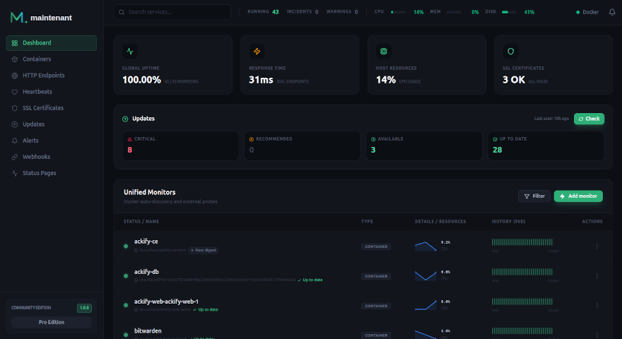

# maintenant

**The all-in-one monitoring dashboard your self-hosted stack deserves.**

Drop a single container. Watch everything. Sleep at night.

---

## What is maintenant?

Most self-hosters juggle 3-5 tools to monitor their stack: one for containers, one for uptime, one for certs, one for metrics, and yet another for a status page. maintenant replaces all of them with a single binary and nothing to install on the datastore layer: no Redis, no message queue, just SQLite, and no configuration to get started. A fleet operator who already runs PostgreSQL can point the server at it so the instance stops being tied to its machine, but nothing requires it. The container runtime (Docker socket or Kubernetes API) is **optional**: endpoint, SSL, and heartbeat monitors work fully without it.

Deploy one container, and maintenant auto-discovers your entire stack. Docker or Kubernetes, it does not matter.



---

## Key Features

- **[Container Monitoring](features/containers.md)** — Zero-config auto-discovery for Docker and Kubernetes. State tracking, health checks, restart loop detection, an opt-in alert for containers that stay stopped, log streaming.
- **[Multi-Host Monitoring](features/multihost.md)** — Monitor many hosts from one central server. Lightweight agents stream container state, endpoints, certificates and per-host resource metrics over gRPC with TLS, each agent authenticating with its own key after a one-time enrollment. An agent keeps its events in a local spool while the server is unreachable and replays them into the history when it reconnects. Personal (up to 20 hosts) or Pro (unlimited).
- **[Docker Swarm Monitoring](features/swarm.md)** — Automatic Swarm service discovery, stack grouping, node health, crash-loop detection, rolling update tracking. Available in every edition.
- **[Endpoint Monitoring](features/endpoints.md)** — HTTP and TCP checks defined as Docker labels, derived from Traefik and Caddy labels, or created by hand. Response times, daily uptime history kept for up to 365 days, sparklines.
- **[Heartbeat & Cron Monitoring](features/heartbeats.md)** — Create a monitor, get a URL, curl from your cron job. Tracks durations, exit codes, missed deadlines. Outbound heartbeats let a second instance watch this one.
- **[TLS Certificate Monitoring](features/certificates.md)** — Auto-detection from HTTPS endpoints. Alerts at 30, 14, 7, 3, and 1 day before expiry. Full chain validation.
- **[Resource Metrics](features/resources.md)** — CPU, memory, network I/O, disk I/O per container. Historical charts (7 days in Community, 30 in Personal, 90 in Pro), alert thresholds, top consumers view.
- **[Update Intelligence](features/updates.md)** — OCI registry scanning, digest comparison. Compose-aware update commands. Know when your images have updates available.
- **[Host OS End-of-Support](features/host-os.md)** — Tracks Debian, Ubuntu, RHEL, Rocky, Alma, Alpine and SLES support cycles. Warns 30 days before a host's security support ends, critical once it has.
- **[Network Security Insights](features/security.md)** — Automatic detection of exposed ports, dangerous network configurations, and privileged containers. CVE ecosystem mapping via OCI manifest inspection (Personal).
- **[Alert Engine](features/alerts.md)** — Unified alerts across all sources. Channels silent by default, routed via Alert Triggers. Webhook and Discord channels, plus email and Telegram with Personal. Silence rules, retries with backoff. Slack, Teams and multi-level escalation policies with Pro.
- **[Public Status Page](features/status-page.md)** — Component groups, live SSE updates. Incident management with Personal. Maintenance windows, subscriber notifications and branding with Pro.
- **[MCP Server](features/mcp.md)** — Expose monitoring data to AI assistants (Claude Code, Cursor) via the Model Context Protocol. 51 tools across monitoring, security, Kubernetes, Swarm and alert routing; stdio and HTTP transports.

---

## Comparison

| | maintenant | Uptime Kuma | Portainer | Dozzle |
|---|:---:|:---:|:---:|:---:|
| Container auto-discovery | **Yes** | No | Yes | Yes |
| HTTP/TCP endpoint checks | **Yes** | Yes | No | No |
| Cron/heartbeat monitoring | **Yes** | Yes | No | No |
| SSL certificate tracking | **Yes** | Yes | No | No |
| CPU/memory/network metrics | **Yes** | No | Limited | No |
| Image update detection | **Yes** | No | Yes | No |
| Network security insights | **Yes** | No | No | No |
| Public status page | **Yes** | Yes | No | No |
| Alerting (webhook, Discord, email, Telegram, Slack, Teams) | **Yes** | Yes | Limited | No |
| Docker Swarm monitoring | **Yes** | No | Limited | No |
| Kubernetes native | **Yes** | No | Yes | No |
| MCP for AI assistants | **Yes** | No | No | No |
| Single binary, zero deps | **Yes** | Node.js | Docker API | Docker API |
| Container runtime optional | **Yes** | No | No | No |

---

## Editions and license

The core of maintenant is licensed under **Apache 2.0** and needs no key: it is the **Community** edition, free for any use. The paid features live in `internal/commercial` and `frontend/src/commercial` under a commercial license, and a license key opens them. Both parts ship in the same binary.

| Edition | For | Adds |
|---|---|---|
| **Community** | Everyone, free | Containers, endpoints, heartbeats, certificates, the status page, the Swarm and Kubernetes views, 7 days of resource history, on a single host, with caps on hand-made monitors (10 endpoints, 5 heartbeats, 5 certificate monitors, 3 status components). |
| **Personal** | One person, on their own infrastructure, freelancers included | No caps, up to 20 remote hosts, email and Telegram alerts, CVE enrichment, risk scoring, security posture, incidents, changelog, 30 days of resource history, advanced trigger filters, OCSP stapling. Bought once, it never expires and includes a year of updates. |
| **Pro** | Teams, and anyone running it for others | Everything in Personal with unlimited hosts, Slack and Teams, escalation policies, per-entity routing, maintenance windows, status page subscribers and branding, 90 days of resource history, and support. Subscription. |

Prices and terms are in [COMMERCIAL-LICENSE.md](https://github.com/kOlapsis/maintenant/blob/main/COMMERCIAL-LICENSE.md). The [Configuration](getting-started/configuration.md#license) page explains how a license key is verified and what happens offline or after a downgrade.

---

## Quick Start

Get maintenant running in 30 seconds:

```yaml
# docker-compose.yml
services:
  maintenant:
    image: ghcr.io/kolapsis/maintenant:latest
    ports:
      - "8080:8080"
    read_only: true
    security_opt:
      - no-new-privileges:true
    tmpfs:
      - /tmp:noexec,nosuid,size=64m
    volumes:
      - /var/run/docker.sock:/var/run/docker.sock:ro
      - /proc:/host/proc:ro
      - /etc/os-release:/host/etc/os-release:ro
      - maintenant-data:/data
    environment:
      MAINTENANT_ADDR: "0.0.0.0:8080"
      MAINTENANT_DB: "/data/maintenant.db"
    restart: unless-stopped

volumes:
  maintenant-data:
```

```bash
docker compose up -d
```

Open **http://localhost:8080**: your containers are already there. No configuration needed.

!!! warning "Read this before exposing it"
    maintenant has no built-in authentication: anyone who can reach the port can read everything and change monitors and settings. `"8080:8080"` publishes the port on every interface of the host. To keep it local, publish `"127.0.0.1:8080:8080"` and put a reverse proxy with authentication in front, see [Security](security.md).

    The Docker socket is mounted read-only, but `:ro` does not stop Docker API writes: the container can control the host's Docker. For production, run maintenant behind a [docker-socket-proxy](security.md#recommended-docker-socket-proxy) instead.

For detailed installation instructions, see [Installation](getting-started/installation.md).
